# pH Model Development Story And Flat-Trial Patch

This report documents the first-principles pH modeling sequence for the inline acetate-buffer system. The objective is to predict the reliable measured output, `PH_2`, from the three inlet flowrates:

- acetic acid, 100 mM,
- sodium acetate, 100 mM,
- Arium ultrapure water.

This report covers the main model-development sequence:

- ideal Henderson-Hasselbalch,
- equilibrium charge balance,
- dynamic identification built around equilibrium pH,
- transport-delay identification using total flow.

It does not evaluate controller targets, MPC, RL, rewards, or `PH_1`. The target pH is excluded from all model-validation metrics. `PH_1` is excluded because the operator stated it was not connected during operation.

## Data Mapping

The source file is:

```text
Data/dsp_db.biosmb-rl-controller-treated-dataset.csv
```

The fixed mapping is:

| Quantity | CSV column |
| --- | --- |
| measured pH | `observation.biosmb-sensors.PH_2` |
| acetic acid flow | `observation.biosmb-flows[0]` |
| sodium acetate flow | `observation.biosmb-flows[1]` |
| Arium water flow | `observation.biosmb-flows[2]` |

Rows are sorted chronologically. Rows with nonpositive acid, acetate, or water flow are excluded from model metrics.

## Raw Data Column Guide

The raw CSV has `1086` rows and `41` columns. The latest dynamic workflow saves a full numeric profile for every raw column here:

```text
results/dynamic_model_identification_20260525_205317/tables/raw_column_profile.csv
```

The processed model table also has its own profile:

```text
results/dynamic_model_identification_20260525_205317/tables/preprocessed_column_profile.csv
```

The raw data columns are:

| Column | Meaning | Current modeling use |
| --- | --- | --- |
| `_id` | database row identifier | audit only |
| `utc_time` | primary timestamp | used for chronological sorting and elapsed time |
| `episode_number` | controller/logged episode index | used for trial segmentation |
| `step_number` | controller/logged step index | used for trial segmentation |
| `target_ph` | controller target pH | not used in model-validation metrics |
| `observation.utc_time` | timestamp inside observation payload | audit only, not used because `utc_time` is primary |
| `observation.biosmb-sensors.P_1` | pressure sensor 1 | not used in current pH model |
| `observation.biosmb-sensors.P_2` | pressure sensor 2 | not used in current pH model |
| `observation.biosmb-sensors.P_3` | pressure sensor 3 | not used in current pH model |
| `observation.biosmb-sensors.P_4` | pressure sensor 4 | not used in current pH model |
| `observation.biosmb-sensors.P_5` | pressure sensor 5 | not used in current pH model |
| `observation.biosmb-sensors.P_6` | pressure sensor 6 | not used in current pH model |
| `observation.biosmb-sensors.P_7` | pressure sensor 7 | not used in current pH model |
| `observation.biosmb-sensors.PH_1` | pH sensor 1 | not used because operator stated it was not connected |
| `observation.biosmb-sensors.PH_2` | pH sensor 2 | only reliable measured output |
| `observation.biosmb-sensors.COND_1` | conductivity sensor 1 | diagnostic only |
| `observation.biosmb-sensors.COND_2` | conductivity sensor 2 | diagnostic only |
| `observation.biosmb-sensors.COND_3` | conductivity sensor 3 | diagnostic only |
| `observation.biosmb-sensors.COND_4` | conductivity sensor 4 | diagnostic only |
| `observation.biosmb-sensors.UV_1A` | UV channel 1A | diagnostic only, constant zero in this CSV |
| `observation.biosmb-sensors.UV_1B` | UV channel 1B | diagnostic only, constant zero in this CSV |
| `observation.biosmb-sensors.UV_1C` | UV channel 1C | diagnostic only, constant zero in this CSV |
| `observation.biosmb-sensors.UV_2A` | UV channel 2A | diagnostic only, mostly zero |
| `observation.biosmb-sensors.UV_2B` | UV channel 2B | diagnostic only, mostly zero |
| `observation.biosmb-sensors.UV_2C` | UV channel 2C | diagnostic only, mostly zero |
| `observation.biosmb-sensors.UV_3A` | UV channel 3A | diagnostic only |
| `observation.biosmb-sensors.UV_3B` | UV channel 3B | diagnostic only |
| `observation.biosmb-sensors.UV_3C` | UV channel 3C | diagnostic only |
| `observation.biosmb-sensors.UV_4A` | UV channel 4A | diagnostic only, constant zero in this CSV |
| `observation.biosmb-sensors.UV_4B` | UV channel 4B | diagnostic only, constant zero in this CSV |
| `observation.biosmb-sensors.UV_4C` | UV channel 4C | diagnostic only, constant zero in this CSV |
| `observation.biosmb-flows[0]` | acetic acid inlet flow | model input, renamed `acid_flow` |
| `observation.biosmb-flows[1]` | sodium acetate inlet flow | model input, renamed `acetate_flow` |
| `observation.biosmb-flows[2]` | Arium water inlet flow | model input, renamed `water_flow` |
| `observation.biosmb-flows[3]` | extra logged flow channel | unused, constant zero in this CSV |
| `observation.biosmb-flows[4]` | extra logged flow channel | unused, constant zero in this CSV |
| `observation.biosmb-flows[5]` | extra logged flow channel | unused, constant zero in this CSV |
| `observation.biosmb-flows[6]` | extra logged flow channel | unused, constant zero in this CSV |
| `observation.mfcs-mass.acid-mass-grams` | logged acid reservoir mass | diagnostic only |
| `observation.mfcs-mass.sodium-mass-grams` | logged sodium acetate reservoir mass | diagnostic only |
| `observation.mfcs-mass.water-mass-grams` | logged water reservoir mass | diagnostic only |

Key raw-column observations:

- The three modeling inputs are only flows `[0]`, `[1]`, and `[2]`, mapped to acetic acid, sodium acetate, and Arium water.
- Flows `[3]` to `[6]` are constant zero and are not part of this mixing setup.
- `PH_2` ranges from `3.5717` to `5.2186`, while `PH_1` ranges from `1.8568` to `9.1226` and is not physically trusted for this experiment.
- `target_ph` ranges from `3.7` to `5.7`, but it is a controller objective log, not a plant-model output. It is intentionally excluded from model metrics.
- The mass columns are useful later for checking consumption and pump consistency, but they are not currently used in the inlet-flow-to-pH model.

## Processed Columns And Trial Definitions

The preprocessing step creates the modeling table used by the runners. Important derived columns are:

| Processed column | Meaning |
| --- | --- |
| `sample_index` | chronological row number after sorting |
| `utc_datetime` | parsed timestamp |
| `elapsed_s`, `elapsed_min`, `elapsed_h` | elapsed time from first sample |
| `dt_s` | time since previous logged row |
| `session_id` | increments after a long time gap greater than `900 s` |
| `trial_id` | increments after a session break, episode reset, or step reset |
| `ph_measured` | renamed `PH_2`, the measured model output |
| `acid_flow` | renamed `biosmb-flows[0]` |
| `acetate_flow` | renamed `biosmb-flows[1]` |
| `water_flow` | renamed `biosmb-flows[2]` |
| `total_flow` | \(F_T = F_H + F_A + F_W\) |
| `flow_ratio_acetate_acid` | \(F_A/F_H\), the ideal buffer ratio coordinate |
| `log10_flow_ratio_acetate_acid` | \(\log_{10}(F_A/F_H)\), the pH-ratio coordinate |
| `valid_for_model` | inclusion flag for fitting and metrics |
| `uninformative_flat_ph_trial` | audit flag for flat-pH trials with large input-ratio movement |
| `acid_flow_in_bounds`, `acetate_flow_in_bounds`, `water_flow_in_bounds` | pump-bound audit flags |
| `acid_analytical_mol_l`, `acetate_analytical_mol_l`, `total_buffer_mol_l`, `sodium_mol_l` | mixed analytical concentrations used by equilibrium chemistry |
| `ph_equilibrium_charge_balance` | equilibrium model prediction before calibration |
| `prediction_*` and `residual_*` | model-stage predictions and `PH_2 - prediction` residuals |

The trial summary table is saved here:

```text
results/dynamic_model_identification_20260525_205317/tables/trial_split_summary.csv
```

The trial timing summary is saved here:

```text
results/dynamic_model_identification_20260525_205317/tables/trial_sampling_summary.csv
```

## Sampling Time Consistency

The sampling is not globally uniform. The latest dynamic run saves sampling diagnostics here:

```text
results/dynamic_model_identification_20260525_205317/tables/sampling_summary.csv
```

The key timing results are:

| Group | Median `dt_s` | 5-95 percent range | Long gaps > 15 min | Interpretation |
| --- | ---: | --- | ---: | --- |
| overall | `69.984 s` | `69.062-142.487 s` | `6` | mixture of one-minute, two-minute, and session-gap intervals |
| indices `0-204` | `141.907 s` | `140.794-143.065 s` | `2` | early regime is about `2.36 min`, not one minute |
| indices `205-290` | `141.392 s` | `140.142-142.467 s` | `0` | flat excluded regime is also about `2.36 min` |
| indices `291-end` | `69.424 s` | `69.030-140.406 s` | `4` | later regime is mostly about `1.16 min` |

Session-level timing shows the change more clearly:

| Session group | Typical sampling |
| --- | --- |
| sessions `0-3` | approximately `140-142 s` |
| sessions `4-6` | approximately `69-70 s` |

This matters for dynamics. A first-order time constant of about `1.71 s` is far below both the early `142 s` and later `69 s` sample intervals, so the fitted dynamic model collapses to the static calibrated model at the available time resolution. It also means integer-lag estimates are coarse: one lag means roughly `2.36 min` in early trials and roughly `1.16 min` in later trials.

## Original Modeling Round Before Flat-Trial Filtering

The first full report used these artifacts:

| Workflow | Result folder |
| --- | --- |
| Henderson-Hasselbalch | `results/henderson_hasselbalch_lab_validation_20260522_003559/` |
| Equilibrium charge balance | `results/equilibrium_charge_balance_lab_validation_20260522_005207/` |
| Dynamic identification | `results/dynamic_model_identification_20260522_013357/` |

At this stage, only the one row with invalid flow was excluded. The suspicious flat-pH trials were still included in model fitting and metrics.

The historical pre-patch result folders are listed for provenance. They are not embedded as figures in this refreshed report because those timestamped artifacts are not present in the current checkout. The current reproducible figures begin with the flat-trial-filtered rerun below.

## Model 1: Ideal Henderson-Hasselbalch

### Model Equation

For an acetate buffer:

$$
pH = pK_a + \log_{10}\left(\frac{[A^-]}{[HA]}\right)
$$

The acid and acetate stock concentrations are both `100 mM`. Under ideal instantaneous mixing:

$$
\frac{[A^-]}{[HA]}
=
\frac{C_{A,0}F_A/F_T}{C_{H,0}F_H/F_T}
=
\frac{F_A}{F_H}
$$

Therefore:

$$
pH_{HH} =
pK_a + \log_{10}\left(\frac{F_A}{F_H}\right)
$$

Water affects dilution and residence time, but it does not change the ideal Henderson-Hasselbalch pH when both stock concentrations are equal.

### Original Result

| Metric | Value |
| --- | ---: |
| valid rows | `1085` |
| mean error, `PH_2 - pH_HH` | `-0.3519 pH` |
| MAE | `0.3690 pH` |
| RMSE | `0.4037 pH` |
| max absolute error | `1.1514 pH` |
| correlation | `0.8346` |

The affine diagnostic was:

$$
PH_2 \approx 1.0139 + 0.7148\,pH_{HH}
$$

The ideal model captured a broad trend but failed as a direct simulator. It overpredicted `PH_2` and the measured pH range was compressed relative to ideal chemistry.


## Model 2: Equilibrium Charge Balance

### Model Equation

The mixed concentrations are:

$$
F_T = F_H + F_A + F_W
$$

$$
C_H = C_{H,0}\frac{F_H}{F_T}
$$

$$
C_A = C_{A,0}\frac{F_A}{F_T}
$$

$$
C_T = C_H + C_A
$$

$$
C_{Na} = C_A
$$

With \(K_a = 10^{-pK_a}\), acetate equilibrium gives:

$$
[A^-] =
\frac{C_TK_a}{K_a + H^+}
$$

and water gives:

$$
[OH^-] = \frac{K_w}{H^+}
$$

The charge balance is:

$$
f(H^+) =
H^+ + C_{Na}
- \frac{C_TK_a}{K_a + H^+}
- \frac{K_w}{H^+}
= 0
$$

After solving for \(H^+\):

$$
pH_{eq} = -\log_{10}(H^+)
$$

### Original Result

| Metric | Value |
| --- | ---: |
| valid rows | `1085` |
| mean error, `PH_2 - pH_eq` | `-0.3527 pH` |
| MAE | `0.3696 pH` |
| RMSE | `0.4042 pH` |
| max absolute error | `1.1517 pH` |
| correlation | `0.8346` |

The affine diagnostic was:

$$
PH_2 \approx 1.0059 + 0.7164\,pH_{eq}
$$

This model also failed as a direct simulator. The extra equilibrium detail did not reduce the error relative to Henderson-Hasselbalch.


## Model 3: Dynamic Identification From Equilibrium pH

### Model Sequence

The dynamic workflow tested three stages after the raw equilibrium baseline.

The baseline was:

$$
\hat y_k = pH_{eq,k}
$$

The static calibration was:

$$
\hat y_k = b_0 + b_1pH_{eq,k}
$$

The parameters were estimated on train trials only using ordinary least squares:

$$
(b_0^{*}, b_1^{*}) =
\underset{b_0,b_1}{\mathrm{arg\,min}}
\sum_{k \in D_{train}}
\left(y_k - b_0 - b_1pH_{eq,k}\right)^2
$$

The lag model was:

$$
\hat y_k(d) =
b_0(d) + b_1(d)pH_{eq,k-d}
$$

The first-order wrapper was:

$$
x_k =
b_0^{*} + b_1^{*}pH_{eq,k-d^{*}}
$$

$$
\hat y_k =
\alpha_k\hat y_{k-1}
+ (1-\alpha_k)x_k
$$

$$
\alpha_k =
\exp\left(-\frac{\Delta t_k}{\tau}\right)
$$

The time constant was estimated by scalar nonlinear optimization:

$$
\tau^{*} =
\underset{\tau > 0}{\mathrm{arg\,min}}
\sqrt{
\frac{1}{N_{train}}
\sum_{k \in D_{train}}
\left(y_k - \hat y_k(\tau)\right)^2
}
$$

### Original Result

Original fitted static calibration:

$$
PH_2 \approx 1.1404 + 0.6928\,pH_{eq}
$$

Original dynamic parameters:

| Parameter | Value |
| --- | ---: |
| best lag | `0` samples |
| fitted \(\tau\) | `1.7033 s` |
| median sample interval | `69.9825 s` |
| approximate effective volume | `0.4641 mL` |

Original train/test metrics:

| Model stage | Split | N | Mean error | MAE | RMSE |
| --- | --- | ---: | ---: | ---: | ---: |
| Equilibrium baseline | train | `826` | `-0.3274` | `0.3495` | `0.3918` |
| Equilibrium baseline | test | `259` | `-0.4337` | `0.4337` | `0.4412` |
| Static calibrated | train | `826` | `0.0000` | `0.1443` | `0.1848` |
| Static calibrated | test | `259` | `-0.0903` | `0.0923` | `0.1148` |
| Lag calibrated | test | `259` | `-0.0903` | `0.0923` | `0.1148` |
| First-order dynamic | test | `259` | `-0.0903` | `0.0923` | `0.1148` |

The original conclusion was that static calibration helped, but integer lag and first-order dynamics did not add useful predictive power.


## Patch: Flat-Trial Removal And Rerun

After reviewing the time plots, a suspicious region was identified around sample indices `205-290`. These are trials `8`, `9`, and `10`.

The pH behavior in this region is not physically informative for a flow-to-pH model:

| Region | Trials | Rows | Model-valid rows after patch | `PH_2` range | \(\log_{10}(F_A/F_H)\) range |
| --- | --- | ---: | ---: | ---: | ---: |
| before suspicious region | `0-7` | `205` | `205` | `3.9301-5.2186` | `-0.8589` to `0.7757` |
| suspicious flat region | `8-10` | `86` | `0` | `4.5718-4.6248` | `-0.8657` to `0.7988` |
| after suspicious region | `11-84` | `795` | `785` | `3.5717-5.0708` | `-0.9387` to `0.9417` |

The suspicious region has almost constant `PH_2`, only about `0.053 pH` range, while the acid/base ratio sweeps over about `1.66` log units. A normal ideal buffer model would expect a large pH movement from that ratio change. This is why the region was treated as low-information or inconsistent with the logged inlet-flow-to-pH relationship.

The filter rule is:

$$
\Delta PH_2 \le 0.05
\quad\text{and}\quad
\Delta \log_{10}(F_A/F_H) \ge 0.5
\quad\text{and}\quad
n \ge 5
$$

The patch flags these trials and sets `valid_for_model = False`. The raw rows are still kept in `preprocessed_lab_data.csv` for audit. They are not used for fitted parameters, metrics, or cleaned model-validation traces.

The updated rerun artifacts are:

| Workflow | Result folder |
| --- | --- |
| Static HH/equilibrium calibration | `results/effective_static_chemistry_calibration_20260525_205542/` |
| Dynamic identification | `results/dynamic_model_identification_20260525_205317/` |
| Transport delay identification | `results/transport_delay_identification_20260525_205338/` |
| Two-minute regime transport delay | `results/first_regime_transport_delay_identification_20260525_205417/` |
| One-minute regime transport delay | `results/second_regime_transport_delay_identification_20260525_205433/` |

The older standalone Henderson-Hasselbalch and equilibrium validation runners are not present in the current checkout. The static baselines were regenerated with `run_effective_static_chemistry_calibration.py`, which computes raw Henderson-Hasselbalch, raw equilibrium charge balance, bias-corrected, effective-pKa, and affine-calibrated static models from the same preprocessed CSV.

### Updated Henderson-Hasselbalch Result

| Metric | Value |
| --- | ---: |
| valid rows | `990` |
| excluded rows | `96` |
| mean error, `PH_2 - pH_HH` | `-0.3660 pH` |
| MAE | `0.3689 pH` |
| RMSE | `0.3976 pH` |
| max absolute error | `0.8451 pH` |
| correlation | `0.9012` |

Updated affine diagnostic:

$$
PH_2 \approx 0.6660 + 0.7891\,pH_{HH}
$$

The current static-chemistry rerun summarizes the raw and calibrated static models in combined figures:

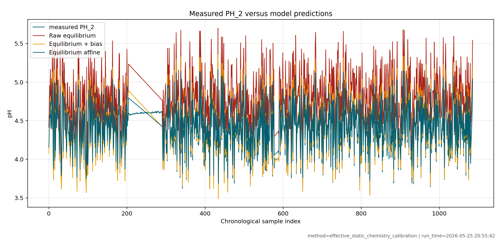

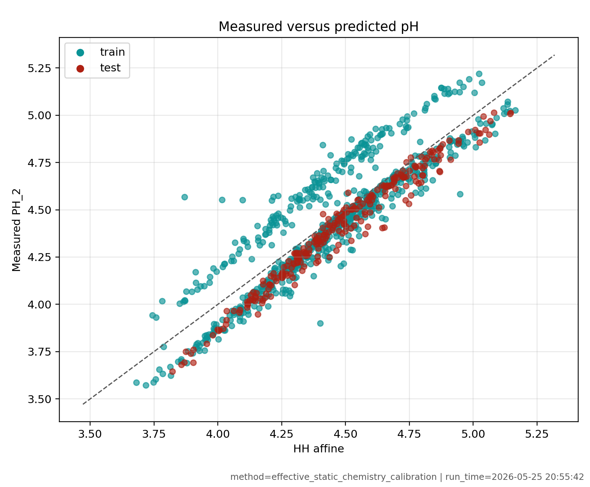

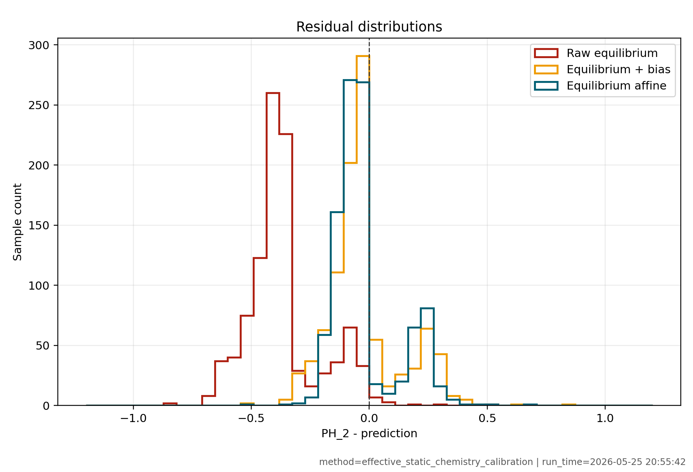

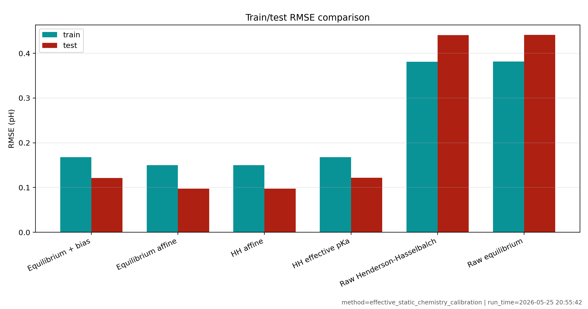

### Updated Equilibrium Charge-Balance Result

| Metric | Value |
| --- | ---: |
| valid rows | `990` |
| excluded rows | `96` |
| mean error, `PH_2 - pH_eq` | `-0.3668 pH` |
| MAE | `0.3697 pH` |
| RMSE | `0.3982 pH` |
| max absolute error | `0.8453 pH` |
| correlation | `0.9011` |

Updated affine diagnostic:

$$
PH_2 \approx 0.6567 + 0.7909\,pH_{eq}
$$

### Updated Dynamic Identification Result

Updated fitted static calibration:

$$
PH_2 \approx 0.6567 + 0.7909\,pH_{eq}
$$

Updated dynamic parameters:

| Parameter | Value |
| --- | ---: |
| train samples | `731` |
| test samples | `259` |
| best lag | `0` samples |
| fitted \(\tau\) | `1.7115 s` |
| median sample interval | `69.7710 s` |
| approximate effective volume | `0.4667 mL` |

What the dynamic model is actually fitting:

The dynamic workflow is not fitting Henderson-Hasselbalch directly, and it is not directly fitting a thermodynamic pKa. It first computes the equilibrium charge-balance prediction \(pH_{eq}\). Then it fits a line from \(pH_{eq}\) to the measured `PH_2`:

$$
PH_2 = b_0 + b_1pH_{eq} + \epsilon
$$

This is ordinary least-squares linear regression in pH-space. The fitted intercept and slope can be interpreted as an effective measurement/process bias and compression. They should not be interpreted as a true physical pKa because \(b_1 \ne 1\). If the only mismatch were a pKa shift, the slope would stay close to `1` and the intercept would mainly move the pH scale. Here the slope is `0.7909`, so the measured pH response is compressed relative to equilibrium chemistry.

After that line is fitted, the workflow searches integer sample delay and a first-order filter. Since the best delay is `0` samples and the fitted time constant is only `1.7115 s`, the dynamic model is effectively the static calibrated equilibrium model at this one-minute sampling resolution.

Updated train/test metrics:

| Model stage | Split | N | Mean error | MAE | RMSE |
| --- | --- | ---: | ---: | ---: | ---: |
| Equilibrium baseline | train | `731` | `-0.3430` | `0.3470` | `0.3819` |
| Equilibrium baseline | test | `259` | `-0.4337` | `0.4337` | `0.4412` |
| Static calibrated | train | `731` | `0.0000` | `0.1223` | `0.1500` |
| Static calibrated | test | `259` | `-0.0805` | `0.0822` | `0.0975` |
| Lag calibrated | test | `259` | `-0.0805` | `0.0822` | `0.0975` |
| First-order dynamic | test | `259` | `-0.0805` | `0.0822` | `0.0975` |

The flat-trial patch improved the calibrated held-out test RMSE from `0.1148 pH` to `0.0975 pH`. The improvement came from cleaner static calibration, not from delay or first-order dynamics.

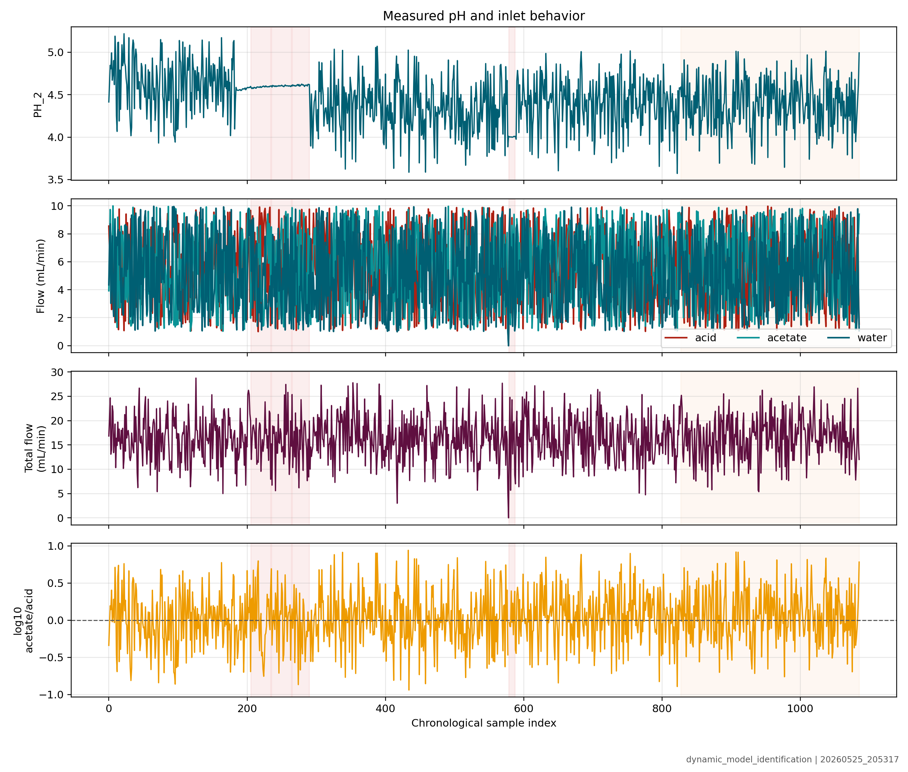

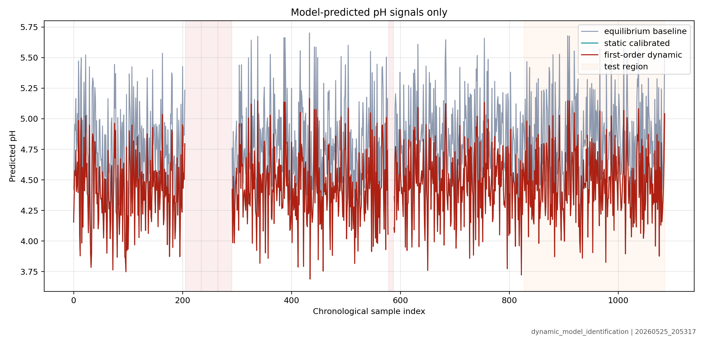

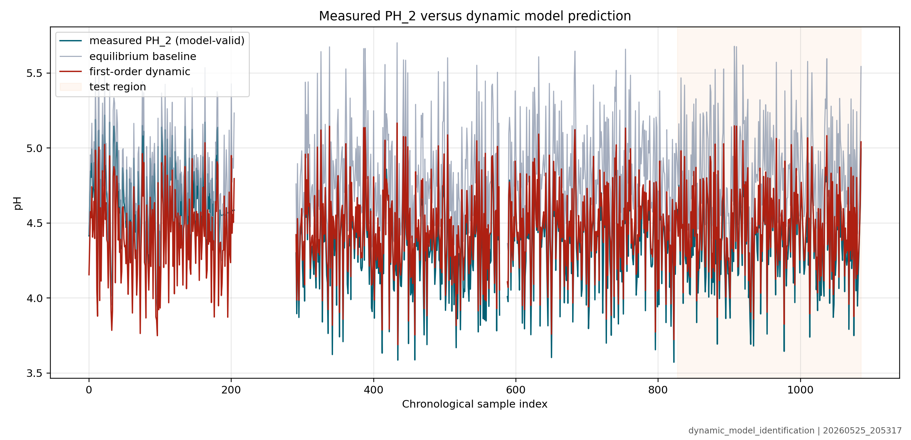

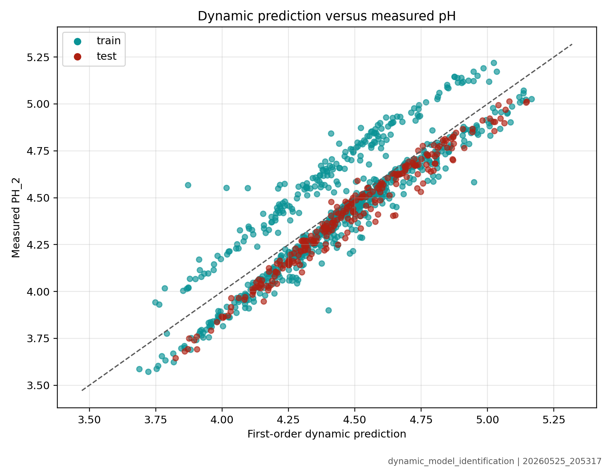

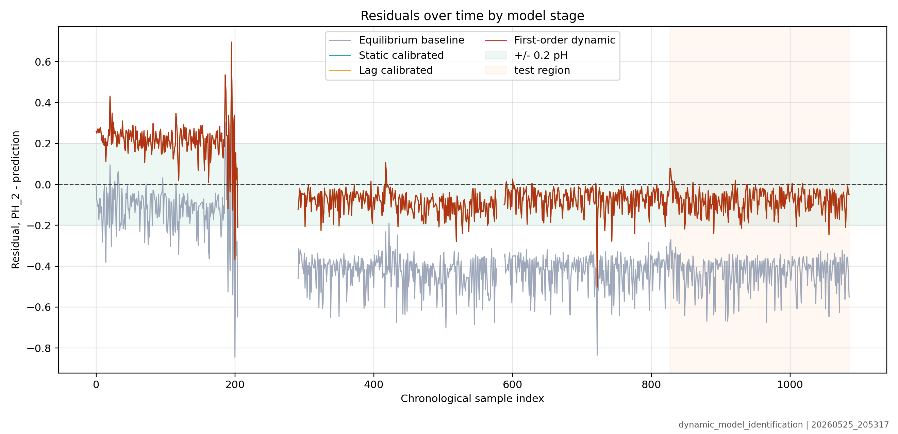

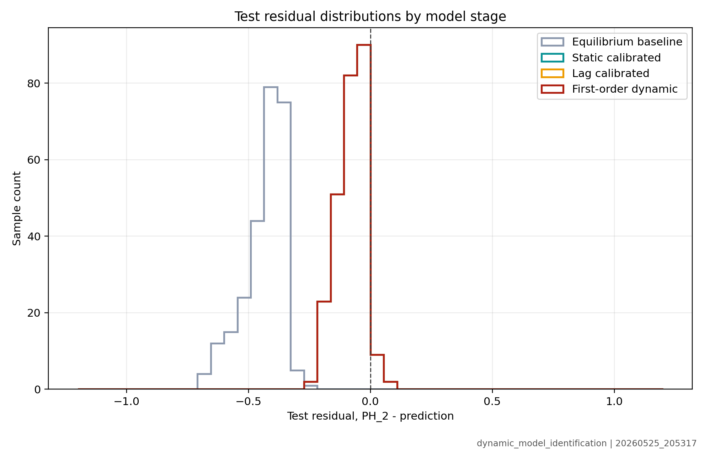

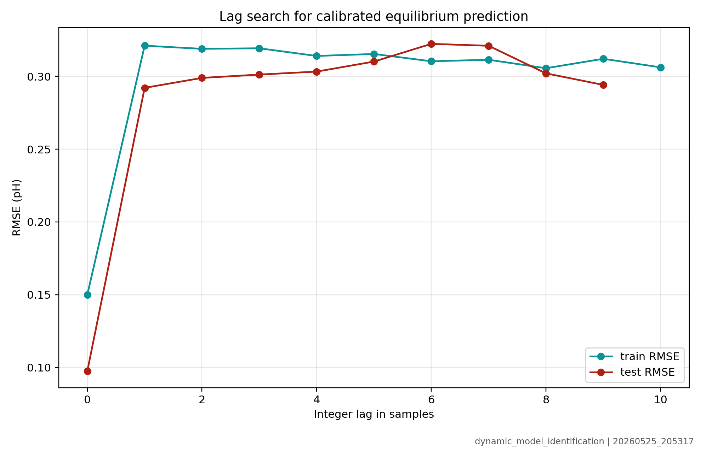

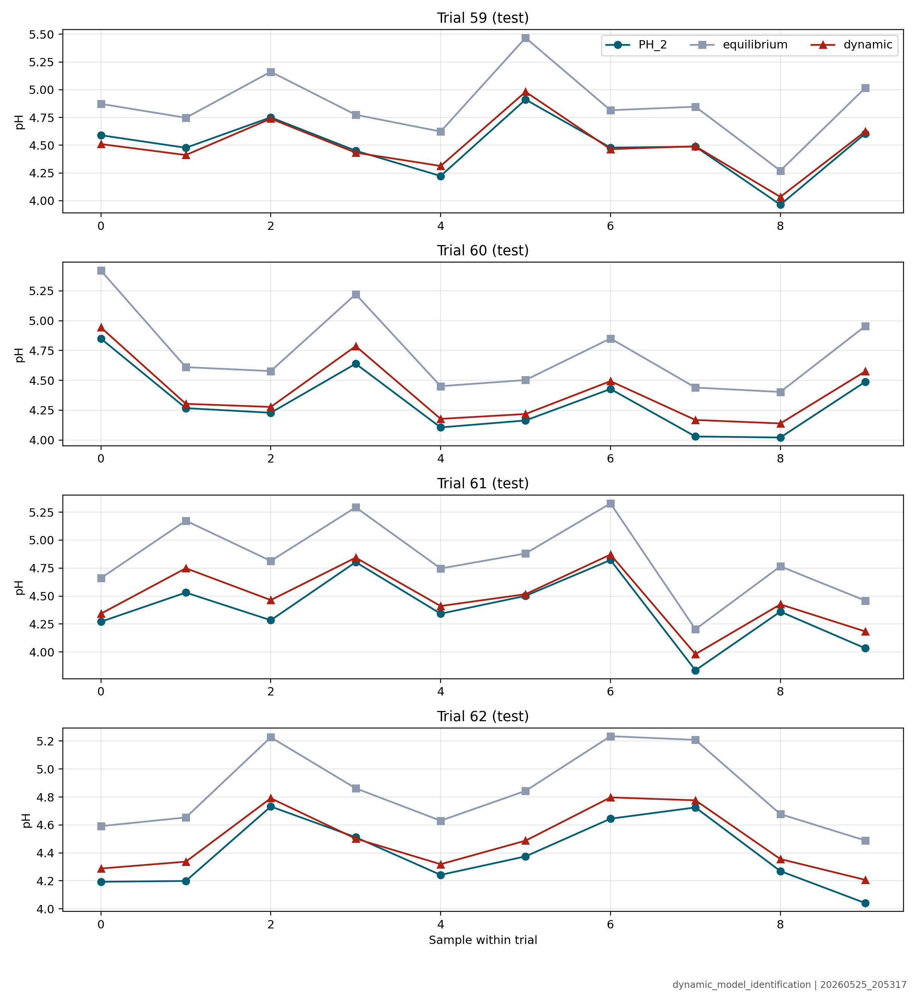

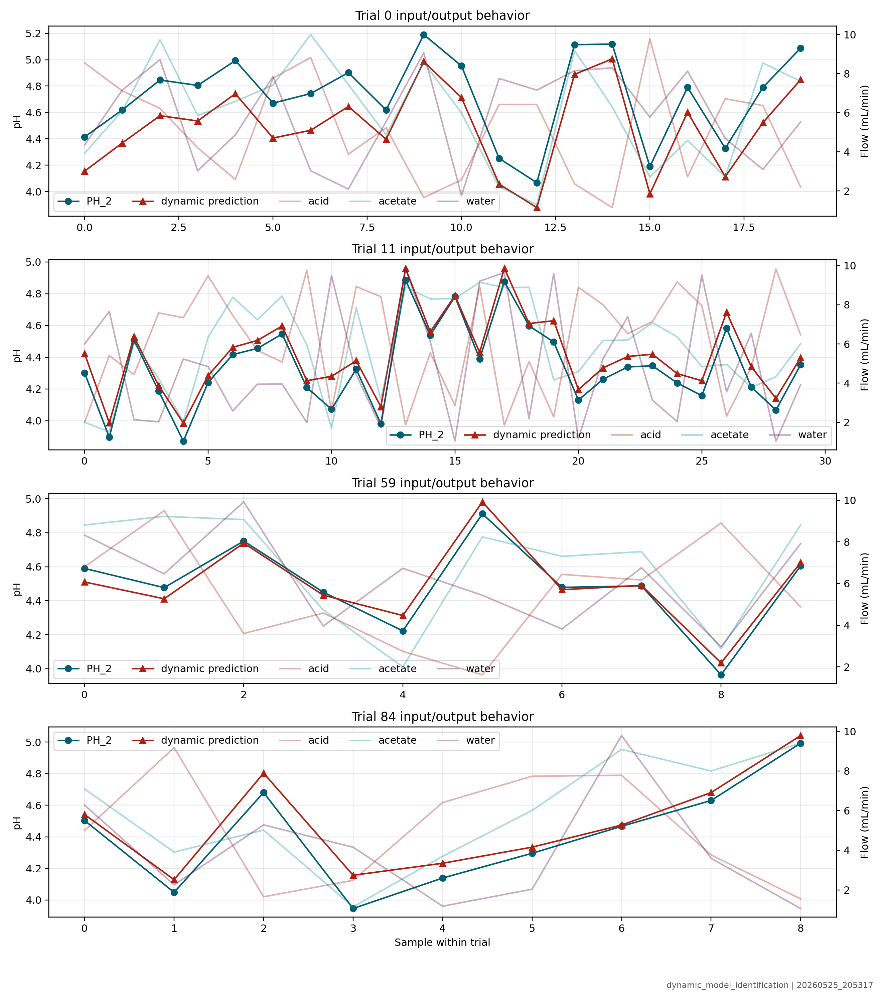

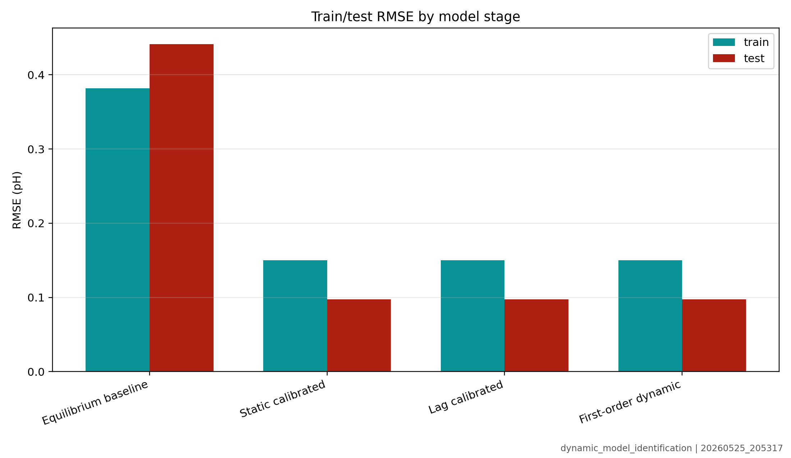

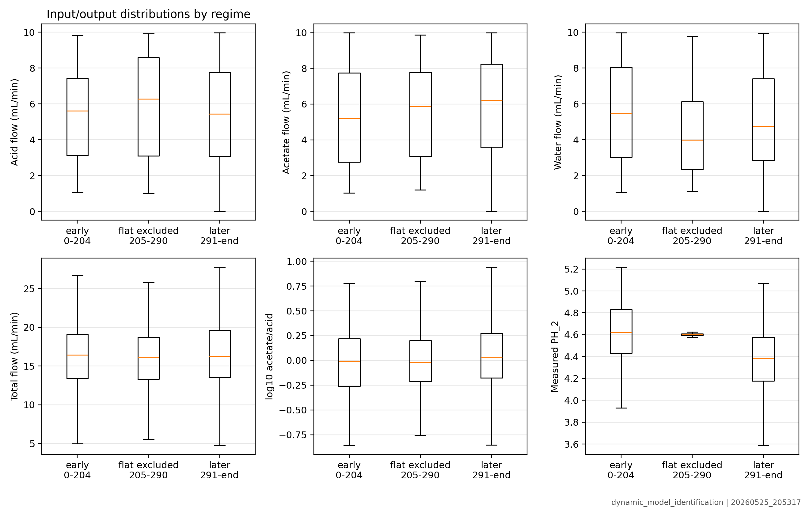

## Transport-Delay Identification With Total Flow

After the integer-lag and first-order dynamic tests, a more physical delay test was added in:

```text
run_transport_delay_identification.py
```

The verified result folder is:

```text
results/transport_delay_identification_20260525_205338/
```

The purpose was to test whether the lab CSV can identify an effective transport volume from the mixer to `PH_2`. This is different from the earlier integer-lag model. The integer-lag model asks whether shifting by `0`, `1`, `2`, ... logged samples improves prediction. The transport-delay model asks whether a fixed fluid volume must pass before a chemistry change reaches the pH probe.

### Physical Idea

If the mixed stream travels through tubing or a flow cell before reaching `PH_2`, then the transport delay depends on total flow:

$$
\theta(t) \approx \frac{V_{tube}}{F_T(t)}
$$

where:

- \(V_{tube}\) is the effective transported volume in `mL`,
- \(F_T(t)\) is total flow in `mL/min`,
- \(\theta(t)\) is the delay in `min`.

In seconds:

$$
\theta_s(t) =
60\frac{V_{tube}}{F_T(t)}
$$

The total flow is:

$$
F_T = F_H + F_A + F_W
$$

This is where water flow enters the dynamic model. Water still does not strongly change the ideal acetate/acid ratio pH when acid and acetate stock concentrations are equal, but water does change total flow. Therefore water changes the implied residence time and transport delay:

$$
F_W \uparrow
\quad\Rightarrow\quad
F_T \uparrow
\quad\Rightarrow\quad
\theta_s \downarrow
$$

So in this transport model, water is not primarily a pH-ratio input. It is a throughput and delay input.

### Transported-Volume Coordinate

Because the sampling interval is irregular, the runner does not assume a constant time delay. Instead, it builds a transported-volume coordinate within each trial:

$$
Q_k =
Q_{k-1}
+
\frac{F_{T,k-1}\Delta t_k}{60}
$$

where:

- \(Q_k\) is cumulative transported volume in `mL`,
- \(F_{T,k-1}\) is the previous logged total flow in `mL/min`,
- \(\Delta t_k\) is the time between samples in seconds.

This is a zero-order-hold assumption: the logged flow command is treated as constant between two logged samples.

For each candidate \(V_{tube}\), the delayed chemistry coordinate is:

$$
Q_{delay,k} = Q_k - V_{tube}
$$

The delayed equilibrium pH is found by interpolation:

$$
pH_{eq,delay,k}
=
pH_{eq}(Q_{delay,k})
$$

Then an affine calibration is fit on train trials only:

$$
PH_{2,k}
=
b_0(V_{tube})
+
b_1(V_{tube})pH_{eq,delay,k}
+
\epsilon_k
$$

The selected volume is the one that minimizes train RMSE:

$$
V_{tube}^{*}
=
\underset{0 \le V_{tube} \le 60}{\mathrm{arg\,min}}
\sqrt{
\frac{1}{N_{train}}
\sum_{k \in D_{train}}
\left(
PH_{2,k}
-
b_0(V_{tube})
-
b_1(V_{tube})pH_{eq,delay,k}
\right)^2
}
$$

The search used a `0-60 mL` grid and local refinement. A secondary first-order wrapper was also tested after the best transport delay:

$$
\hat y_k =
\alpha_k\hat y_{k-1}
+
(1-\alpha_k)x_k
$$

$$
\alpha_k =
\exp\left(-\frac{\Delta t_k}{\tau}\right)
$$

This secondary \(\tau\) is only an empirical smoothing diagnostic. It is not treated as a physical tubing-volume estimate.

### Result

The best fit returned:

| Quantity | Value |
| --- | ---: |
| best \(V_{tube}\) | `0.000 mL` |
| median \(\theta_s\) | `0.000 s` |
| transport calibration | \(PH_2 = 0.6567 + 0.7909pH_{eq,delay}\) |
| train RMSE improvement over static | `0.0000 pH` |
| test RMSE improvement over static | `0.0000 pH` |
| identifiability flag | `weak_non_identifiable_near_zero_volume` |

The train/test comparison was:

| Model stage | Test RMSE | Test mean error | Interpretation |
| --- | ---: | ---: | --- |
| Equilibrium baseline | `0.4412` | `-0.4337` | raw chemistry still biased |
| Static calibrated equilibrium | `0.0975` | `-0.0805` | best current empirical model |
| Transport-delay calibrated | `0.0975` | `-0.0805` | identical to static because \(V_{tube}=0\) |
| Transport-delay plus first-order | `0.0975` | `-0.0805` | no added held-out improvement |

The RMSE search confirms that any positive transport volume made the fit worse:

| \(V_{tube}\) mL | Train RMSE | Test RMSE |
| ---: | ---: | ---: |
| `0.0` | `0.1500` | `0.0975` |
| `0.5` | `0.1509` | `0.1015` |
| `1.0` | `0.1517` | `0.1035` |
| `2.0` | `0.1549` | `0.1109` |
| `5.0` | `0.1777` | `0.1578` |
| `10.0` | `0.2447` | `0.2630` |
| `20.0` | `0.3099` | `0.3022` |
| `40.0` | `0.3203` | `0.3016` |
| `60.0` | `0.3144` | `0.3023` |

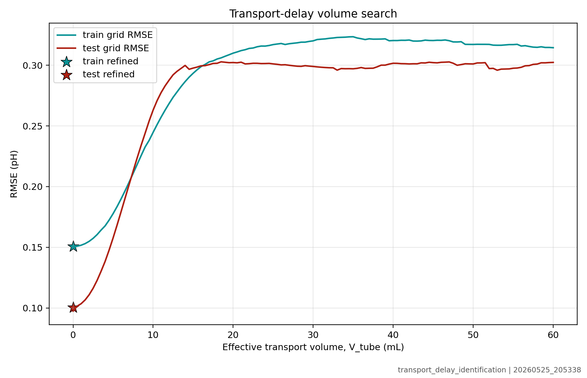

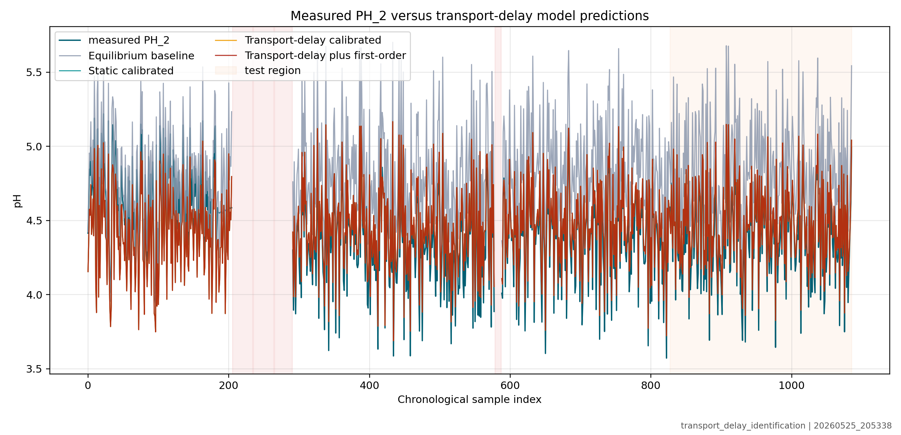


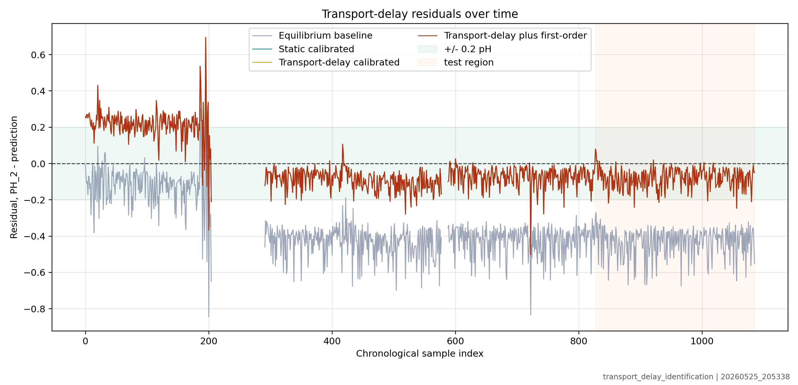

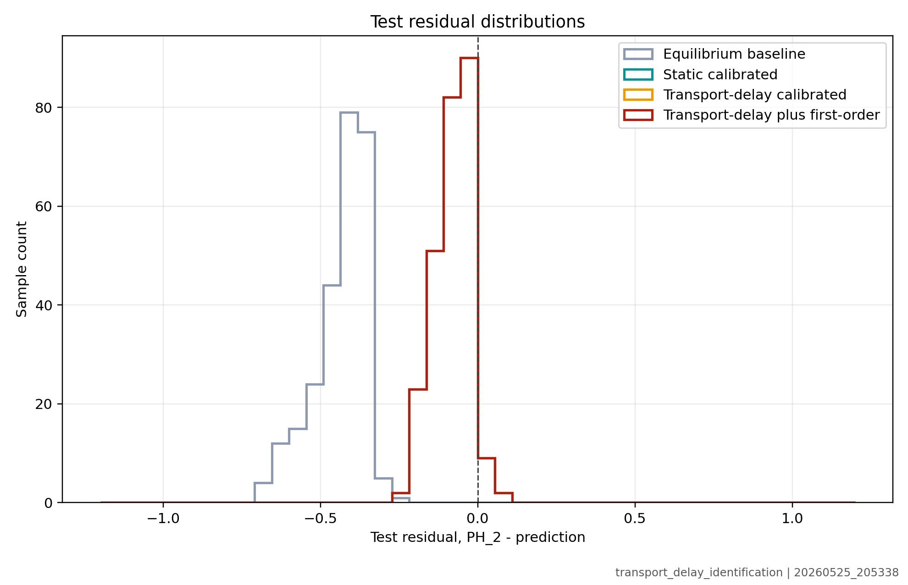

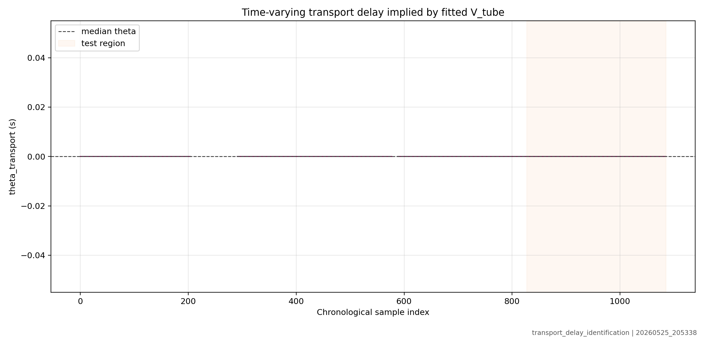

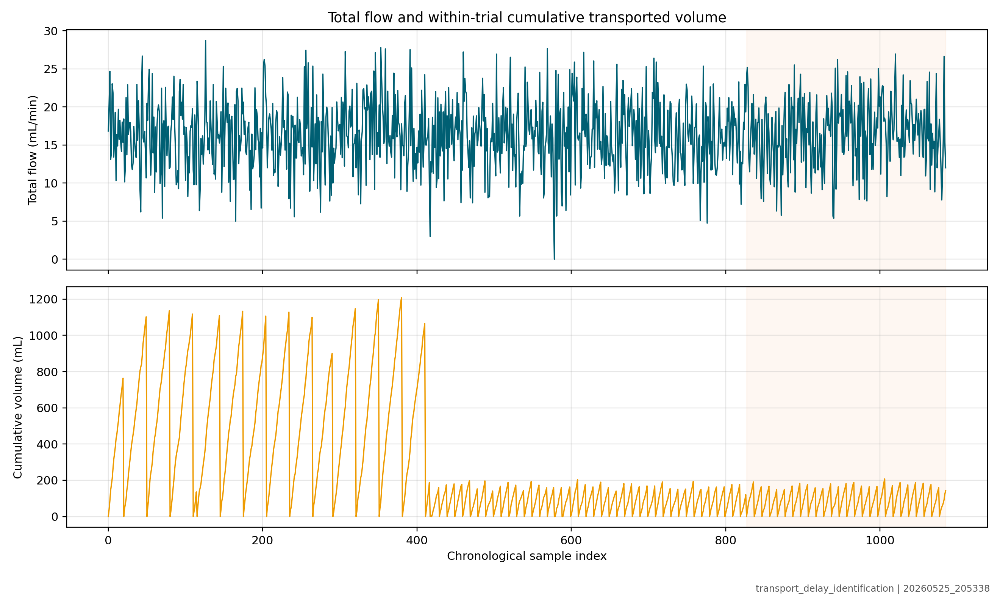

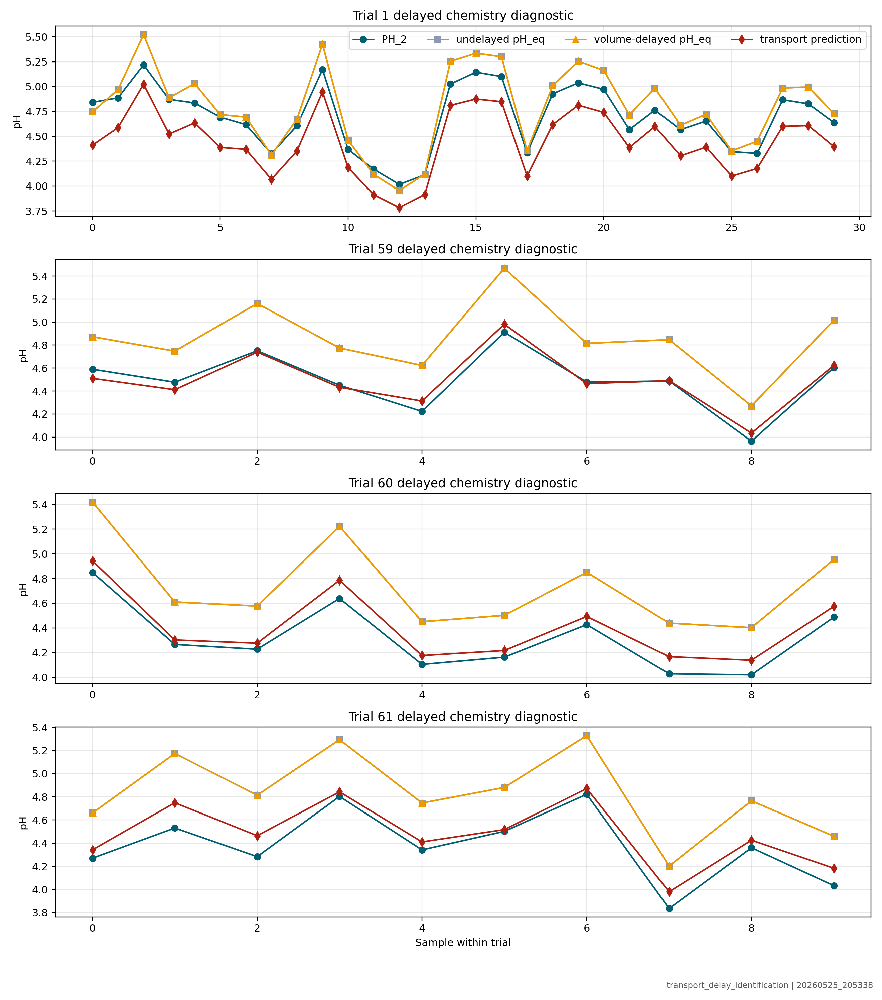

### Why The Estimated Volume Is Zero

The zero-volume result should not be read as proof that the physical tubing volume is literally zero. It means that, within this CSV and this sampling rate, adding a nonzero transport delay does not improve prediction.

There are four likely reasons.

First, the sampling interval is too coarse. The later data are mostly sampled every `69-70 s`, and the early data are mostly sampled every `140-142 s`. If the actual tubing delay is, for example, `5-30 s`, the pH change happens inside one sampling interval. The dataset cannot resolve it cleanly.

Second, the static calibration already captures most of the predictable low-frequency relationship:

$$
PH_2 \approx 0.6567 + 0.7909pH_{eq}
$$

After this calibration, delaying the chemistry signal mainly misaligns already useful information.

Third, the data are closed-loop or controller-generated, not designed open-loop identification data. The controller changes flows in response to pH behavior, so input changes and output changes are correlated through feedback. That makes physical delay harder to separate from controller action timing, pH probe response, and session effects.

Fourth, positive \(V_{tube}\) removes or weakens early information in each trial because \(Q_k - V_{tube}\) can fall before the available trial history. This is physically correct, but with short or coarse trials it reduces the usable delayed samples and tends to hurt the fit unless a real delay is strongly visible.

The conclusion is:

$$
V_{tube}^{*} = 0
$$

for this dataset and model structure. Therefore the current data do not identify a physical transport volume. The safer interpretation is:

```text
Transport delay is either smaller than the logging resolution, confounded with static calibration, or not excited well enough by this closed-loop dataset.
```

### Regime-Specific Transport-Delay Tests

The full-data test mixes two different logging regimes, so two additional subset runners were added:

```text
run_first_regime_transport_delay_identification.py
run_second_regime_transport_delay_identification.py
```

The first runner uses the earlier two-minute-sampling sessions:

```text
session_id <= 3
```

The second runner uses the later one-minute-sampling sessions:

```text
session_id >= 4
```

This split is based on sampling behavior, not pH target. The goal is to ask whether transport delay becomes more visible when each timing regime is modeled separately.

The result folders are:

| Regime | Result folder |
| --- | --- |
| two-minute regime | `results/first_regime_transport_delay_identification_20260525_205417/` |
| one-minute regime | `results/second_regime_transport_delay_identification_20260525_205433/` |

The subset definitions are:

| Regime | Sessions | Sample indices | Valid rows | Median `dt_s` | 5-95 percent `dt_s` |
| --- | --- | --- | ---: | ---: | --- |
| two-minute | `0,1,2,3` | `0-416` | `331` | `141.3665 s` | `140.0400-142.8680 s` |
| one-minute | `4,5,6` | `417-1085` | `659` | `69.3550 s` | `69.0218-70.2136 s` |

The model comparison is:

| Regime | Static test RMSE | Transport test RMSE | Transport + dynamic test RMSE | Best \(V_{tube}\) | Median \(\theta_s\) | Identifiability |
| --- | ---: | ---: | ---: | ---: | ---: | --- |
| two-minute | `0.2914` | `0.2904` | `0.2904` | `1.012 mL` | `3.71 s` | `weak_non_identifiable_small_rmse_gain` |
| one-minute | `0.0513` | `0.0513` | `0.0516` | `0.467 mL` | `1.72 s` | `weak_non_identifiable_near_zero_volume` |

For the two-minute regime, the search finds a slightly positive volume near `1 mL`. However, the test RMSE improves by only about `0.001 pH`, which is far below the practical improvement threshold of `0.005 pH`. The fitted delay is also only about `3.71 s`, while the sample interval is about `141 s`.

For the one-minute regime, the search finds a volume near `0.467 mL`, corresponding to about `1.72 s`. The held-out test RMSE is effectively unchanged and slightly worse by about `0.00003 pH`. This is even clearer evidence that the apparent positive volume is not a reliable physical delay estimate.

The RMSE searches show the same pattern in both regimes: very small volumes are the only plausible values, and larger volumes quickly damage the fit.

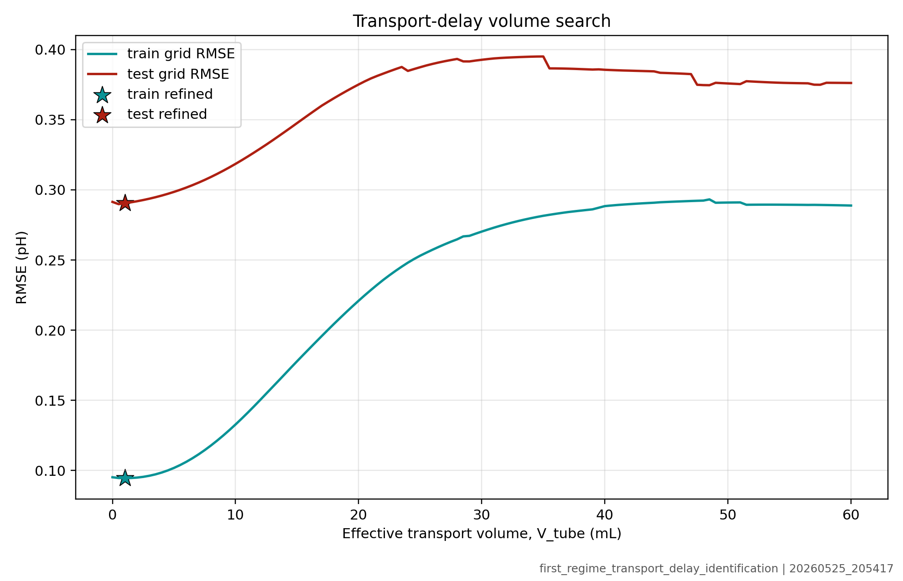

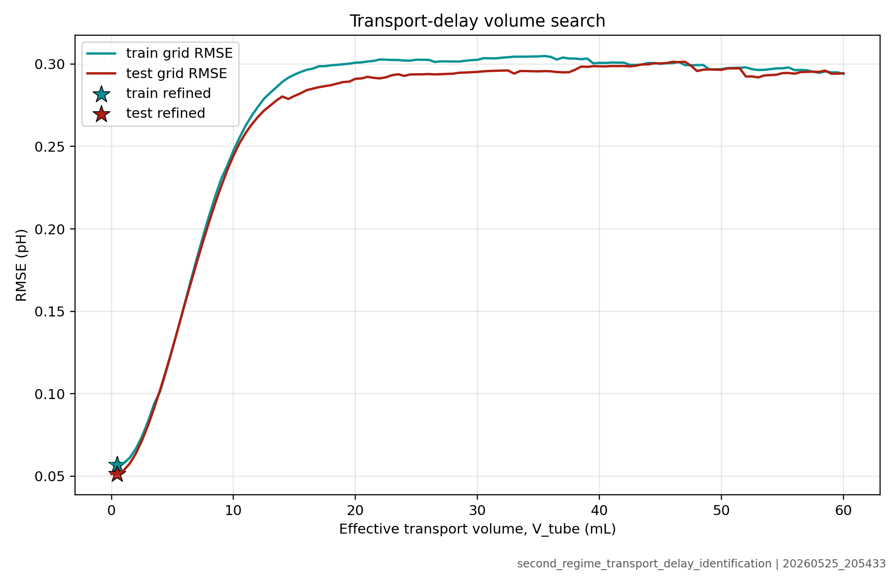

The time-response plots show why the delay is not strongly identifiable. The transport-delay prediction mostly overlays the static calibrated prediction, because the selected physical delay is much shorter than the logging interval.

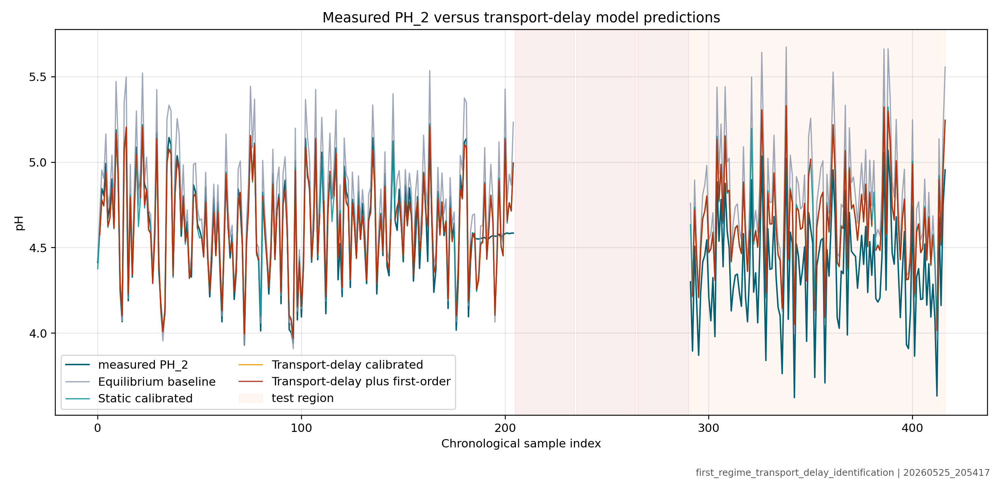

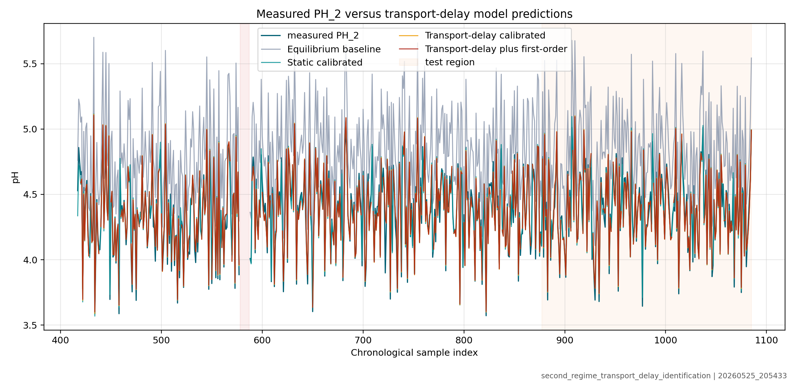

The regime split also clarifies a bigger modeling issue. The one-minute regime is much easier to calibrate: static test RMSE is only `0.0513 pH`. The two-minute regime has static test RMSE `0.2914 pH`, mainly because the chronological train/test split inside sessions `0-3` crosses a change in process behavior after the flat trials. In other words, the two-minute data are not just slower-sampled; they are also more nonstationary.

The regime-specific conclusion is:

```text
Splitting by sampling regime does not reveal a trustworthy nonzero transport volume.
The one-minute regime is better predicted by static calibration.
The two-minute regime remains nonstationary, and a tiny fitted volume does not explain the mismatch.
```

## Why Performance Changes Before Index 200 And After Index 300

The performance difference is a real diagnostic clue, not only a plotting artifact.

Before index `205`, the raw equilibrium model is much closer to `PH_2`. After index `291`, the calibrated model is much closer:

| Region | Raw equilibrium RMSE | Dynamic calibrated RMSE |
| --- | ---: | ---: |
| indices `0-204` | `0.1781 pH` | `0.2333 pH` |
| indices `291-end` | `0.4379 pH` | `0.0993 pH` |

The input ranges do not explain this by themselves:

| Regime | Valid rows | mean acid | mean acetate | mean water | mean total flow | mean log-ratio | mean PH_2 |
| --- | ---: | ---: | ---: | ---: | ---: | ---: | ---: |
| indices `0-204` | `205` | `5.40` | `5.35` | `5.53` | `16.28` | `-0.011` | `4.626` |
| indices `205-290` | `0` | `5.93` | `5.55` | `4.47` | `15.95` | `-0.020` | `4.601` |
| indices `291-end` | `785` | `5.43` | `5.90` | `5.07` | `16.40` | `0.046` | `4.371` |

The early and later regimes have very similar acid-flow, acetate-flow, water-flow, total-flow, and log-ratio ranges. Both regimes explore broad pump ranges. The major difference is the relationship between those inputs and `PH_2`, not the input ranges alone.

The most likely explanation is nonstationarity in the lab setup. Around indices `205-290`, `PH_2` becomes almost flat even while the commanded acid/base ratio changes strongly. After index `290`, there is a long session break and the measured pH response becomes much more active again, but shifted relative to ideal chemistry. Possible causes include:

- the pH probe or flow cell not seeing the newly commanded mixture during the flat region,
- a logging synchronization problem between flow commands and pH measurement,
- a large unmodeled dead volume or flushing delay during that part of operation,
- a temporary mixing or routing abnormality,
- probe conditioning, calibration drift, or startup effects between sessions.

The raw equilibrium model works better before index `205` because that early segment has a smaller offset from ideal chemistry. The calibrated dynamic model works better after index `291` because the fitted calibration maps the ideal pH coordinate to the lower, compressed pH response that dominates the later data. This is evidence that one global steady-state first-principles model is not enough unless we also model session effects, measurement calibration, and experiment timing.

The relevant diagnostic table is saved as:

```text
results/dynamic_model_identification_20260525_205317/tables/regime_summary.csv
```

## Final Comparison After The Patch

| Model | Fitted? | Validation basis | RMSE | Mean error | Conclusion |
| --- | --- | --- | ---: | ---: | --- |
| Ideal Henderson-Hasselbalch | no | filtered valid rows | `0.3976` | `-0.3660` | Still fails as direct plant model. |
| Equilibrium charge balance | no | filtered valid rows | `0.3982` | `-0.3668` | Still fails as direct plant model. |
| Static calibrated equilibrium | yes | held-out test trials | `0.0975` | `-0.0805` | Best current empirical predictor. |
| Lag calibrated equilibrium | yes | held-out test trials | `0.0975` | `-0.0805` | No delay improvement is identifiable. |
| First-order dynamic | yes | held-out test trials | `0.0975` | `-0.0805` | No first-order dynamic improvement is identifiable at this sample rate. |
| Transport-volume delay | yes | held-out test trials | `0.0975` | `-0.0805` | Best volume is `0.000 mL`; no physical delay is identifiable from this CSV. |
| Two-minute regime transport delay | yes | held-out test trials | `0.2904` | `-0.2851` | Tiny `1.012 mL` volume gives only `0.001 pH` test RMSE improvement. |
| One-minute regime transport delay | yes | held-out test trials | `0.0513` | `-0.0001` | Tiny `0.467 mL` volume gives no held-out improvement over static calibration. |

The safest current statement is:

$$
PH_2 \approx 0.6567 + 0.7909\,pH_{eq}
$$

with the warning that this is an empirical calibration for this CSV, not a validated dynamic simulator.

## Controller Implications For Acid, Base, And Water

Even though this report is not yet a control report, the modeling results tell us something important about future controller design.

For ideal Henderson-Hasselbalch chemistry, pH is controlled by the acid/base ratio:

$$
r = \frac{F_A}{F_H}
$$

For a target pH under the ideal model:

$$
r^{*} = 10^{pH^{*} - pK_a}
$$

But this ratio does not uniquely determine the two pump flowrates. If \(F_A = r^{*}F_H\), then many acid/base pairs produce the same ideal pH ratio. A controller still needs a rule for the scale of the flows:

$$
F_H = s
$$

$$
F_A = r^{*}s
$$

where \(s\) must satisfy the pump bounds:

$$
1 \le F_H \le 10
$$

$$
1 \le F_A \le 10
$$

The feasible scale interval is:

$$
\max\left(1,\frac{1}{r^{*}}\right)
\le s \le
\min\left(10,\frac{10}{r^{*}}\right)
$$

So a pH controller cannot choose only the ratio. It must also choose a throughput objective, a chemical-usage objective, a residence-time objective, or a fixed acid-plus-base flow.

Water is even more underdetermined by ideal pH. In the ideal Henderson-Hasselbalch model with equal acid and acetate stock concentrations, water does not change the acid/base ratio, so it does not change ideal pH. In the equilibrium model, water changes total buffer concentration and ionic strength, but in this operating range the pH still mostly follows the acid/base ratio. In the real system, water can still matter strongly because it changes:

- total flow,
- dilution and buffer concentration,
- residence time in tubing or mixer,
- transport delay to `PH_2`,
- flushing speed after a flow change.

The total flow is already computed in preprocessing and saved in the model tables:

$$
F_T = F_H + F_A + F_W
$$

In the current lab data, the valid median total flow is about `16.36 mL/min`. The configuration file also contains pump bounds `1-10 mL/min`, `default_water_flow = 5.0`, and `default_buffer_flow_sum = 10.0`. Those are defaults, not a final controller policy.

If a future controller specifies a desired total flow \(F_T^{*}\), then water can be chosen after acid and acetate:

$$
F_W = F_T^{*} - F_H - F_A
$$

and then checked against:

$$
1 \le F_W \le 10
$$

If \(F_W\) is infeasible, the controller must adjust the acid/base scale \(s\), the total-flow target \(F_T^{*}\), or accept a different throughput. This is why future control should likely use both a pH objective and a flow policy, not a pH ratio alone.

## Next Modeling Step

The next step should stay inside first-principles model improvement. The most useful experiment is a designed open-loop dataset with:

- step changes in acid/acetate ratio at fixed total flow,
- step changes in total flow at fixed acid/acetate ratio,
- long holds until `PH_2` visibly settles,
- recorded mixing-point location,
- tubing inner diameter and length to `PH_2`,
- flow-cell, static mixer, and dead-volume estimates,
- probe response-time metadata,
- known synchronization between logged flows and logged pH.

The transport-delay runners already tested physical transport delay on the current CSV:

$$
\theta(t) \approx \frac{V_{tube}}{F_T(t)}
$$

The full-data result found \(V_{tube}^{*} = 0\). The one-minute and two-minute subset tests found only tiny effective volumes, `0.467 mL` and `1.012 mL`, with no meaningful held-out improvement. With new open-loop data, the same model can be rerun to test whether a nonzero physical delay becomes identifiable.

mixing residence time:

$$
\tau_{mix}(t) \approx \frac{V_{mix}}{F_T(t)}
$$

and sensor response:

$$
\tau_s\frac{dy}{dt} =
pH_{chem}(t-\theta) - y(t)
$$

The current CSV is valuable for diagnosing failure modes, but it is not enough to identify those physical dynamic parameters reliably.
