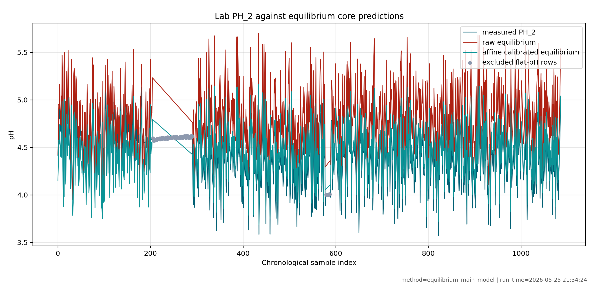
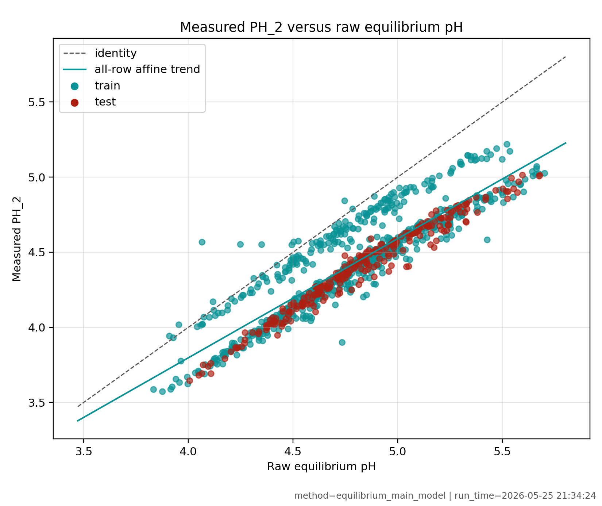
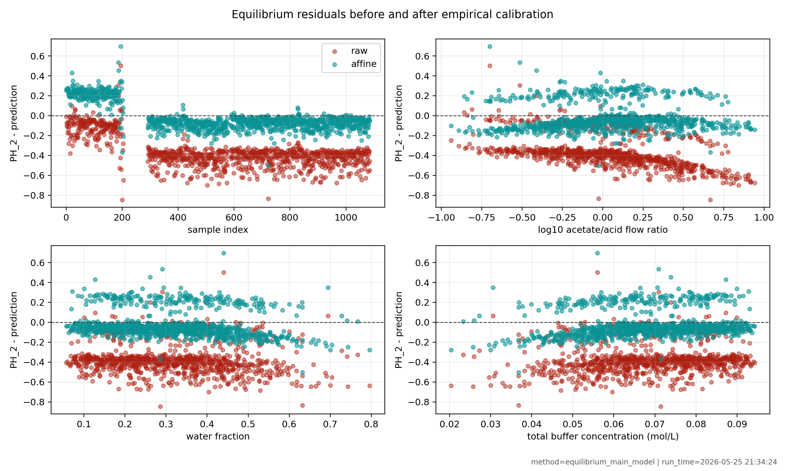
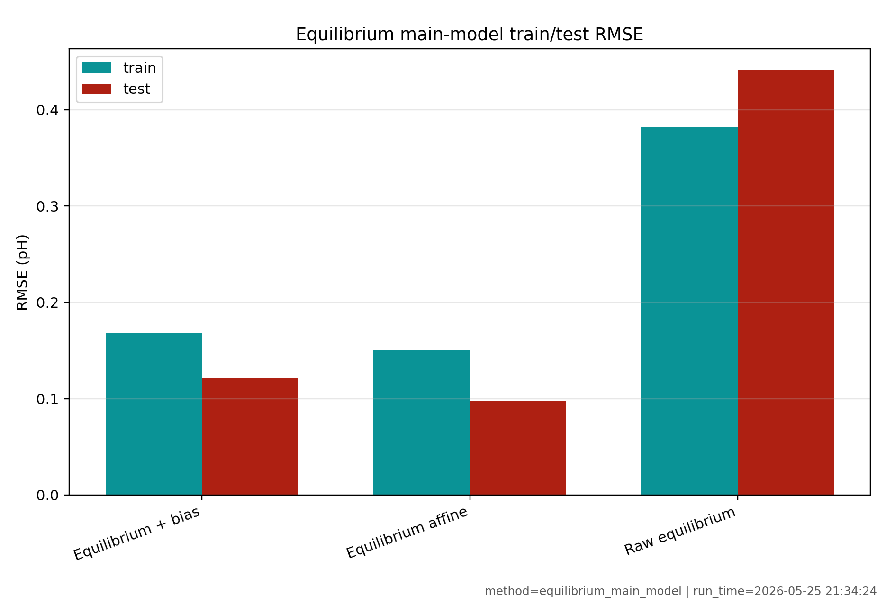
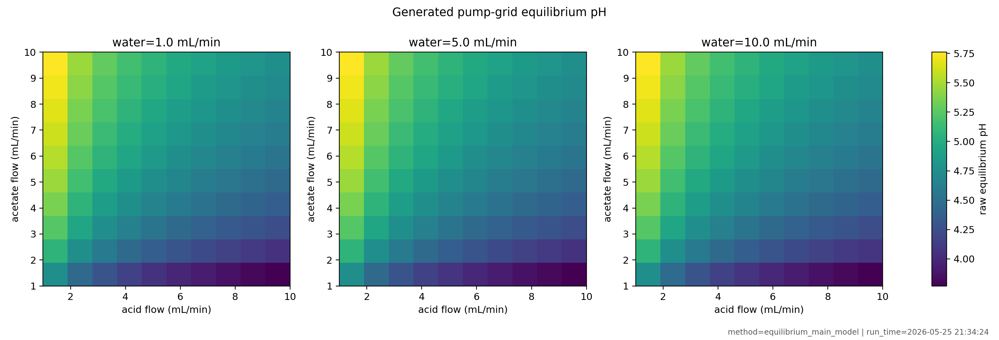
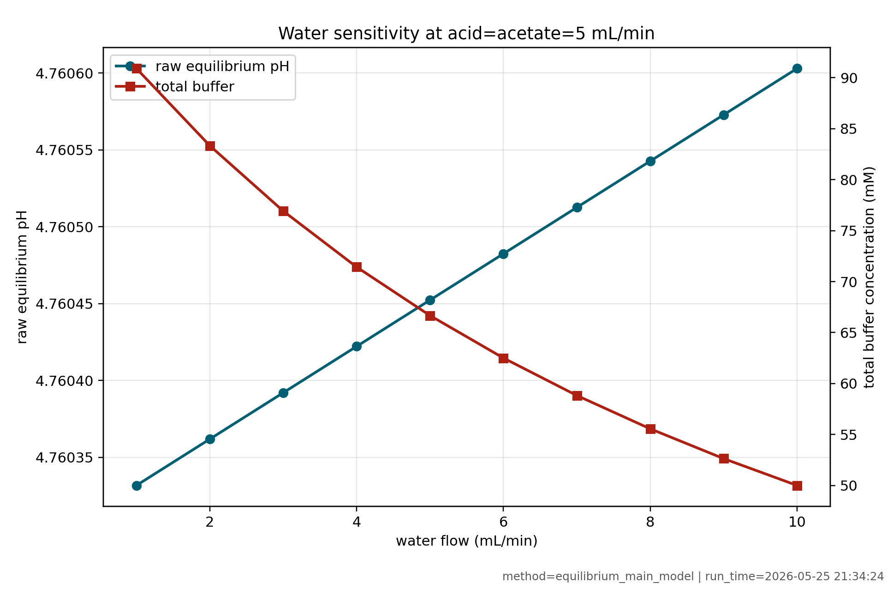

# Data, BioSMB Plumbing, And Affine Equilibrium pH Model


## Objective

This report summarizes the data used for pH model validation and the current
equilibrium charge-balance model with its empirical affine correction to the
reliable outlet pH sensor, `PH_2`.

It is based on:

- `reports/dynamic_model_identification_report.md`,
- `reports/equilibrium_charge_balance_main_model_report.md`,
- `reports/biosmb_ph_plumbing_smoke_test_report.md`.

This report intentionally focuses only on:

- the BioSMB pH plumbing interpretation,
- the lab data and preprocessing,
- the equilibrium charge-balance chemistry model,
- the affine calibration from equilibrium pH to measured `PH_2`,
- the figures that support those points.

It does not cover Henderson-Hasselbalch results, transport-delay fitting,
first-order dynamic wrappers, MPC, RL, rewards, policies, or feedback control.

## BioSMB pH Plumbing Interpretation

The current pH setup uses three inlet streams:

| Item | Current interpretation |
| --- | --- |
| Pump 1 | Do not use, reported not working |
| Pump 2 | Acetic acid inlet |
| Pump 3 | Sodium acetate inlet |
| Pump 4 | Arium water inlet |
| `P2` | Valve at column `P`, row 2, aligned with acetic acid row |
| `P3` | Valve at column `P`, row 3, aligned with sodium acetate row |
| `P4` | Valve at column `P`, row 4, aligned with water row |
| `PH_2` | Reliable outlet pH measurement |
| `PH_1` | Diagnostic only, not a validation output |

The BioSMB valve labels are coordinates, not pump numbers. The expert sketch
opens `P2`, `P3`, and `P4`, meaning the far-right `P` column on the three pH
inlet rows. The reliable pH measurement is:

```python
current_ph = biosmb.get_ph(2)
```

The physical outlet tubing downstream of the routed `PH_2` path still needs
hardware confirmation. For model validation, the current historical CSV uses
the recorded flow columns described below.

## Source Data

The source lab file is:

```text
Data/dsp_db.biosmb-rl-controller-treated-dataset.csv
```

The raw CSV has `1086` rows and `41` columns. Rows are sorted
chronologically before modeling.

The fixed model-validation mapping is:

| Quantity | CSV column | Modeling role |
| --- | --- | --- |
| measured pH | `observation.biosmb-sensors.PH_2` | only reliable output |
| acetic acid flow | `observation.biosmb-flows[0]` | model input |
| sodium acetate flow | `observation.biosmb-flows[1]` | model input |
| Arium water flow | `observation.biosmb-flows[2]` | model input |
| pH sensor 1 | `observation.biosmb-sensors.PH_1` | diagnostic only |
| target pH | `target_ph` | controller log, not a model-validation output |

The historical CSV flow columns use zero-based array names from the logged data.
That is separate from the current live BioSMB pump numbering, where the pH
experiment is interpreted as pumps 2, 3, and 4.

## Raw Column Groups

The raw columns fall into these groups:

| Group | Examples | Current modeling use |
| --- | --- | --- |
| Time and trial labels | `_id`, `utc_time`, `episode_number`, `step_number` | chronological sorting and trial segmentation |
| Controller objective | `target_ph` | excluded from model-validation metrics |
| Pressure sensors | `P_1` through `P_7` | diagnostic only |
| pH sensors | `PH_1`, `PH_2` | `PH_2` only is the validation output |
| Conductivity sensors | `COND_1` through `COND_4` | diagnostic only |
| UV sensors | `UV_1A` through `UV_4C` | diagnostic only |
| Flow channels | `biosmb-flows[0]` through `[6]` | `[0]`, `[1]`, `[2]` are acid, acetate, water |
| Reservoir masses | acid, sodium acetate, water mass columns | diagnostic only |

Important raw-data observations from the dynamic-identification report:

- Flow channels `[3]` through `[6]` are constant zero and are not part of this
  pH mixing setup.
- `PH_2` ranges from about `3.5717` to `5.2186`.
- `PH_1` ranges from about `1.8568` to `9.1226` and is not trusted for this
  experiment.
- `target_ph` ranges from `3.7` to `5.7`, but it is a controller objective log,
  not a measured plant output.
- The mass columns may help later with consumption or pump-consistency checks,
  but they are not used in the present inlet-flow-to-pH model.

The raw-column profile is saved here:

```text
results/dynamic_model_identification_20260522_133621/tables/raw_column_profile.csv
```

## Processed Modeling Table

The preprocessing step creates a table with explicit pH-modeling names and
derived coordinates.

| Processed column | Meaning |
| --- | --- |
| `sample_index` | chronological row number |
| `utc_datetime` | parsed timestamp |
| `elapsed_s`, `elapsed_min`, `elapsed_h` | elapsed time from the first sample |
| `dt_s` | time since the previous logged row |
| `session_id` | increments after long gaps greater than `900 s` |
| `trial_id` | increments after session breaks, episode resets, or step resets |
| `ph_measured` | renamed `PH_2`, the measured output |
| `acid_flow` | renamed `observation.biosmb-flows[0]` |
| `acetate_flow` | renamed `observation.biosmb-flows[1]` |
| `water_flow` | renamed `observation.biosmb-flows[2]` |
| `total_flow` | \(F_T = F_H + F_A + F_W\) |
| `flow_ratio_acetate_acid` | \(F_A/F_H\) |
| `log10_flow_ratio_acetate_acid` | \(\log_{10}(F_A/F_H)\) |
| `valid_for_model` | inclusion flag for fitting and metrics |
| `uninformative_flat_ph_trial` | audit flag for flat-pH trials with strong input-ratio motion |
| `acid_analytical_mol_l` | mixed acetic acid analytical concentration |
| `acetate_analytical_mol_l` | mixed sodium acetate analytical concentration |
| `total_buffer_mol_l` | total acetate-family concentration |
| `sodium_mol_l` | sodium counter-ion concentration |
| `ph_equilibrium_charge_balance` | raw equilibrium pH before calibration |

The processed model table is saved here:

```text
results/dynamic_model_identification_20260522_133621/tables/preprocessed_lab_data.csv
```

The latest equilibrium main-model workflow saves its own processed table here:

```text
results/equilibrium_main_model_20260525_213424/tables/preprocessed_lab_data.csv
```

## Valid Rows And Flat-pH Trial Filtering

Rows with nonpositive acid, acetate, or water flow are excluded from model
metrics. The preprocessing also flags low-information flat-pH trials.

The rule is:

$$
\Delta PH_2 \le 0.05
$$

$$
\Delta \log_{10}(F_A/F_H) \ge 0.5
$$

with at least `5` trial samples.

This rule identifies trials where the chemistry input changes strongly but
`PH_2` barely moves. Those rows are kept for audit, but they are excluded from
`valid_for_model`.

The key excluded region is around sample indices `205-290`, corresponding to
trials `8`, `9`, and `10`.

| Region | Trials | Rows | Model-valid rows after filtering | `PH_2` range | \(\log_{10}(F_A/F_H)\) range |
| --- | --- | ---: | ---: | ---: | ---: |
| before flat region | `0-7` | `205` | `205` | `3.9301-5.2186` | `-0.8589` to `0.7757` |
| flat region | `8-10` | `86` | `0` | `4.5718-4.6248` | `-0.8657` to `0.7988` |
| after flat region | `11-84` | `795` | `785` | `3.5717-5.0708` | `-0.9387` to `0.9417` |

The resulting validation set used in the equilibrium main-model report has:

| Split | Valid rows |
| --- | ---: |
| train | `731` |
| held-out test | `259` |
| all valid rows | `990` |

## Sampling Time

The data are time-series data, but the sample period is not globally uniform.
This matters because the current CSV is not ideal for identifying physical
transport or probe dynamics.

| Group | Median `dt_s` | 5-95 percent range | Interpretation |
| --- | ---: | --- | --- |
| overall | `69.984 s` | `69.062-142.487 s` | mixture of one-minute, two-minute, and session-gap intervals |
| indices `0-204` | `141.907 s` | `140.794-143.065 s` | early regime is about `2.36 min` |
| indices `205-290` | `141.392 s` | `140.142-142.467 s` | flat excluded regime is also about `2.36 min` |
| indices `291-end` | `69.424 s` | `69.030-140.406 s` | later regime is mostly about `1.16 min` |

The sampling diagnostics are saved here:

```text
results/dynamic_model_identification_20260522_133621/tables/sampling_summary.csv
```

## Data Evidence

The figure below shows the measured `PH_2`, inlet flow commands, total flow,
and acid/acetate log-ratio coordinate over the chronological sample index. The
highlighted regions mark the low-information flat-pH behavior and held-out
test portions.


The distribution plot shows that the flat region does not simply have a narrow
input range. The acid, acetate, water, total-flow, and log-ratio distributions
remain broad, while measured `PH_2` is unusually compressed.


## Equilibrium Charge-Balance Model

The equilibrium model is the main first-principles chemistry core because it
uses all three inlet streams:

- \(F_H\): acetic acid flowrate,
- \(F_A\): sodium acetate flowrate,
- \(F_W\): Arium water flowrate.

The total flow is:

$$
F_T = F_H + F_A + F_W
$$

The stock concentrations are:

$$
C_{H,0} = 0.1\ \mathrm{mol/L}
$$

$$
C_{A,0} = 0.1\ \mathrm{mol/L}
$$

After ideal inline mixing:

$$
C_H = C_{H,0}\frac{F_H}{F_T}
$$

$$
C_A = C_{A,0}\frac{F_A}{F_T}
$$

The total analytical acetate-family concentration is:

$$
C_T = C_H + C_A
$$

The sodium concentration from the sodium acetate stream is:

$$
C_{Na} = C_A
$$

For acetic acid:

$$
K_a = 10^{-pK_a}
$$

with:

$$
pK_a = 4.76
$$

Given \(H = [H^+]\), the acetate speciation is:

$$
[A^-] = \frac{C_T K_a}{K_a + H}
$$

Water self-ionization contributes:

$$
[OH^-] = \frac{K_w}{H}
$$

with:

$$
K_w = 10^{-14}
$$

The charge-balance residual is:

$$
f(H) =
H + C_{Na}
- \frac{C_TK_a}{K_a + H}
- \frac{K_w}{H}
$$

The model solves:

$$
f(H) = 0
$$

and reports:

$$
pH_{eq} = -\log_{10}(H)
$$

## Why Water Is Included

With equal acid and acetate stock concentrations, water does not directly
change the ideal Henderson-Hasselbalch ratio:

$$
\frac{F_A}{F_H}
$$

However, water is still physically important. It changes:

- total flow \(F_T\),
- total buffer concentration \(C_T\),
- sodium concentration \(C_{Na}\),
- dilution and conductivity,
- future residence time and transport delay,
- the sensitivity of the measured pH response.

That is why the charge-balance model is a better core for future dynamic
identification than a ratio-only expression.

## Affine Calibration To PH_2

The raw equilibrium model is not accurate enough as a direct plant-output
predictor. The observed `PH_2` is lower and compressed relative to raw
equilibrium pH.

The empirical affine measurement map is:

$$
\widehat{PH}_{2,k} = b_0 + b_1pH_{eq,k}
$$

The fitted calibration from the current main equilibrium report is:

$$
PH_2 \approx 0.6567 + 0.7909\,pH_{eq}
$$

This calibration is fit on training trials only.

The slope below `1` is important. It means the measured pH response is
compressed relative to ideal equilibrium chemistry. This is more than a simple
constant pH bias. If the mismatch were only a pKa shift or sensor offset, the
slope would remain closer to `1`.

## Validation Metrics

The metrics below come from:

```text
results/equilibrium_main_model_20260525_213424/tables/lab_metrics.csv
```

| Model stage | Split | N | Mean error | MAE | RMSE | Max abs |
| --- | --- | ---: | ---: | ---: | ---: | ---: |
| Raw equilibrium | train | `731` | `-0.3430` | `0.3470` | `0.3819` | `0.8453` |
| Raw equilibrium | test | `259` | `-0.4337` | `0.4337` | `0.4412` | `0.6749` |
| Raw equilibrium | all | `990` | `-0.3668` | `0.3697` | `0.3982` | `0.8453` |
| Equilibrium + bias | test | `259` | `-0.0906` | `0.0926` | `0.1216` | `0.3319` |
| Equilibrium affine | train | `731` | `0.0000` | `0.1223` | `0.1500` | `0.6949` |
| Equilibrium affine | test | `259` | `-0.0805` | `0.0822` | `0.0975` | `0.2470` |
| Equilibrium affine | all | `990` | `-0.0211` | `0.1118` | `0.1382` | `0.6949` |

The raw equilibrium model overpredicts measured `PH_2` by about `0.37 pH` on
average. On the held-out test split, raw equilibrium has:

```text
RMSE = 0.4412 pH
mean error = -0.4337 pH
```

After affine calibration, the held-out test result improves to:

```text
RMSE = 0.0975 pH
mean error = -0.0805 pH
max absolute error = 0.2470 pH
```

The affine model is therefore the best current static empirical predictor.
It should still be treated as a calibrated chemistry coordinate, not as a fully
validated dynamic plant simulator.

## Equilibrium And Affine Model Figures

The time-response plot shows that the raw equilibrium pH is consistently higher
than measured `PH_2`, while the affine-calibrated equilibrium prediction is on
the measured pH scale.



The scatter plot shows the measured `PH_2` scale relative to raw equilibrium
pH. The fitted trend is below the identity line, which visually supports the
affine compression.



The residual plots show how calibration reduces the strong negative raw
residuals. Residual structure remains, which is why the model is not yet a
complete plant simulator.



The train/test RMSE comparison summarizes the effect of moving from raw
equilibrium to bias-only and affine calibration.



## Generated Pump-Grid And Water-Dilution Figures

The generated pump grid sweeps all three pumps over the configured bounds:

$$
1 \le F_H, F_A, F_W \le 10\ \mathrm{mL/min}
$$

The raw equilibrium pH range across the grid is about `3.7697-5.7602`. The
affine-calibrated pH range is about `3.6382-5.2125`.



The water-dilution figure shows that water changes buffer strength and total
flow even when the acid/acetate ratio remains fixed.



## What The Model Can And Cannot Be Used For

The current equilibrium affine model can be used for:

- computing a physically structured pH coordinate from acid, acetate, and water
  flows,
- explaining why `PH_2` is compressed relative to raw equilibrium chemistry,
- generating offline pump-grid and target-flow tables,
- designing open-loop pH identification experiments,
- serving as the static chemistry block for a later dynamic model.

It should not yet be used for:

- autonomous feedback control,
- MPC or RL policy implementation,
- claiming exact pH from raw equilibrium chemistry alone,
- estimating physical transport delay from this CSV,
- using `PH_1` or `target_ph` as validation outputs.

## Main Interpretation

The main result is:

$$
PH_2 \approx 0.6567 + 0.7909\,pH_{eq}
$$

This means the charge-balance calculation is useful, but it must currently be
mapped onto the measured `PH_2` scale. The affine model reduces held-out test
RMSE from `0.4412 pH` to `0.0975 pH`.

The remaining residuals and the nonstationary data behavior show that a static
model is still incomplete. The next safe step is a designed open-loop dynamic
identification experiment that can separate:

```text
flow commands -> equilibrium chemistry -> delay -> mixing -> pH sensor -> PH_2
```

Only after that dynamic model predicts held-out `PH_2` reliably should
controller work be added.
