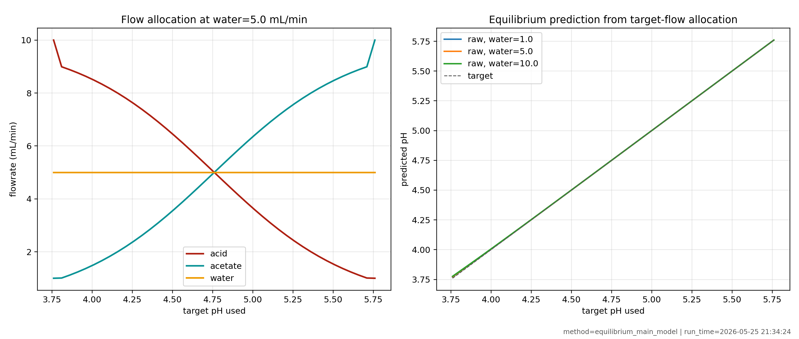

# Equilibrium Charge-Balance Main Model Report

This report promotes **Model 2: Equilibrium Charge Balance** as the main
first-principles chemistry core for the acetate-buffer pH project.

The model is useful because it includes all three inlet streams:

- acetic acid flow, `acid_flow`,
- sodium acetate flow, `acetate_flow`,
- Arium water flow, `water_flow`.

The important qualification is that the raw equilibrium prediction is not yet a
validated standalone plant simulator. Against the available lab CSV, it needs an
empirical affine measurement correction to match the reliable outlet pH sensor,
`PH_2`.

The reproducible runner for this report is:

```text
run_equilibrium_main_model_report.py
```

The generated artifacts are saved in:

```text
results/equilibrium_main_model_20260525_213424/
```

## Modeling Role

The current model should be used as:

```text
first-principles chemistry core + empirical PH_2 calibration
```

It should not yet be used as:

```text
standalone closed-loop plant simulator
```

The best current static relation from this report is:

$$
PH_2 \approx 0.6567 + 0.7909\,pH_{eq}
$$

This line is fitted on training trials only. The slope below `1` means the
measured pH response is compressed relative to ideal equilibrium chemistry.

## Data And Sensor Mapping

The source lab file is:

```text
Data/dsp_db.biosmb-rl-controller-treated-dataset.csv
```

The model-validation mapping is fixed:

| Quantity | CSV column | Role |
| --- | --- | --- |
| measured pH | `observation.biosmb-sensors.PH_2` | only reliable validation output |
| acetic acid flow | `observation.biosmb-flows[0]` | model input |
| sodium acetate flow | `observation.biosmb-flows[1]` | model input |
| Arium water flow | `observation.biosmb-flows[2]` | model input |

`PH_1` is not used. The logged controller target is also not used for
model-validation metrics.

The preprocessing keeps the raw rows for audit, but excludes rows with invalid
flows and the known low-information flat-pH trials. The resulting validation set
has `990` valid rows: `731` train rows and `259` held-out test rows.

## Mathematical Model

Let:

- \(F_H\) be the acetic acid flowrate,
- \(F_A\) be the sodium acetate flowrate,
- \(F_W\) be the Arium water flowrate,
- \(F_T\) be the total flowrate.

Then:

$$
F_T = F_H + F_A + F_W
$$

The stock concentrations are currently:

$$
C_{H,0} = 0.1\ \mathrm{mol/L}
$$

$$
C_{A,0} = 0.1\ \mathrm{mol/L}
$$

After ideal inline mixing, the analytical acid and acetate concentrations are:

$$
C_H = C_{H,0}\frac{F_H}{F_T}
$$

$$
C_A = C_{A,0}\frac{F_A}{F_T}
$$

The total analytical acetate-family concentration is:

$$
C_T = C_H + C_A
$$

Because the acetate stream is sodium acetate, the sodium counter-ion
concentration is:

$$
C_{Na} = C_A
$$

For acetic acid:

$$
K_a = 10^{-pK_a}
$$

The current configuration uses:

$$
pK_a = 4.76
$$

Given a hydrogen ion concentration \(H = [H^+]\), acetate speciation is:

$$
[A^-] = \frac{C_T K_a}{K_a + H}
$$

and:

$$
[HA] = \frac{C_T H}{K_a + H}
$$

Water self-ionization contributes:

$$
[OH^-] = \frac{K_w}{H}
$$

with:

$$
K_w = 10^{-14}
$$

Electroneutrality requires:

$$
H + C_{Na} = [A^-] + [OH^-]
$$

Substituting the equilibrium expressions gives the scalar residual:

$$
f(H) =
H + C_{Na}
- \frac{C_T K_a}{K_a + H}
- \frac{K_w}{H}
$$

The model solves:

$$
f(H) = 0
$$

over the positive hydrogen concentration interval and reports:

$$
pH_{eq} = -\log_{10}(H)
$$

Finally, the measurement/process calibration used in this report is:

$$
PH_{2,k} = b_0 + b_1 pH_{eq,k} + \epsilon_k
$$

where:

$$
b_0 = 0.6567
$$

$$
b_1 = 0.7909
$$

This correction is empirical. It is a practical map from the equilibrium
chemistry coordinate to the observed `PH_2` scale in the current CSV.

## Why This Is The Main Chemistry Core

The Henderson-Hasselbalch model is useful, but it only represents the ideal
buffer ratio:

$$
pH = pK_a + \log_{10}\left(\frac{F_A}{F_H}\right)
$$

With equal acid and acetate stock concentrations, water cancels out of that
ratio. The equilibrium charge-balance model keeps the same buffer-ratio
intuition, but it also includes:

- analytical dilution by \(F_T\),
- total buffer concentration \(C_T\),
- sodium charge \(C_{Na}\),
- water self-ionization through \(K_w\),
- the three-stream flow structure needed by later residence-time and delay
  models.

For future control-oriented modeling, that makes the charge-balance model the
better first-principles core. The current evidence says it should be calibrated,
not discarded.

## Literature Connection

[McAvoy, Hsu, and Lowenthal (1972)](https://pubs.acs.org/doi/10.1021/i260041a013)
is a classical first-principles pH reactor modeling reference. It supports the
idea that pH dynamics should be built from chemistry plus physical reactor
dynamics, not from a purely linear static fit.

[Waller and Makila (1981)](https://pubs.acs.org/doi/10.1021/i200012a001)
formalized reaction invariants and variants for reactor modeling, simulation,
and control. That viewpoint is useful here because the conserved analytical
quantities \(C_T\) and \(C_{Na}\) can drive an equilibrium pH calculation.

[Gustafsson and Waller (1983)](https://www.sciencedirect.com/science/article/pii/0009250983801572)
directly connects dynamic pH modeling with reaction-invariant ideas. Their
framework supports the structure used here: fast acid-base chemistry can be
represented by a static equilibrium relation, while transport, mixing, and
sensor behavior should be modeled as physical dynamics around that relation.

[Hermansson and Syafiie (2015)](https://www.sciencedirect.com/science/article/pii/S0967066115300162)
review MPC for pH neutralization and emphasize the nonlinear and transient
behavior that makes pH control difficult. This report does not implement MPC,
but the review supports the conclusion that careful identification must come
before controller design.

## Available-Data Validation

The lab validation table is:

```text
results/equilibrium_main_model_20260525_213424/tables/lab_equilibrium_model_comparison.csv
```

The metrics table is:

```text
results/equilibrium_main_model_20260525_213424/tables/lab_metrics.csv
```

| Model stage | Split | N | Mean error | MAE | RMSE | Max abs |
| --- | --- | ---: | ---: | ---: | ---: | ---: |
| Raw equilibrium | train | 731 | -0.3430 | 0.3470 | 0.3819 | 0.8453 |
| Raw equilibrium | test | 259 | -0.4337 | 0.4337 | 0.4412 | 0.6749 |
| Raw equilibrium | all | 990 | -0.3668 | 0.3697 | 0.3982 | 0.8453 |
| Equilibrium + bias | test | 259 | -0.0906 | 0.0926 | 0.1216 | 0.3319 |
| Equilibrium affine | train | 731 | 0.0000 | 0.1223 | 0.1500 | 0.6949 |
| Equilibrium affine | test | 259 | -0.0805 | 0.0822 | 0.0975 | 0.2470 |
| Equilibrium affine | all | 990 | -0.0211 | 0.1118 | 0.1382 | 0.6949 |

The raw model overpredicts the measured `PH_2` by about `0.37 pH` on average.
The held-out raw test RMSE is `0.4412 pH`, so raw equilibrium is not accurate
enough by itself.

The affine correction substantially improves the held-out test result:

```text
test RMSE: 0.0975 pH
test mean error: -0.0805 pH
test max absolute error: 0.2470 pH
```

Correlation is not enough to validate a pH model. The raw model has strong
trend agreement, but its bias and residual magnitude are too large. The affine
calibration is therefore part of the current main model.


## Generated Pump-Grid Data

The generated pump-grid table is:

```text
results/equilibrium_main_model_20260525_213424/tables/generated_pump_grid.csv
```

The grid sweeps all three pumps over the configured bounds:

$$
1 \le F_H \le 10
$$

$$
1 \le F_A \le 10
$$

$$
1 \le F_W \le 10
$$

using `10` points per axis, for `1000` generated points.

Key generated ranges are:

| Quantity | Min | Mean | Max |
| --- | ---: | ---: | ---: |
| raw equilibrium pH | 3.7697 | 4.7612 | 5.7602 |
| affine-calibrated pH | 3.6382 | 4.4224 | 5.2125 |
| total buffer concentration, mol/L | 0.0167 | 0.0667 | 0.0952 |
| water fraction | 0.0476 | 0.3333 | 0.8333 |

The pump-grid heatmap shows that pH is still dominated by the
acetate-to-acid ratio. Water changes the concentration scale and total flow, but
it does not flip the main ratio structure.


## Generated Target-Flow Sweep

The generated target-flow table is:

```text
results/equilibrium_main_model_20260525_213424/tables/generated_target_flow_sweep.csv
```

This sweep uses the useful acetate-buffer pH range:

$$
3.76 \le pH^{*} \le 5.76
$$

It creates a static allocation using:

$$
r^{*} = 10^{pH^{*} - pK_a}
$$

with:

$$
r^{*} = \frac{F_A}{F_H}
$$

and a fixed acid-plus-acetate flow target of `10 mL/min` before pump-bound
clipping. The sweep evaluates the resulting flow allocations with the
equilibrium model. This is generated analysis data, not feedback-control code.

The table has `123` rows: `41` pH targets at water flows `1`, `5`, and
`10 mL/min`.

The raw equilibrium prediction tracks the ideal target allocation closely:

| Quantity | Min | Mean | Max |
| --- | ---: | ---: | ---: |
| target pH used | 3.7600 | 4.7600 | 5.7600 |
| raw equilibrium pH | 3.7697 | 4.7619 | 5.7602 |
| raw equilibrium minus target | 0.0001 | 0.0019 | 0.0165 |
| affine calibrated minus target | -0.5475 | -0.3370 | -0.1164 |

The last row is important. The affine-calibrated output is lower than the ideal
target coordinate because the current lab measurement scale is lower and
compressed relative to equilibrium chemistry.



## Water And Dilution

In the ideal Henderson-Hasselbalch limit with equal acid and acetate stock
concentrations, water does not directly change:

$$
\frac{F_A}{F_H}
$$

so it does not directly change ideal pH.

In the charge-balance model, water still matters because it changes:

- \(F_T\), the total flowrate,
- \(C_T\), the total buffer concentration,
- \(C_{Na}\), the sodium charge concentration,
- dilution and measurement sensitivity,
- future residence time and transport delay.

For example, at `acid_flow = acetate_flow = 5 mL/min`, increasing water from
`1` to `10 mL/min` reduces the total buffer concentration from about
`90.9 mM` to `50.0 mM`. The pH remains near the acid/acetate balance point, but
the solution strength and throughput change substantially.


## What The Model Can Be Used For

The model can currently be used for:

- computing a physically structured pH coordinate from acid, acetate, and water
  flows,
- generating safe offline pump-grid and target-flow tables,
- designing open-loop identification experiments,
- providing the chemistry block for later dynamic models,
- interpreting how water changes dilution and total flow.

The model should not yet be used for:

- autonomous feedback control,
- MPC or RL policy implementation,
- claiming exact steady-state pH from raw chemistry alone,
- estimating physical transport delay without better open-loop data,
- using `PH_1` or logged target values as validation outputs.

## Limitations

The current model does not include:

- activity-coefficient corrections for ionic strength,
- temperature dependence of \(K_a\) or \(K_w\),
- dissolved carbon dioxide effects,
- pH probe calibration drift,
- valve-routing or tubing-volume changes,
- static mixer residence time,
- transport delay to `PH_2`,
- pH sensor response dynamics,
- session-specific nonstationarity.

The previous dynamic-identification report found that the current closed-loop
CSV does not identify a meaningful nonzero transport delay. That does not mean
the real hardware has zero dead volume. It means this dataset does not resolve
that delay well enough.

## Recommended First Experiment

The next safe experiment should be open-loop dynamic identification, not
feedback control.

Run designed step tests using the BioSMB control library:

1. Reset hardware to a known safe state.
2. Configure a verified valve path to `PH_2`.
3. Hold total flow fixed and step the acid/acetate ratio.
4. Hold acid/acetate ratio fixed and step total flow or water flow.
5. Keep each condition long enough for `PH_2` to settle.
6. Log acid, acetate, water, total flow, `PH_2`, timestamps, valve path, pump
   mapping, tubing geometry, and sample period.
7. Shut down with zero flows, disabled pumps, and closed valves.

The decisive new evidence would be a time-series dataset where the raw
equilibrium coordinate, the affine calibration, transport delay, mixing
residence time, and pH sensor response can be separated.

Only after that dynamic model predicts `PH_2` reliably should controller work be
added.
