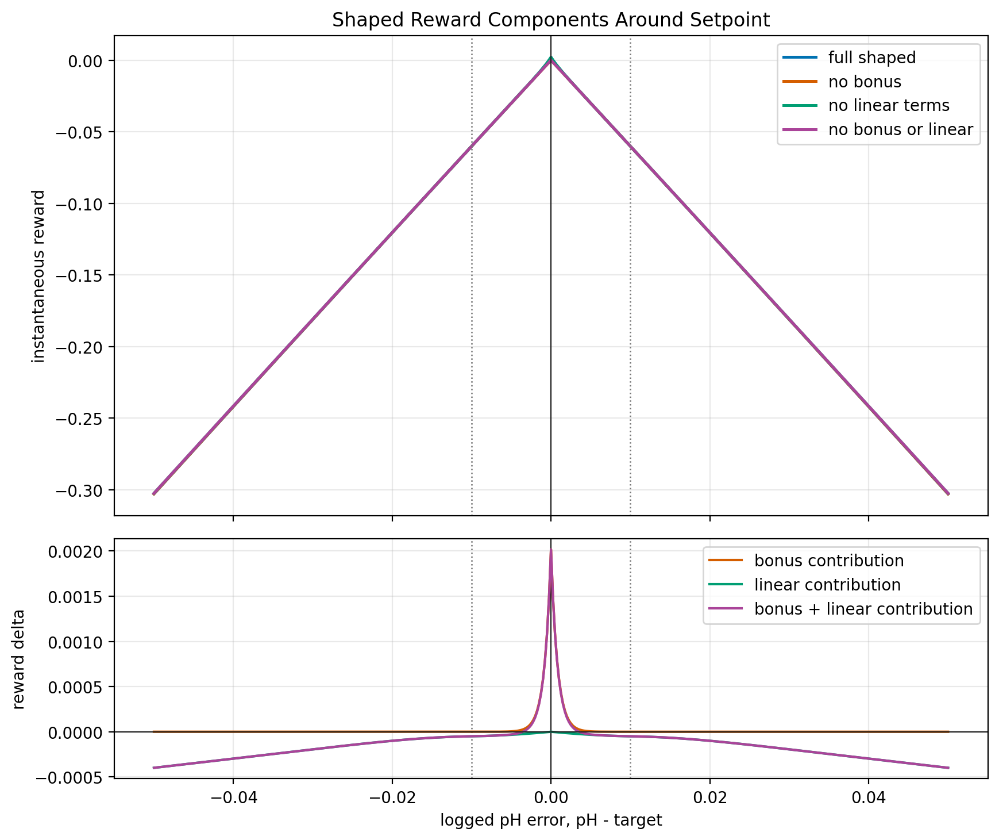

# Offline pH TD3 Method Report

## Objective

This report documents the current offline reinforcement-learning setup for the
pH control simulation. It is a method report, not a claim of laboratory
validation. The current environment is an ideal first-principles
Henderson-Hasselbalch simulator for the acetate buffer system, and the TD3
agent is trained only against this offline simulation.

The report will be expanded step by step. This first version records:

- the first-principles environment model,
- manipulated variables and controlled outputs,
- RL state and action definitions,
- TD3 network architecture and training settings,
- the shaped reward function,
- fixed physical and numerical parameters.

## First-Principles pH Environment

The simulated plant is the inline acetate buffer mixing system with three inlet
streams:

- acetic acid stock solution,
- sodium acetate stock solution,
- Arium water.

The first-principles model currently used in the RL environment is the ideal
Henderson-Hasselbalch relation. Let

- `F_HAc` be the acetic acid flowrate in mL/min,
- `F_Ac` be the sodium acetate flowrate in mL/min,
- `F_W` be the water flowrate in mL/min,
- `C_HAc` be the acetic acid stock concentration,
- `C_Ac` be the sodium acetate stock concentration.

The ideal buffer ratio is

$$
R =
\frac{C_{Ac} F_{Ac}}{C_{HAc} F_{HAc}} .
$$

The simulated pH is

$$
\mathrm{pH}
= pK_a + \log_{10}(R).
$$

Since the current acid and acetate stock concentrations are equal,

$$
C_{HAc} = C_{Ac} = 0.1~\mathrm{mol/L},
$$

the pH prediction reduces to

$$
\mathrm{pH}
= pK_a + \log_{10}\left(\frac{F_{Ac}}{F_{HAc}}\right).
$$

Water is still logged as a physical stream, but in this ideal
Henderson-Hasselbalch environment it does not directly change the acid/acetate
ratio because both stocks have equal concentration. In the real lab system,
water can still affect residence time, delay, mixing, buffer strength, and pH
sensor response. Those dynamic effects are not included in this offline RL
environment.

## Manipulated Inputs And Outputs

The physical pump variables are:

| Variable | Meaning | Current role |
|---|---|---|
| `acid_flow` or `F_HAc` | acetic acid flowrate | changed indirectly by the RL ratio action |
| `acetate_flow` or `F_Ac` | sodium acetate flowrate | changed indirectly by the RL ratio action |
| `water_flow` or `F_W` | Arium water flowrate | fixed at the default value |

The RL action is not a direct three-pump command in the current offline setup.
By default, the agent outputs two normalized actions:

$$
a_t =
\begin{bmatrix}
a^{\rho}_t \\
a^{S}_t
\end{bmatrix},
\qquad
a^{\rho}_t,a^{S}_t \in [-1,1].
$$

The first action, `a_ratio`, is mapped to a log acetate/acid ratio. The second
action, `a_buffer_sum`, is mapped to the total acid+acetate flow:

$$
\eta^{S}_t = \frac{a^{S}_t + 1}{2},
\qquad
S_t = S_{\min} + \eta^{S}_t(S_{\max}-S_{\min}).
$$

The current default bounds are

$$
S_{\min}=2~\mathrm{mL/min},
\qquad
S_{\max}=20~\mathrm{mL/min}.
$$

For the selected \(S_t\), the environment computes the feasible acid-flow
interval implied by the individual pump bounds:

$$
F^{\min}_{HAc}(S_t)=\max(F^{\min}_{HAc}, S_t-F^{\max}_{Ac}),
\qquad
F^{\max}_{HAc}(S_t)=\min(F^{\max}_{HAc}, S_t-F^{\min}_{Ac}).
$$

This gives a feasible acetate/acid ratio interval:

$$
R_{\min}(S_t)=\frac{S_t-F^{\max}_{HAc}(S_t)}
{F^{\max}_{HAc}(S_t)},
\qquad
R_{\max}(S_t)=\frac{S_t-F^{\min}_{HAc}(S_t)}
{F^{\min}_{HAc}(S_t)}.
$$

The ratio action is then mapped inside that feasible log-ratio interval. Define

$$
\eta^{\rho}_t = \frac{a^{\rho}_t + 1}{2},
$$

where `eta_ratio` is a unit-interval interpolation coordinate. The feasible
log-ratio is

$$
\ell_t =
\ell_{\min}(S_t)
+ \eta^{\rho}_t(\ell_{\max}(S_t) - \ell_{\min}(S_t)),
$$

where

$$
\ell_{\min}(S_t) = \log_{10}(R_{\min}(S_t)),
\qquad
\ell_{\max}(S_t) = \log_{10}(R_{\max}(S_t)).
$$

The commanded acetate-to-acid flow ratio is

$$
R_t = 10^{\ell_t}.
$$

The acid and acetate flows are then computed from the selected buffer-flow sum:

$$
F_{HAc,t} = \frac{S_t}{1 + R_t},
\qquad
F_{Ac,t} = S_t - F_{HAc,t},
\qquad
F_{W,t} = F_W^{\mathrm{fixed}}.
$$

For the current default runner,

$$
S_t \in [2,20]~\mathrm{mL/min},
\qquad
F_W^{\mathrm{fixed}} = 5~\mathrm{mL/min}.
$$

The older one-action fixed-sum setup is still available with
`--action-mode ratio`. In that ablation mode, \(S=15~\mathrm{mL/min}\) by
default and the agent controls only the ratio action.

The controlled output in the offline simulation is the simulated outlet pH.
The tracking target is `target_ph`. The logged tracking error is

$$
e^{\mathrm{log}}_t = \mathrm{pH}_t - \mathrm{pH}_{sp,t}.
$$

The reward function uses the opposite sign convention internally:

$$
e_t = \mathrm{pH}_{sp,t} - \mathrm{pH}_t.
$$

Both signs have the same absolute error and squared error. The report uses
`e_t = pH_sp,t - pH_t` in the reward section.

## RL State And Action

The default environment observation has dimension 5:

$$
s_t =
\begin{bmatrix}
\mathrm{pH}_t \\
\mathrm{pH}_{sp,t} \\
\mathrm{pH}_t - \mathrm{pH}_{sp,t} \\
a^{\rho}_{t-1} \\
a^{S}_{t-1}
\end{bmatrix}.
$$

The state components are:

| Index | State component | Meaning |
|---:|---|---|
| 0 | `current_ph` | current simulated pH |
| 1 | `target_ph` | current setpoint |
| 2 | `current_ph - target_ph` | signed pH tracking error |
| 3 | normalized ratio action | current acid/acetate log-ratio coordinate in `[-1, 1]` |
| 4 | normalized buffer-sum action | current acid+acetate total-flow coordinate in `[-1, 1]` |

The earlier `t/T` step-fraction state has been removed. The reason is that the
current task is steady-state setpoint tracking, not a finite-horizon trajectory
planning problem, so the normalized time state can encourage horizon-dependent
behavior that is not physically meaningful for steady holds.

The default action has dimension 2:

$$
a_t =
\begin{bmatrix}
a^{\rho}_t \\
a^{S}_t
\end{bmatrix},
\qquad
a^{\rho}_t,a^{S}_t \in [-1,1].
$$

The action is clipped to `[-1, 1]` before it is mapped to physical flows. For
ablation, `--action-mode ratio` keeps the old one-action form and uses the
state

$$
\begin{bmatrix}
\mathrm{pH}_t &
\mathrm{pH}_{sp,t} &
\mathrm{pH}_t-\mathrm{pH}_{sp,t} &
a^{\rho}_{t-1}
\end{bmatrix}^{T}.
$$

## TD3 Agent Architecture

The current runner constructs a TD3 agent with:

| Item | Current default |
|---|---:|
| State dimension | 5 |
| Action dimension | 2 |
| Actor hidden layers | `[128, 128]` |
| Critic hidden layers | `[128, 128]` |
| Activation | ReLU |
| Actor output squash | tanh |
| Maximum action magnitude | 1.0 |
| Layer normalization | disabled |
| Dropout | 0.0 |

The actor network is

$$
\pi_\theta:
\mathbb{R}^{5}
\rightarrow
\mathbb{R}^{2}.
$$

With the default hidden layers, the actor structure is:

$$
5 \rightarrow 128 \rightarrow 128 \rightarrow 2,
$$

with ReLU activations on the hidden layers and a final tanh squash so that the
output lies in `[-1, 1]`. The final actor linear layer is initialized uniformly
in `[-1e-3, 1e-3]` for both weights and bias to reduce early saturation.

The critic is a twin-Q critic. Each Q-network takes the concatenated
state-action vector:

$$
\begin{bmatrix}
s_t \\
a_t
\end{bmatrix}
\in \mathbb{R}^{7}.
$$

Each critic branch has structure:

$$
7 \rightarrow 128 \rightarrow 128 \rightarrow 1.
$$

The critic returns two estimates:

$$
Q_{\phi_1}(s_t,a_t),
\qquad
Q_{\phi_2}(s_t,a_t).
$$

The TD3 target uses the minimum of the two target critics by default.

## TD3 Training Settings

The current default runner settings are:

| Parameter | Value |
|---|---:|
| Total rollout steps | 500000 |
| Default setpoint hold length | 200 steps |
| Default number of setpoint cycles | 2500 |
| Default setpoint range source | lab-data `target_ph` range |
| Lab-data desired setpoint range | 3.7 to 5.7 pH |
| Resolved default training setpoint range | 3.76 to 5.7 pH |
| Batch size | 64 |
| Replay buffer capacity | 60000 |
| Discount factor `gamma` | 0.97 |
| Actor learning rate | 1e-4 |
| Critic learning rate | 1e-3 |
| Optimizer | AdamW |
| Critic loss | Huber |
| Gradient clip norm | 10.0 |
| Policy delay | 2 critic updates per actor update |
| Target update type | soft update |
| Soft update coefficient `tau` | 0.005 |
| Target policy smoothing noise std | 0.2 |
| Target policy smoothing noise clip | 0.5 |
| Target critic combine rule | min |
| Warm-start cycles | 0 |
| Evaluation cycle | final setpoint cycle |
| Save training checkpoint | yes, enabled by default |
| Save actor-only deployment bundle | yes in `ratio_buffer_sum` mode |

The offline runner now defaults to `500000` rollout steps, `gamma = 0.97`, actor
layers `[128, 128]`, critic layers `[128, 128]`, and batch size `64`. These
settings reproduce the experiment definition used by the selected successful
checkpoint. A new run still receives a new result directory and must be judged
from its own saved metrics before replacing existing weights.

The next run also writes a BioSMB-ready `deployment_bundle` containing the actor
manifest, actor weights, training checkpoint, and exact offline configuration.
The new checkpoint stores the actor/critic architecture, `gamma`, and optimizer
states. `Biosmb-run-online` reads the architecture and `gamma` from the trusted
checkpoint, restores the optimizer state, and starts a new empty 10000-sample
online replay buffer. All four generated model files must be copied together.

The default exploration mode is Gaussian action noise:

| Exploration parameter | Value |
|---|---:|
| Initial standard deviation | 0.35 |
| Final standard deviation | 0.02 |
| Decay mode | linear |
| Decay steps | 5000 |
| Exponential decay rate option | 0.99 |

The replay buffer is a mixed prioritized/recent/uniform buffer:

| Replay parameter | Value |
|---|---:|
| Prioritized replay fraction | 0.5 |
| Recent replay fraction | 0.2 |
| Uniform replay fraction | 0.3 |
| Recent window | 1000 |
| Prioritization exponent `alpha` | 0.6 |
| Importance beta start | 0.4 |
| Importance beta end | 1.0 |
| Importance beta steps | 50000 |

The active TD3 implementation instantiates `PERRecentReplayBuffer` directly.
No normal uniform-only replay buffer is used in the offline pH TD3 path.

## Reward Function

The current default reward mode in `run_offline_ph_td3_training.py` is
`relative_band_offset`. This reward starts from a relative-band shaped reward
and adds an explicit absolute-error penalty. The late-hold tail offset penalty
is still available as an ablation option, but it is off in the current default
because it dominated the reward magnitude in the previous run.

Let

$$
e_t = \mathrm{pH}_{sp,t} - \mathrm{pH}_t,
\qquad
|e_t| = \epsilon_t.
$$

The pH band is

$$
b_t =
\max(k_{rel}|\mathrm{pH}_{sp,t}|, b_{\min}, 10^{-12}).
$$

The current defaults use `k_rel = 0`, so

$$
b_t = b_{\min} = 0.01~\mathrm{pH}.
$$

The smooth inside-band weight is

$$
w^{in}_t =
\sigma\left(\frac{b_t - \epsilon_t}{\tau_t}\right),
\qquad
\tau_t = \tau_{frac} b_t,
$$

where `sigma(.)` is the logistic sigmoid. The normalized error is

$$
z_t = \frac{\epsilon_t}{b_t}.
$$

The main quadratic error term is

$$
J_{quad,t} = q_{band} e_t^2.
$$

The effective quadratic term is

$$
J_{eff,t}
=
(1-w^{in}_t)J_{quad,t}
+ w^{in}_t \lambda_{in}J_{quad,t}.
$$

Since the default `lambda_in` is 1, this currently reduces to
`J_eff,t = J_quad,t`, but the explicit form is kept for diagnostic consistency.

The old ratio-action move penalty is disabled in the default steady-state
tracking setup:

$$
r_{move}=0.
$$

Instead, the default move penalty is placed on the physical total acid+acetate
flow:

$$
J_{\Delta S,t}
= r_{\Delta S}
\left(
\frac{S_t-S_{t-1}}{S_{\max}-S_{\min}}
\right)^2.
$$

The current default uses

$$
r_{\Delta S}=5.0,
\qquad
S_{\min}=2~\mathrm{mL/min},
\qquad
S_{\max}=20~\mathrm{mL/min}.
$$

The linear outside-band and inside-band terms use the slope at the band edge:

$$
m_t = 2q_{band}b_t.
$$

The outside-band linear term is

$$
J_{lin,out,t}
=
(1-w^{in}_t)\gamma_{out}m_t
\,\max(\epsilon_t-b_t,0).
$$

The inside-band linear term is

$$
J_{lin,in,t}
=
w^{in}_t\gamma_{in}m_t
\,\min(\epsilon_t,b_t).
$$

The bonus term is

$$
J_{bonus,t}
=
w^{in}_t
\,w_{bonus}
f_{bonus}(z_t).
$$

Here \(w_{bonus}\) is an absolute reward-unit weight, not a weight multiplied
by \(b_t^2\). This matters because the pH band is only `0.01` pH. Scaling the
bonus by \(b_t^2\) would reduce the maximum bonus by \(10^{-4}\), making it
nearly invisible compared with the absolute pH-error penalty.

For the default exponential bonus shape,

$$
f_{bonus}(z)
=
\frac{\exp(-k_{bonus}\bar{z})-\exp(-k_{bonus})}
{1-\exp(-k_{bonus})},
\qquad
\bar{z} = \mathrm{clip}(z,0,1).
$$

The late-hold offset activation is computed from the setpoint-hold progress
`p_t`:

$$
h_t =
\mathrm{clip}
\left(
\frac{p_t-p_{start}}{1-p_{start}},
0,
1
\right).
$$

This optional term is only active when `tail_offset_weight > 0`. The current
default uses `tail_offset_weight = 0`, so the active default reward is

$$
r_t =
-\alpha
\left[
J_{eff,t}
+J_{\Delta S,t}
+J_{lin,out,t}
+J_{lin,in,t}
-J_{bonus,t}
+w_{|e|}\epsilon_t
\right].
$$

If a late-hold tail penalty is deliberately enabled for an ablation, the
additional cost is

$$
J_{tail,t}=w_{tail}h_t\epsilon_t.
$$

In simple terms, the shaped reward makes the pH band tight and attractive. The
`0.01` pH band defines the near-zero-offset region, the linear terms shape the
slope as the error moves inside or outside that band, the `0.05` reward-unit
bonus adds a visible attraction near exact tracking, and the total-flow penalty
discourages abrupt changes in the acid+acetate sum. The default is now
offset-focused without the extra late-hold tail term that previously dominated
the reward values.

The report-level reward-shape comparison is shown below. The same figure is
also saved by the offline TD3 result-artifact helper as
`fig_reward_shape_comparison.png`.



The default reward parameters used by the runner are:

| Reward parameter | Value |
|---|---:|
| Reward mode | `relative_band_offset` |
| `q_band` | 1.0 |
| `r_move` | 0.0 |
| `r_delta_S` or `sum_move_penalty_weight` | 5.0 |
| `b_min` or `band_floor_ph` | 0.01 |
| `k_rel` | 0.0 |
| `tau_frac` | 0.7 |
| `gamma_out` | 0.5 |
| `gamma_in` | 0.5 |
| legacy `beta` | 0.0 |
| `w_bonus` or `reward_bonus_weight` | 0.05 |
| `lambda_in` | 1.0 |
| `bonus_kind` | `exp` |
| `bonus_k` | 6.0 |
| `reward_scale` or `alpha` | 1.0 |
| `w_abs` or `absolute_error_weight` | 1.0 |
| `w_tail` or `tail_offset_weight` | 0.0 |
| `p_start` or `tail_start_fraction` | 0.75 |
| `default_flow_weight` | 0.0 |

The older three-term reward is still available for ablation:

$$
r_t =
-\left(q_2e_t^2 + q_1|e_t|
+ r_{\Delta u}\frac{1}{n_a}\sum_{i=1}^{n_a}
(a_{t,i}-a_{t-1,i})^2
\right).
$$

It can be selected with:

```powershell
--reward-mode three_term
```

## Fixed Physical Parameters

| Parameter | Value | Notes |
|---|---:|---|
| `pKa` | 4.76 | acetic acid buffer pKa used by ideal HH model |
| `Kw` | 1e-14 | configured but not used by the ideal HH environment |
| `acid_stock_mol_l` | 0.1 mol/L | acetic acid stock concentration |
| `acetate_stock_mol_l` | 0.1 mol/L | sodium acetate stock concentration |
| `acid_flow_min` | 1.0 mL/min | pump lower bound |
| `acid_flow_max` | 10.0 mL/min | pump upper bound |
| `acetate_flow_min` | 1.0 mL/min | pump lower bound |
| `acetate_flow_max` | 10.0 mL/min | pump upper bound |
| `water_flow_min` | 1.0 mL/min | pump lower bound |
| `water_flow_max` | 10.0 mL/min | pump upper bound |
| `default_buffer_flow_sum` | 10.0 mL/min | process-config default, not the current TD3 runner fixed sum |
| `fixed_buffer_flow_sum` | 15.0 mL/min | nominal/default sum and ratio-only fixed sum |
| `buffer_flow_sum_min` | 2.0 mL/min | minimum selectable `acid_flow + acetate_flow` |
| `buffer_flow_sum_max` | 20.0 mL/min | maximum selectable `acid_flow + acetate_flow` |
| `fixed_water_flow` | 5.0 mL/min | current water stream value |
| nominal target range | 3.76 to 5.76 pH | general process target bounds |
| lab-data desired target range | 3.7 to 5.7 pH | min/max of `target_ph` in `Data/dsp_db.biosmb-rl-controller-treated-dataset-weights.csv` |
| resolved default training target range | about 3.76 to 5.70 pH | lab-data range intersected with current process/reachable bounds |
| reachable default variable-sum target range | about 3.76 to 5.76 pH | due to variable 2-20 mL/min buffer sum and 1-10 mL/min pump bounds |
| reachable ratio-only target range | about 4.459 to 5.061 pH | due to fixed 15 mL/min buffer sum and 1-10 mL/min pump bounds |
| target tolerance | 0.02 pH | success flag threshold |

For the default variable-sum action, the acid+acetate sum can vary over:

$$
S_t \in [2,20]~\mathrm{mL/min}.
$$

The individual acid and acetate pumps still satisfy:

$$
F_{HAc,t},F_{Ac,t} \in [1,10]~\mathrm{mL/min}.
$$

The widest ideal-Henderson-Hasselbalch ratios occur when one buffer pump is at
its minimum and the other is at its maximum:

$$
R_{\min}=\frac{1}{10}=0.1,
\qquad
R_{\max}=\frac{10}{1}=10.
$$

With `pKa = 4.76`, the variable-sum setup can therefore span approximately

$$
\mathrm{pH}_{\min}=4.76+\log_{10}(0.1)=3.76,
\qquad
\mathrm{pH}_{\max}=4.76+\log_{10}(10)=5.76.
$$

For the ratio-only fixed-sum ablation with \(S=15~\mathrm{mL/min}\), the
feasible acid flow range becomes:

$$
F_{HAc} \in [5,10]~\mathrm{mL/min},
$$

and the feasible acetate flow range also becomes:

$$
F_{Ac} \in [5,10]~\mathrm{mL/min}.
$$

Thus

$$
R_{\min} = \frac{5}{10}=0.5,
\qquad
R_{\max} = \frac{10}{5}=2.
$$

With `pKa = 4.76`, this gives

$$
\mathrm{pH}_{\min}
=4.76+\log_{10}(0.5)
\approx 4.459,
$$

and

$$
\mathrm{pH}_{\max}
=4.76+\log_{10}(2)
\approx 5.061.
$$

## Current Environment Variables And Logged Quantities

The environment logs the following quantities in `info` and in the saved
trajectory table:

| Logged variable | Meaning |
|---|---|
| `ph` | simulated current pH |
| `target_ph` | current pH setpoint |
| `ph_error` | `ph - target_ph` |
| `acid_flow` | current acetic acid flow |
| `acetate_flow` | current sodium acetate flow |
| `water_flow` | current water flow |
| `buffer_flow_sum` | `acid_flow + acetate_flow` |
| `buffer_flow_sum_min` | lower bound for selectable acid+acetate sum |
| `buffer_flow_sum_max` | upper bound for selectable acid+acetate sum |
| `flow_ratio_acetate_acid` | `acetate_flow / acid_flow` |
| `log10_flow_ratio_acetate_acid` | log flow ratio |
| `ratio_action` | normalized ratio action |
| `normalized_buffer_sum_action` | normalized total-flow action |
| `molar_base_acid_ratio` | ideal molar base/acid ratio |
| `success` | true when `abs(ph-target_ph) <= 0.02` |
| `step_count` | step count within environment episode |
| `setpoint_hold_step` | step count within current held setpoint |
| `setpoint_hold_progress` | normalized setpoint-hold progress |
| reward component columns | shaped reward diagnostics |

The runner additionally logs:

| Runner variable | Meaning |
|---|---|
| `cycle` | setpoint-hold segment index |
| `is_warm_start` | whether Henderson-Hasselbalch warm-start action was used |
| `is_test` | whether the step belongs to the final deterministic evaluation cycle |
| `action_source` | `td3_explore`, `td3_eval`, or `warm_start_hh` |
| `action_ratio` | raw TD3 normalized action used for the ratio |
| `action_buffer_sum` | raw TD3 normalized action used for acid+acetate total flow |
| `exploration_sigma` | current Gaussian noise standard deviation |
| `exploration_magnitude` | mean absolute exploration noise |
| `action_saturation_fraction` | fraction of action dimensions at saturation |
| `critic_loss` | critic loss when a training update occurs |
| `actor_loss` | actor loss when a delayed actor update occurs |

## Latest Offline TD3 Result For Meeting

The latest full run is:

`results/offline_ph_td3_training_20260709_001341`

This completed run used the previous defaults: `200000` rollout steps,
`1000` setpoint cycles, `200` steps per setpoint, `batch_size = 128`,
`buffer_size = 60000`, lab-data setpoint range source, and the shaped
`relative_band_offset` reward with `sum_move_penalty_weight = 5.0`,
`reward_bonus_weight = 0.05`, and `tail_offset_weight = 0.0`.

The lab CSV desired setpoint range was `3.7` to `5.7` pH, and the simulator
resolved this to `3.76` to `5.7` pH after intersecting with the reachable
ideal-HH range.

| Scope | Steps | MAE | RMSE | Max \|e\| | Mean reward |
|---|---:|---:|---:|---:|---:|
| all steps | 200000 | 0.03360 | 0.06711 | 1.60821 | -0.03933 |
| post-decay training | 194800 | 0.02870 | 0.04511 | 0.88321 | -0.03010 |
| last 100 training cycles | 20000 | 0.03035 | 0.04914 | 0.55538 | -0.03225 |
| final evaluation cycle | 200 | 0.01838 | 0.01898 | 0.06393 | -0.01900 |
| final evaluation tail 150 steps | 151 | 0.01777 | 0.01777 | 0.01777 | -0.01817 |

The final deterministic evaluation target was `4.53664` pH, and the final pH
was `4.55441`. The final logged error was therefore `0.01777` pH. This is
inside the current `0.02` pH success tolerance, but it is not yet strong
evidence of robust offset-free control because it is one final target only.

The reward-component magnitudes show that the current reward is interpretable:

| Component | Share of gross positive cost |
|---|---:|
| absolute-error term | 81.81% |
| effective squared-error term | 10.97% |
| weighted total-flow move penalty | 6.58% |
| outside plus inside linear terms | 0.64% |
| late-hold tail term | 0.00% |
| bonus term | 4.22% negative cost |

The important finding is that the absolute bonus is now visible in reward
units and the late-hold tail term no longer dominates. Increasing the
total-flow move penalty to `5.0` also reduced the raw normalized total-flow
movement per step compared with the previous 100000-step absolute-bonus run,
although the comparison is not perfectly controlled because the setpoint
schedule and run length changed.

The main remaining weakness is edge behavior. In the latest run, low-edge
targets with `target_ph <= 3.90` had mean tail-50 MAE `0.06267` pH and median
tail-50 MAE `0.03568` pH, which is worse than the middle of the range. Since
the environment is static ideal Henderson-Hasselbalch, this is best explained
by action geometry near pump bounds rather than hidden process dynamics.

The next result needed for a meeting-quality claim is a frozen-policy
setpoint sweep. The actor should be trained with the current defaults, saved,
then evaluated without exploration or learning updates over a grid from
`3.76` to `5.7` pH. The sweep should report tail-50 MAE, final error,
flow commands, total-flow command, action saturation, and pump-bound activity
for each target.

Key figures from this run:


## Scope And Limitations

This setup is useful for testing the offline RL scaffold and reward design
under a clean static chemical map. It is not yet a validated controller for the
lab system.

Important limitations:

- the environment is static and ideal,
- no transport delay is included,
- no mixing or residence-time dynamics are included,
- no pH sensor response model is included,
- no lab-data mismatch or calibration bias is included,
- water does not affect the ideal pH ratio directly in this model,
- final-cycle evaluation is only one held setpoint unless additional evaluation
  sweeps are added.

The runner now saves per-setpoint average reward, last-25-setpoint tracking,
action diagnostics, flow diagnostics, reward-shape comparison figures, and
training-loss figures. Critic loss is plotted on a log axis when positive, and
actor loss is plotted on a signed-log axis because TD3 actor loss can be
negative.

The next addition to this report should be a quantitative interpretation of the
exact 500000-step reproduction run plus a frozen-policy evaluation sweep across
the reachable pH range.
