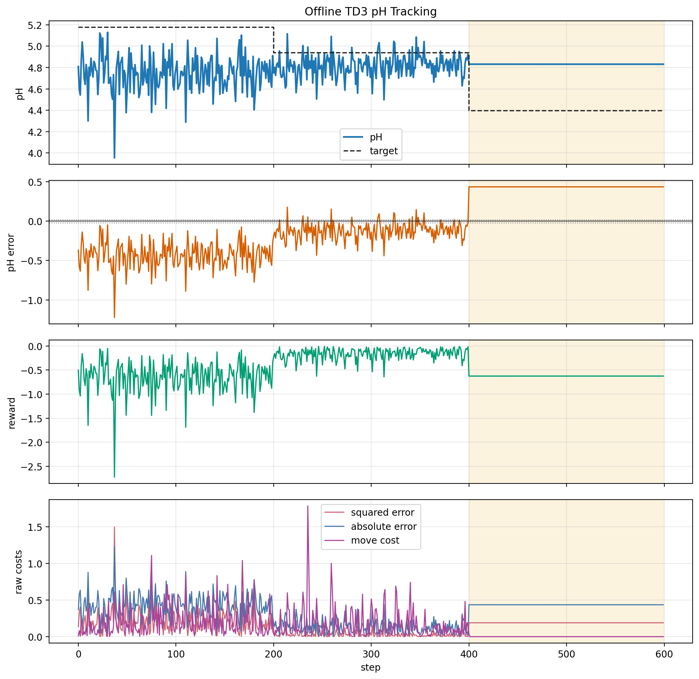
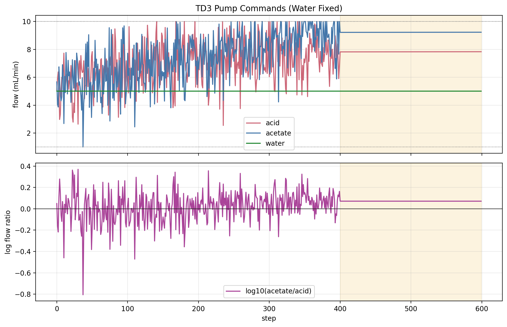
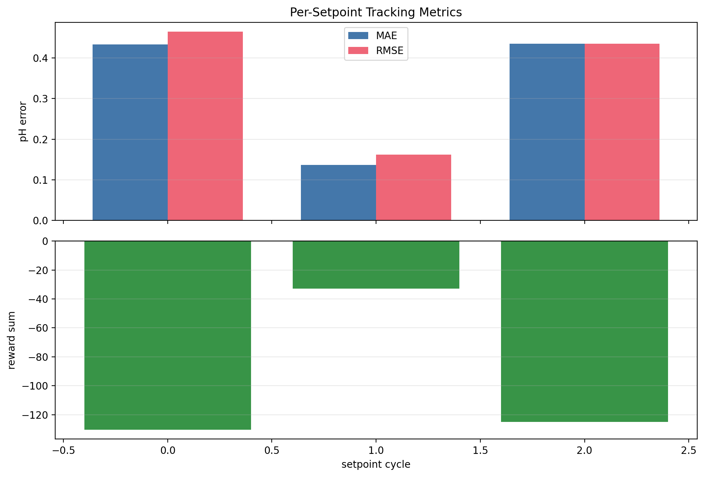
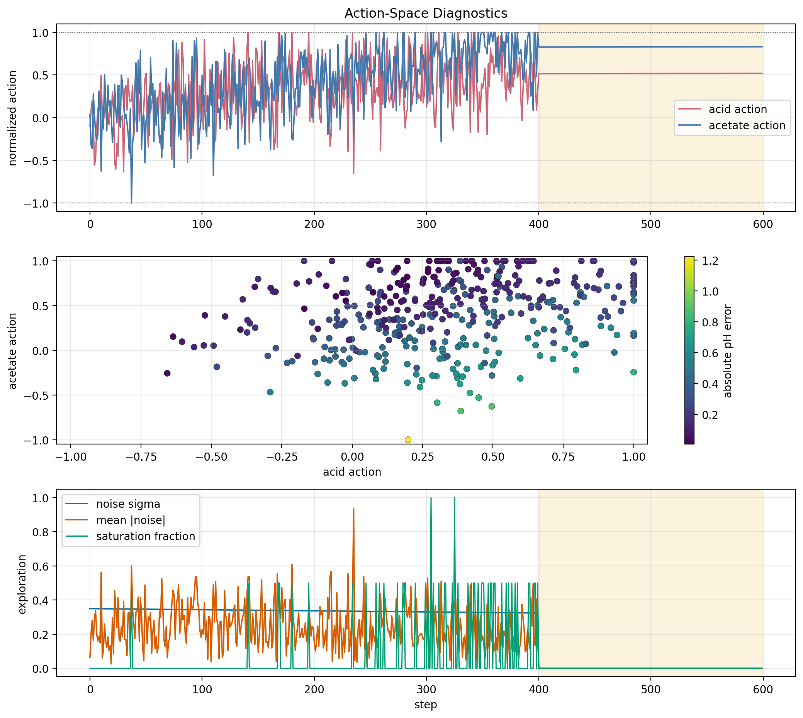
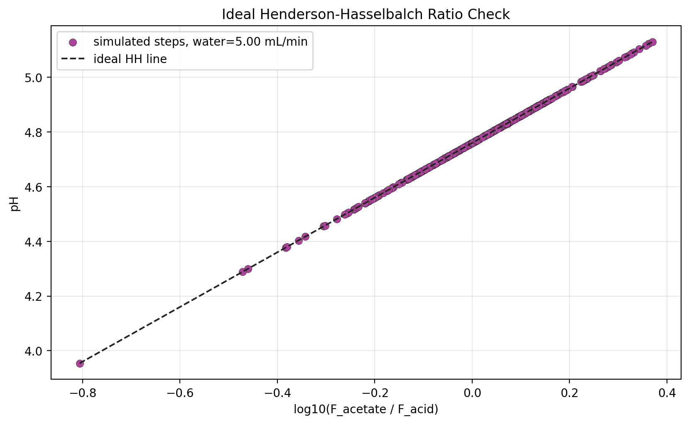
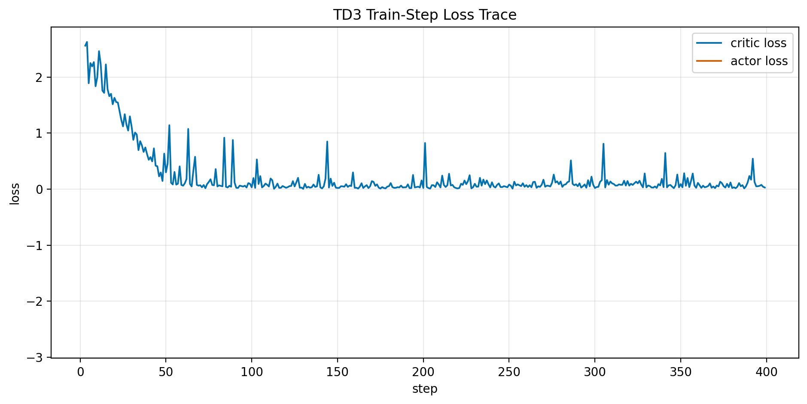

# Offline TD3 pH Tracking Result Analysis

Generated on 2026-07-01 21:19:18 from saved result files only.

## Scope

This report analyzes the current offline pH TD3 simulation output. It does not launch BioSMB, an OPC emulator, hardware, MPC, valves, or pumps. The source result folder is:

`results/offline_ph_td3_training_20260701_211724`

The purpose is to create editable figures and a first write-up around the new direct-flow TD3 scaffold. The result should be treated as an offline software diagnostic, not as a validated pH controller.

## Method

The environment state is the six-element vector

$$ s_t = [\mathrm{pH}_t,\ \mathrm{pH}^{\mathrm{sp}}_t,\ e_t,\ a_{HAc,t},\ a_{Ac,t},\ \tau_t], $$

where `e_t = pH_t - pH_sp,t`. The TD3 action is

$$ a_t = [a_{HAc,t},\ a_{Ac,t}],\quad a_i \in [-1,1]. $$

Each action coordinate is mapped to an acid or acetate pump command by

$$ F_i = F_{i,\min} + \frac{a_i + 1}{2}(F_{i,\max}-F_{i,\min}). $$

The water flow is not part of the action. It is fixed and logged at 5 mL/min in the current offline simulation.

The setpoint schedule uses `admissible_random` targets. Each setpoint is held for `200` steps, and this saved run contains `3` setpoint segments.

The plant pH is the accepted ideal Henderson-Hasselbalch relation

$$ \mathrm{pH} = pK_a + \log_{10}\left(\frac{C_{Ac} F_{Ac}}{C_{HAc} F_{HAc}}\right). $$

Because the current acid and acetate stock concentrations are equal, this reduces to

$$ \mathrm{pH} = pK_a + \log_{10}\left(\frac{F_{Ac}}{F_{HAc}}\right). $$

The saved runner reward is

$$ r_t = -\left(q_2 e_t^2 + q_1 |e_t| + r_{\Delta u}\|a_t-a_{t-1}\|_2^2/n_u\right), $$

where `e_t = pH_sp,t - pH_t`, `a_t` is the normalized acid/acetate action, and `n_u = 2`.

## Quantitative Summary

| Scope | Steps | MAE | RMSE | Max \|e\| | Reward sum | Sq cost | Abs cost | Move cost | Train updates |
| --- | --- | --- | --- | --- | --- | --- | --- | --- | --- |
| all_steps | 600 | 0.335 | 0.3793 | 1.223 | -288.1 | 86.32 | 201 | 79.73 | 397 |
| td3_training_steps | 400 | 0.2849 | 0.3479 | 1.223 | -163.2 | 48.41 | 113.9 | 79.7 | 397 |
| td3_eval_steps | 200 | 0.4353 | 0.4353 | 0.4355 | -125 | 37.91 | 87.07 | 0.0378 | 0 |

Overall MAE is 0.335 pH and overall RMSE is 0.3793 pH. The evaluation-window MAE is 0.4353 pH and evaluation-window RMSE is 0.4353 pH. These values depend on the saved run length and random seed.

## Figures



This figure is the main tracking diagnostic. The fourth panel separates the raw squared-error, absolute-error, and move-penalty costs before reward weighting.



This figure shows the actual acid and acetate commands, the fixed water-flow log, and the acid/acetate log-ratio that drives the ideal HH pH.





The action diagnostic figure includes the normalized acid/base action trajectory, the action scatter, and exploration traces when those columns are available.



The maximum absolute residual against the ideal HH ratio line is 1.776e-15 pH. Water is fixed at 5 mL/min and does not create an independent pH offset in this static ideal model.



## Flow Diagnostics

| Flow | Mean | Min | Max | Low sat frac | High sat frac | Mean \|dF\| |
| --- | --- | --- | --- | --- | --- | --- |
| acid | 7.262 | 2.547 | 10 | 0 | 0.025 | 1.08 |
| acetate | 7.983 | 1 | 10 | 0.001667 | 0.05833 | 1.027 |
| water | 5 | 5 | 5 | 0 | 0 | 0 |

## Interpretation

The current scaffold is behaving consistently with the intended static first-principles pH model. The action-to-flow mapping is bounded, the reward sign penalizes tracking error and action movement, and the logged pH follows the acid/acetate ratio.

The result is not enough to claim controller quality. A short smoke run mainly verifies that the schedule, exploration, reward, TD3 update, and plotting pipeline execute together. A longer multi-seed run is needed before comparing learning behavior.

## Bugs, Inconsistencies, Or Risks

- The plant is static ideal HH, so it does not include delay, mixing, residence time, sensor lag, or lab mismatch.
- Water is fixed at 5 mL/min in this version and is plotted only as a logged process condition.
- The final evaluation result is run-dependent and should not be treated as generalization evidence.
- The report reads saved CSV files, so stale figures are possible if the report is not regenerated after a new run.

## Recommended Next Experiment

Run the default offline simulation with no HH warm-start segment, 200-step setpoint holds, and one final evaluation cycle. Use the same report script afterward and compare `td3_training_steps`, evaluation MAE, max absolute error, flow saturation fractions, exploration traces, and the action scatter plot.

Example:

```powershell
& 'C:\Users\HAMEDI\miniconda3\envs\rl\python.exe' run_offline_ph_td3_training.py --total-steps 25000 --set-points-len 200 --batch-size 64 --buffer-size 5000 --seed 21
& 'C:\Users\HAMEDI\miniconda3\envs\rl\python.exe' analysis\generate_offline_ph_td3_report.py
```

## Provenance

Files inspected or consumed:

- `run_offline_ph_td3_training.py`
- `simulation/ph_environment.py`
- `simulation/henderson_hasselbalch_model.py`
- `external: RL_assisted_MPC/Simulation/rl_sim.py`
- `external: RL_assisted_MPC/report/scripts/analyze_distillation_all_runners_latest_20260609.py`
- `external: RL_assisted_MPC/report/generate_rl_state_scaling_report.py`
- `external: RL_assisted_MPC/utils/plotting_core.py`
- `results/offline_ph_td3_training_20260701_211724/tables/trajectory.csv`
- `results/offline_ph_td3_training_20260701_211724/tables/episode_metrics.csv`
- `results/offline_ph_td3_training_20260701_211724/tables/training_summary.csv`
- `results/offline_ph_td3_training_20260701_211724/tables/config_snapshot.json`

Generated outputs:

- `reports/figures/offline_ph_td3_training_20260701_211724_analysis/summary_metrics.csv`
- `reports/figures/offline_ph_td3_training_20260701_211724_analysis/flow_diagnostics.csv`
- `reports/figures/offline_ph_td3_training_20260701_211724_analysis/cycle_metrics.csv`
- `reports/figures/offline_ph_td3_training_20260701_211724_analysis/hh_consistency.csv`
- `reports/figures/offline_ph_td3_training_20260701_211724_analysis/source_training_summary.csv`
- `reports/figures/offline_ph_td3_training_20260701_211724_analysis/manifest.json`
- `reports/figures/offline_ph_td3_training_20260701_211724_analysis/fig_ph_tracking_error_reward.png`
- `reports/figures/offline_ph_td3_training_20260701_211724_analysis/fig_flow_commands_and_ratio.png`
- `reports/figures/offline_ph_td3_training_20260701_211724_analysis/fig_cycle_metrics.png`
- `reports/figures/offline_ph_td3_training_20260701_211724_analysis/fig_action_diagnostics.png`
- `reports/figures/offline_ph_td3_training_20260701_211724_analysis/fig_hh_ratio_consistency.png`
- `reports/figures/offline_ph_td3_training_20260701_211724_analysis/fig_training_losses.png`
- `reports/offline_ph_td3_training_result_analysis.md`
