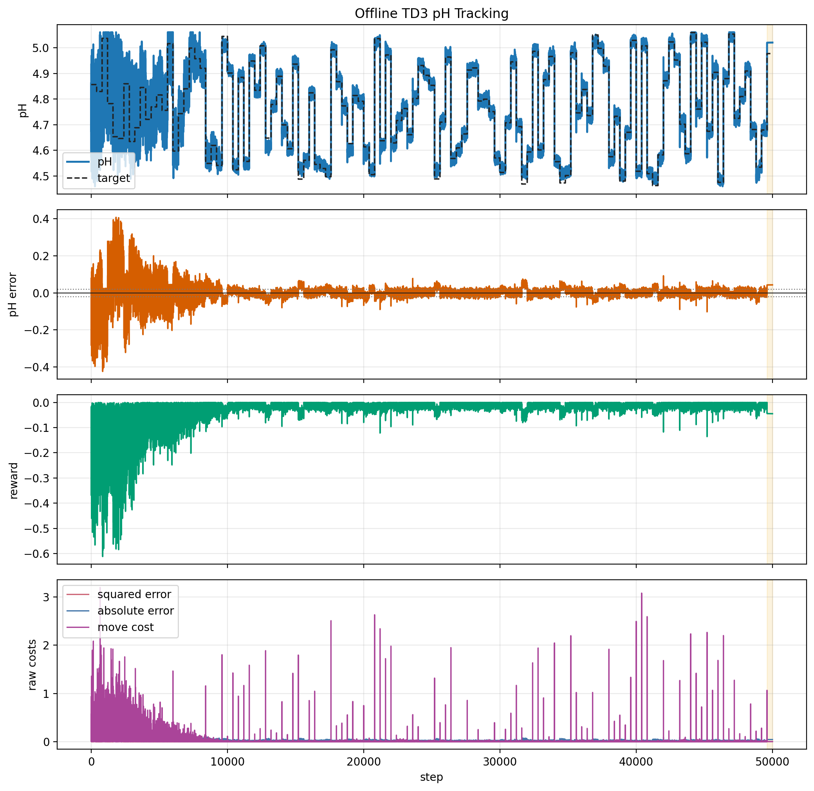
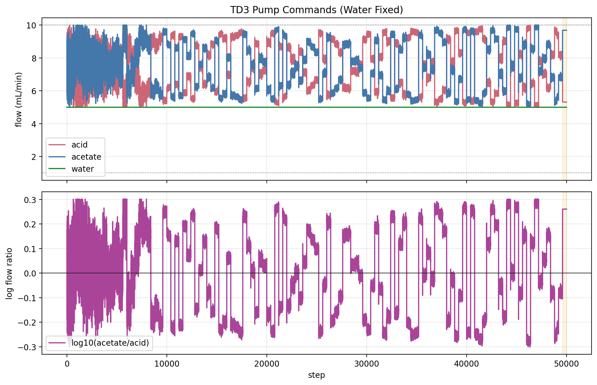
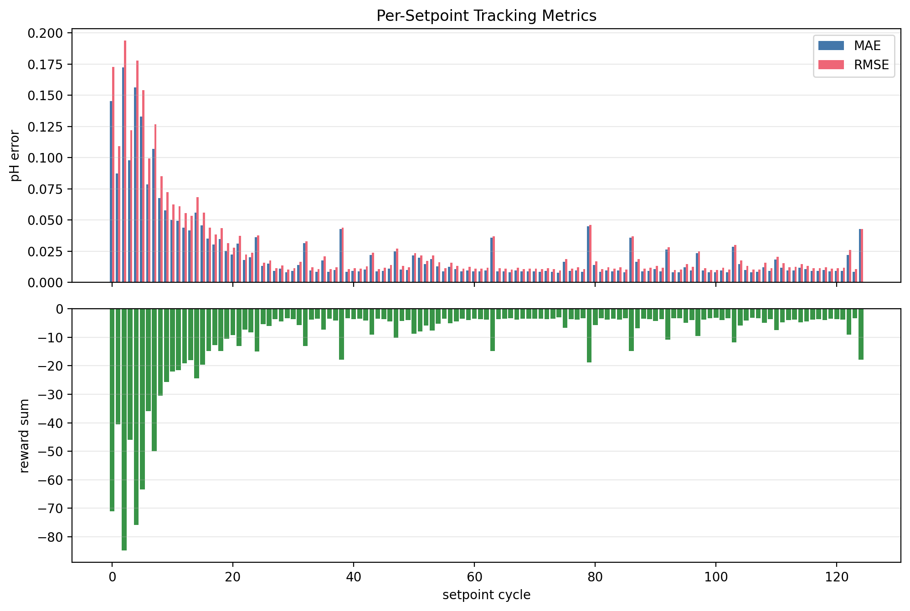
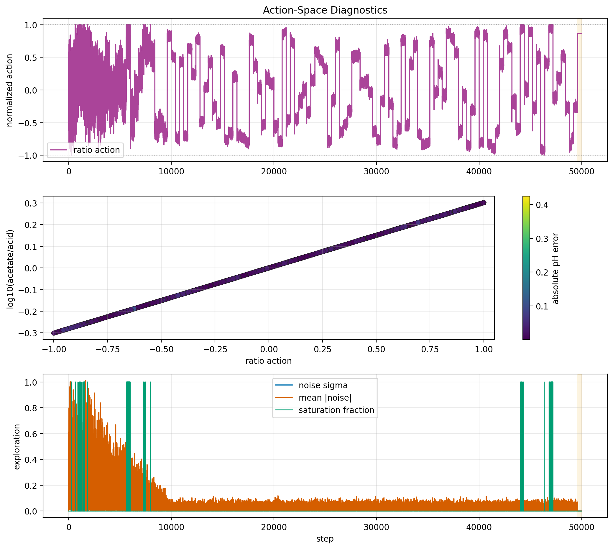
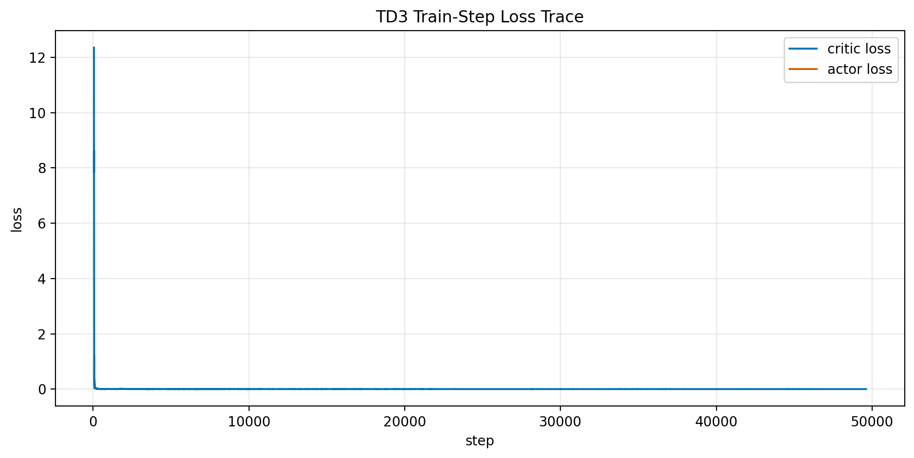

# Offline TD3 pH Tracking Result Analysis

Generated on 2026-07-02 00:40:05 from saved result files only. Rewritten on 2026-07-02 after inspecting the latest requested 50,000-step run and the neighboring result folders.

## Absolute-Bonus Variable-Sum Reward Analysis, 2026-07-08

This update analyzes the newest full offline TD3 run:

`results/offline_ph_td3_training_20260708_233033`

This run uses the current absolute-bonus shaped reward:

$$
r_t =
-J_{eff,t}
-J_{\Delta S,t}
-J_{lin,out,t}
-J_{lin,in,t}
-w_{|e|}|e_t|
+J_{bonus,t},
$$

with `band_floor_ph = 0.01`, `reward_bonus_weight = 0.05`,
`bonus_k = 6.0`, `sum_move_penalty_weight = 1.0`, and
`tail_offset_weight = 0.0`.

### Tracking Summary

| Scope | Steps | MAE | RMSE | Max \|e\| | Mean reward |
|---|---:|---:|---:|---:|---:|
| all steps | 100000 | 0.04202 | 0.09307 | 1.50627 | -0.05048 |
| first 5000 exploration-decay steps | 5000 | 0.23074 | 0.32422 | 1.50627 | -0.35620 |
| post-decay training | 94800 | 0.03215 | 0.05994 | 0.91126 | -0.03448 |
| last 100 training cycles | 20000 | 0.02751 | 0.04350 | 0.41846 | -0.02802 |
| final evaluation cycle | 200 | 0.00532 | 0.02751 | 0.34611 | 0.00515 |
| final evaluation after first 10 steps | 190 | 0.00193 | 0.00193 | 0.00193 | 0.00990 |

The absolute-bonus reward helped the final deterministic evaluation offset.
The previous full variable-sum run, `20260708_230047`, had final evaluation
tail MAE of `0.01910` pH at the same final target. The new run has final
evaluation tail MAE of `0.00193` pH. That is the cleanest evidence that the
new bonus scaling helped remove steady offset.

The all-step MAE is not lower because it includes the early exploration-heavy
period and a few late edge-setpoint failures. This is why the final evaluation
looks much better than the global run average.

The relevant figures are:


### Reward Magnitude After Rescaling

The reward component sums over the 100000-step run are:

| Component | Sum | Share of gross positive cost |
|---|---:|---:|
| absolute-error term | 4202.16 | 80.68% |
| effective squared-error term | 866.29 | 16.63% |
| normalized total-flow move penalty | 105.44 | 2.02% |
| outside linear term | 32.62 | 0.63% |
| inside linear term | 1.69 | 0.03% |
| late-hold tail offset term | 0.00 | 0.00% |
| bonus term | 159.81 | 3.07% negative cost |

This is a much better scaling than the previous reward. The bonus is no longer
invisible. It increased from about `0.06%` of gross cost in the previous run to
about `3.07%` in this run. The tail term is now truly absent. The total-flow
move penalty also has a visible but not dominant role.

The linear terms are still very small. This means the current shaped reward is
mostly an absolute-error reward plus a meaningful near-zero bonus and a modest
total-flow move penalty.

### Late-Operation Drifts

The last-five-setpoint plot shows two different behaviors:

- the final yellow evaluation hold is deterministic, flat, and nearly
  offset-free after the first transition steps,
- the preceding green training holds still have small drift and jitter around
  the setpoint.

This drift is not a hidden process dynamic. The current environment is static:

$$
\mathrm{pH}_t =
pK_a+\log_{10}\left(\frac{F_{Ac,t}}{F_{HAc,t}}\right).
$$

Therefore, any pH drift inside a hold must come from changing actions. In the
last training cycles, exploration is still active at `std_end = 0.01`, and TD3
continues updating during the hold. Each 200-step training hold has 50 updates
inside its final 50-step tail. The evaluation hold has no exploration and no
updates, and it becomes flat.

The last 100 training cycles had:

| Drift diagnostic | Value |
|---|---:|
| mean tail MAE | 0.02616 pH |
| median tail MAE | 0.01947 pH |
| 90th percentile tail MAE | 0.04261 pH |
| maximum tail MAE | 0.27043 pH |
| mean absolute tail-minus-early drift | 0.01426 pH |
| cycles with absolute tail-minus-early drift > 0.02 pH | 25 of 100 |

The strongest late-cycle correlation is between pH error and ratio-related
variables, not the total-flow action by itself:

| Late-cycle correlation | Value |
|---|---:|
| `ph_error` vs `action_ratio` | -0.3565 |
| `ph_error` vs `flow_ratio_acetate_acid` | -0.3447 |
| `ph_error` vs `action_buffer_sum` | 0.0497 |

The difficult failures are mostly near the reachable pH edges. For example,
cycle 392 had target `3.7676` pH. The actor saturated the ratio action at
`-1`, but chose an acid+acetate sum near `13.0` mL/min. With the acid pump at
its `10` mL/min upper bound, that sum forces acetate near `3.0` mL/min, so the
lowest achievable ratio in that moment is about `0.30`, not the target ratio
near `0.10`. The result was a tail error of about `+0.469` pH.

The same action-geometry issue appears at high-pH edge targets. At cycle 394,
target `5.6960` pH requires a very high acetate/acid ratio. The ratio action
was near `+1`, but the selected sum moved enough that the individual pump
bounds prevented the desired ratio from being maintained. This produced a
large transient and a poor final error.

So the near-end drift is best interpreted as an action-parameterization and
edge-feasibility problem, amplified by residual exploration and ongoing actor
updates. It is not evidence that the absolute bonus made offset worse.

### Interpretation And Next Step

The reward change did what it was supposed to do for offset: it made the
zero-offset region attractive enough that the final deterministic policy
settled within about `0.002` pH of the final setpoint after the transition.

The next bottleneck is not the bonus weight. The next bottleneck is whether the
two-action mapping can reliably coordinate ratio and total-flow sum near the
edges of the feasible pH range.

The next experiment should be a deterministic frozen-policy evaluation sweep:

1. Train as usual with the current absolute-bonus reward.
2. Freeze the actor.
3. Evaluate without exploration and without training updates over a grid of
   target pH values from `3.76` to `5.76`.
4. Save per-target tail MAE, final error, acid/acetate/sum actions, and pump
   saturation flags.
5. Plot target pH versus tail error and target pH versus final acid, acetate,
   and sum.

This will show whether the new offset-free behavior is robust across the full
range or only good at the final held-out target. If edge targets fail in the
frozen sweep, the most useful next code change is not another global bonus
increase. It is an edge-aware action mapping or a setpoint-conditioned nominal
sum helper so the actor cannot choose a total-flow sum that makes the requested
ratio infeasible under pump bounds.

The numeric support tables for this section are saved under:

`reports/figures/offline_ph_td3_training_20260708_233033_analysis/`

## Latest Variable-Sum Reward Analysis, 2026-07-08

This update analyzes the newer variable-sum TD3 run:

`results/offline_ph_td3_training_20260708_230047`

This run uses the updated state and action definitions:

$$
s_t =
[\mathrm{pH}_t,\ \mathrm{pH}_{sp,t},\
\mathrm{pH}_t-\mathrm{pH}_{sp,t},\
a^{\rho}_{t-1},\ a^{S}_{t-1}],
$$

and

$$
a_t=[a^{\rho}_t,\ a^{S}_t],
$$

where \(a^{\rho}_t\) controls the acetate/acid ratio and \(a^{S}_t\)
controls the acid+acetate total flow over \(S_t \in [2,20]\) mL/min. The old
`t/T` state is no longer used.

### Latest Quantitative Summary

| Scope | Steps | MAE | RMSE | Max \|e\| | Mean reward |
|---|---:|---:|---:|---:|---:|
| all steps | 100000 | 0.03978 | 0.08747 | 1.4598 | -0.07218 |
| TD3 training steps | 99800 | 0.03982 | 0.08756 | 1.4598 | -0.07226 |
| final eval cycle | 200 | 0.01953 | 0.02025 | 0.09194 | -0.03222 |

The final deterministic evaluation cycle is close to the `0.02` pH success
tolerance in MAE, but the overall run is still affected by early exploration
and occasional later bad setpoints. The connected setpoint-average reward plot
is now a better diagnostic than the previous bar chart because it shows both
learning trend and isolated setpoint failures:


### Reward Magnitude Diagnosis

The current reward component sums over the 100000-step run are:

| Component | Sum | Share of total cost |
|---|---:|---:|
| squared-error cost | 765.16 | 10.60% |
| absolute-error cost | 3977.92 | 55.11% |
| late-hold tail offset cost | 2433.30 | 33.71% |
| normalized total-flow move penalty | 13.52 | 0.19% |
| outside linear term | 30.34 | 0.42% |
| inside linear term | 1.75 | 0.02% |
| bonus term | 4.08 | 0.06% negative cost |

This explains why the full shaped reward curve appears almost identical to the
curves without bonus and linear terms. With `band_floor_ph = 0.01`, the bonus
is proportional to \(b^2=10^{-4}\), so even `beta = 25` gives a maximum visible
bonus of only about `0.002` reward. In contrast, the late-hold offset penalty
has an effective slope of about \(1 + 5 = 6\) reward units per pH error, so a
`0.05` pH error costs about `0.30` before the quadratic and linear terms are
even considered.

The regenerated reward-shape figure now includes a lower panel that shows the
small shaping deltas directly:


### Interpretation

The analyzed reward was not really being shaped by the bonus or the linear
inside/outside terms. It was primarily an absolute-error plus late-hold
absolute-error reward. The total-flow move penalty was also small relative to
tracking penalties. It regularized large total-flow jumps, but it was not a
dominant training signal.

The implemented follow-up reward makes the offset-focused reward simpler and
better scaled:

$$
r_t =
-w_e |e_t|
-w_S
\left(
\frac{S_t-S_{t-1}}{S_{\max}-S_{\min}}
\right)^2
+w_b f_{bonus}\left(\frac{|e_t|}{b}\right)
\quad
\text{plus the retained small relative-band quadratic and linear terms.}
$$

The current defaults are `b = 0.01`, `w_e = 1`, `w_tail = 0`, `w_S = 1.0`,
`w_b = 0.05`, and `bonus_k = 6.0`. The key correction is that the bonus is now
in absolute reward units instead of being scaled by `b^2`. This makes the
near-zero-offset attraction visible while keeping large errors strongly
penalized by the absolute-error term.

The older sections below describe the previous one-action fixed-sum run and
are retained as historical context.

## Scope

This report analyzes the current offline pH TD3 simulation output. It does not launch BioSMB, an OPC emulator, hardware, MPC, valves, or pumps. The source result folder is:

`results/offline_ph_td3_training_20260702_003841`

This is the latest requested 50,000-step run with 400-step setpoint holds and 10,000-step exploration decay. A newer folder, `results/offline_ph_td3_training_20260702_004325`, exists on disk, but it is a default 25,000-step/200-step-hold run and is not the requested 50,000-step experiment.

The purpose is to interpret the ratio-action TD3 scaffold scientifically and decide the next simulation step. The result should be treated as an offline software diagnostic, not as a validated pH controller.

## Executive Summary

The 50,000-step run improves the training-phase behavior of the ratio-action TD3 policy. Overall MAE decreases to `0.02347` pH, and after exploration reaches its floor the MAE is `0.01291` pH. The last 5,000 training steps are even better at `0.01057` pH MAE.

The final deterministic evaluation cycle is weaker than the late-training behavior. The evaluation target is `4.97763` pH, but the actor settles near `5.02067` pH, giving an offset of about `0.043` pH. The ideal HH model itself is not the cause, because the saved HH residual is about numerical zero. The failure is a policy/action-selection offset at this setpoint.

The main decision is therefore not to run another single final-cycle experiment. The next step should be a deterministic frozen-policy evaluation sweep across the reachable setpoint range, saved as a table and figure, so we can see whether the `4.98` pH offset is local or systematic.

## Method

The environment state is the five-element vector

$$ s_t = [\mathrm{pH}_t,\ \mathrm{pH}^{\mathrm{sp}}_t,\ e_t,\ a_{r,t},\ \tau_t], $$

where `e_t = pH_t - pH_sp,t`. The TD3 action is

$$ a_t = [a_{r,t}],\quad a_{r,t} \in [-1,1]. $$

The action is mapped to a bounded acetate/acid flow ratio in log space:

$$ \log_{10}(F_{Ac}/F_{HAc}) = \ell_{\min} + \frac{a_{r,t}+1}{2}(\ell_{\max}-\ell_{\min}). $$

The buffer-flow sum is fixed at `15.0` mL/min, so `F_HAc + F_Ac` is constant and the ratio action determines the two buffer flows. Water is fixed and logged at 5 mL/min.

The setpoint schedule uses `admissible_random` targets. Each setpoint is held for `400` steps, and this saved run contains `125` setpoint segments.

The plant pH is the accepted ideal Henderson-Hasselbalch relation

$$ \mathrm{pH} = pK_a + \log_{10}\left(\frac{C_{Ac} F_{Ac}}{C_{HAc} F_{HAc}}\right). $$

Because the current acid and acetate stock concentrations are equal, this reduces to

$$ \mathrm{pH} = pK_a + \log_{10}\left(\frac{F_{Ac}}{F_{HAc}}\right). $$

The saved runner reward is

$$ r_t = -\left(q_2 e_t^2 + q_1 |e_t| + r_{\Delta u}\|a_t-a_{t-1}\|_2^2/n_u\right), $$

where `e_t = pH_sp,t - pH_t`, `a_t` is the normalized ratio action, and `n_u = 1`.

## Quantitative Summary

| Scope | Steps | MAE | RMSE | Max \|e\| | Reward sum | Sq cost | Abs cost | Move cost | Train updates |
| --- | --- | --- | --- | --- | --- | --- | --- | --- | --- |
| all_steps | 50000 | 0.02347 | 0.04466 | 0.4247 | -1284 | 99.72 | 1173 | 1141 | 49537 |
| td3_training_steps | 49600 | 0.02331 | 0.04467 | 0.4247 | -1267 | 98.99 | 1156 | 1139 | 49537 |
| td3_eval_steps | 400 | 0.04282 | 0.04283 | 0.04304 | -17.87 | 0.7337 | 17.13 | 1.066 | 0 |

Overall MAE is 0.02347 pH and overall RMSE is 0.04466 pH. The evaluation-window MAE is 0.04282 pH and evaluation-window RMSE is 0.04283 pH. These values depend on the saved run length and random seed.

Compared with the previous 25,000-step/200-step-hold run, the 50,000-step run improves overall MAE from `0.02842` to `0.02347` pH and improves late-training MAE from about `0.01618` to `0.01057` pH. However, the final evaluation MAE worsens from `0.01586` to `0.04282` pH. This means the longer run is not simply "better" or "worse". It learns the training distribution more cleanly, but the single final deterministic evaluation target exposes a larger policy offset.

## Learning-Phase Diagnostics

| Phase | Steps | MAE | RMSE | Max \|e\| | Mean \|ratio error\| | Mean sigma | Mean \|noise\| |
| --- | --- | --- | --- | --- | --- | --- | --- |
| all_steps | 50000 | 0.02347 | 0.04466 | 0.4247 | 0.02347 | 0.06176 | 0.04935 |
| first_10000_steps | 10000 | 0.06569 | 0.09386 | 0.4247 | 0.06569 | 0.19 | 0.1517 |
| after_exploration_decay | 40000 | 0.01291 | 0.01704 | 0.1026 | 0.01291 | 0.0297 | 0.02377 |
| last_5000_training_steps | 5000 | 0.01057 | 0.01374 | 0.1026 | 0.01057 | 0.03 | 0.02419 |
| evaluation_cycle | 400 | 0.04282 | 0.04283 | 0.04304 | 0.04282 | 0 | 0 |
| first_20_each_cycle | 2500 | 0.02689 | 0.05024 | 0.4058 | 0.02689 | 0.06297 | 0.05083 |
| first_50_each_cycle | 6250 | 0.02577 | 0.04862 | 0.4247 | 0.02577 | 0.06288 | 0.05126 |
| last_50_each_cycle | 31250 | 0.02275 | 0.04351 | 0.4081 | 0.02275 | 0.06128 | 0.04878 |

The main learning signature is the drop from 0.06569 pH MAE during `first_10000_steps` to 0.01291 pH MAE after exploration reaches its floor. This indicates that the one-dimensional ratio action is learnable in the ideal HH simulator.

The final deterministic evaluation cycle gives 0.04282 pH MAE and 0.04304 pH maximum absolute error. This is not a robust failure claim because it is only one held-out setpoint cycle, but it is a useful warning that final-cycle evaluation is too narrow.

## Cycle-Group And Settling Diagnostics

| Cycle group | Cycles | Mean cycle MAE | Mean cycle RMSE | Max cycle \|e\| | Mean move cost |
| --- | --- | --- | --- | --- | --- |
| cycles_0_24 | 25 | 0.06569 | 0.07905 | 0.4247 | 38.31 |
| cycles_25_49 | 25 | 0.01359 | 0.01586 | 0.08054 | 1.709 |
| cycles_50_74 | 25 | 0.0118 | 0.0141 | 0.09015 | 1.797 |
| cycles_75_99 | 25 | 0.01363 | 0.01581 | 0.07676 | 1.668 |
| cycles_100_123 | 24 | 0.01136 | 0.01388 | 0.1026 | 2.184 |
| evaluation_cycles | 1 | 0.04282 | 0.04283 | 0.04304 | 1.066 |

| Tolerance | Hold steps | Settled cycles | Failed cycles | Median settling steps | P90 settling steps | Max settling steps |
| --- | --- | --- | --- | --- | --- | --- |
| 0.05 | 20 | 107 | 18 | 0 | 13.2 | 334 |
| 0.02 | 20 | 83 | 42 | 26 | 148.8 | 354 |

The settling table is computed within each 400-step setpoint hold. A cycle is counted as settled only after the error stays inside the tolerance band for the listed hold duration.

## Best And Worst Setpoint Cycles

| Rank | Cycle | Target pH | Eval | MAE | RMSE | Max \|e\| | Move cost |
| --- | --- | --- | --- | --- | --- | --- | --- |
| worst | 2 | 5.037 | False | 0.1725 | 0.1938 | 0.4247 | 76.11 |
| worst | 4 | 4.653 | False | 0.1564 | 0.1776 | 0.4081 | 73.02 |
| worst | 0 | 4.857 | False | 0.1454 | 0.1728 | 0.3976 | 95.75 |
| worst | 5 | 4.646 | False | 0.1328 | 0.1541 | 0.4058 | 74.31 |
| worst | 7 | 4.634 | False | 0.1071 | 0.1268 | 0.3182 | 65.21 |
| best | 74 | 4.57 | False | 0.007512 | 0.009683 | 0.02839 | 1.108 |
| best | 100 | 4.518 | False | 0.007937 | 0.009954 | 0.02728 | 3.142 |
| best | 106 | 5.023 | False | 0.008022 | 0.01013 | 0.03301 | 0.9219 |
| best | 99 | 5.029 | False | 0.008024 | 0.01001 | 0.03118 | 1.997 |
| best | 66 | 4.568 | False | 0.008037 | 0.01013 | 0.03152 | 2.732 |

## Evaluation Offset Diagnosis

The evaluation cycle is not noisy. Exploration is off, the actor output is nearly constant, and the pH offset is nearly constant over the 400-step hold.

For the final evaluation cycle:

| Quantity | Value |
| --- | --- |
| target pH | 4.97763 |
| mean pH | 5.02045 |
| final pH | 5.02067 |
| mean normalized ratio action | 0.86519 |
| final normalized ratio action | 0.86592 |
| ideal target normalized ratio action | 0.72294 |
| final action bias | 0.14298 |

Because the ideal HH plant is static,

$$
\mathrm{pH} = pK_a + \log_{10}(F_{Ac}/F_{HAc}),
$$

the evaluation error is directly interpretable as a ratio-action error. The policy selects too high an acetate/acid ratio for the final target, so the pH is too high by about `0.043` pH. This is a policy-selection issue, not a chemistry-model residual issue.

## Figures



This figure is the main tracking diagnostic. The fourth panel separates the raw squared-error, absolute-error, and move-penalty costs before reward weighting.



This figure shows the actual acid and acetate commands under the fixed buffer-flow sum, the fixed water-flow log, and the acid/acetate log-ratio that drives the ideal HH pH.





The action diagnostic figure includes the normalized ratio-action trajectory, the ratio/log-ratio scatter, and exploration traces when those columns are available.


The maximum absolute residual against the ideal HH ratio line is 1.776e-15 pH. Water is fixed at 5 mL/min and does not create an independent pH offset in this static ideal model.



## Flow Diagnostics

| Flow | Mean | Min | Max | Low sat frac | High sat frac | Mean \|dF\| |
| --- | --- | --- | --- | --- | --- | --- |
| acid | 7.487 | 5 | 10 | 0 | 4e-05 | 0.1951 |
| acetate | 7.513 | 5 | 10 | 0 | 0.00122 | 0.1951 |
| water | 5 | 5 | 5 | 0 | 0 | 0 |
| buffer_sum | 15 | 15 | 15 | nan | nan | 2.91e-07 |

Flow-limit check: no logged acid, acetate, or water flow exceeded its configured pump bounds. The maximum logged physical flow was 10 mL/min.

The logged acid-plus-acetate sum stayed between 15 and 15 mL/min.

## Interpretation

The current scaffold is behaving consistently with the intended static first-principles pH model. The action-to-flow mapping is bounded, the reward sign penalizes tracking error and action movement, the logged pH follows the acid/acetate ratio, and the physical flow limits are respected.

For this saved run, the TD3 policy learns much of the static ratio-tracking task after the initial exploration-heavy period. Cycles 25-123 mostly operate near the ideal HH inverse mapping, with mean cycle MAE around `0.011-0.014` pH. The weaker final evaluation cycle shows that the learned policy is not uniformly accurate across the reachable setpoint range.

The most important conclusion is that a single final held-out setpoint is not an adequate evaluation protocol. It can make a run look better or worse depending on the last target. The next report should judge the frozen actor on a deterministic setpoint grid.

## Bugs, Inconsistencies, Or Risks

- The plant is static ideal HH, so it does not include delay, mixing, residence time, sensor lag, or lab mismatch.
- Water is fixed at 5 mL/min in this version and is plotted only as a logged process condition.
- The final evaluation result is only one setpoint cycle, so it should not be treated as robust generalization evidence.
- The final evaluation offset is caused by actor ratio-action bias, not by an HH-model residual.
- The current run did not save a checkpoint, so a post-hoc frozen-policy sweep cannot be reconstructed from this result folder alone.
- The current fixed 15 mL/min buffer-flow sum restricts the reachable setpoint range to about 4.459-5.061 pH under the current pump bounds.
- The move penalty is small compared with the absolute-error term, so the learned action can still show occasional sharp moves during training.
- The report reads saved CSV files, so stale figures are possible if the report is not regenerated after a new run.

## Recommended Next Experiments

### 1. Add Frozen-Policy Setpoint Sweep

Purpose: replace the single final-cycle evaluation with a deterministic evaluation over the whole reachable pH range.

Implementation target: `run_offline_ph_td3_training.py`.

What to add:

- after training, freeze the actor,
- disable exploration and replay updates,
- evaluate a grid of setpoints across `4.459-5.061` pH,
- hold each test setpoint for 400 steps,
- save `tables/evaluation_sweep.csv`,
- save a figure showing target pH, final pH, MAE, and actor action bias versus setpoint.

Success criterion: the evaluation-grid MAE should stay below about `0.02` pH for most setpoints, and the worst setpoint should explain any systematic bias.

Failure mode to watch: a monotonic action bias where high targets are overpredicted or low targets are underpredicted.

### 2. Save Checkpoints For Serious Runs

Purpose: make trained policies reusable for later deterministic evaluation, seed comparison, and report regeneration.

Implementation target: keep using the existing `--save-checkpoint` path or make checkpoint saving default for long runs.

Success criterion: each result folder contains an actor/critic checkpoint and can be re-evaluated without retraining.

### 3. Run A Seed Batch Only After The Evaluation Sweep Exists

After that, run a small seed batch, for example seeds 7, 21, 47, 73, and 101, using the same 50000-step protocol. Compare the mean and worst-case evaluation MAE rather than relying on one run.

### 4. Sweep Fixed Buffer-Flow Sum

Try buffer-flow sums such as 12, 15, and 18 mL/min, and record the reachable pH range, saturation frequency, and grid-evaluation tracking quality. This will tell us whether 15 mL/min is a good control design choice or just a convenient first setting.

Current reproducibility command:

```powershell
& 'C:\Users\HAMEDI\miniconda3\envs\rl\python.exe' run_offline_ph_td3_training.py --total-steps 50000 --set-points-len 400 --std-decay-steps 10000 --batch-size 64 --buffer-size 5000 --seed 7
& 'C:\Users\HAMEDI\miniconda3\envs\rl\python.exe' analysis\generate_offline_ph_td3_report.py --result-dir results/offline_ph_td3_training_20260702_003841
```

## Provenance

Files inspected or consumed:

- `run_offline_ph_td3_training.py`
- `simulation/ph_environment.py`
- `simulation/henderson_hasselbalch_model.py`
- `reports/overview.md`
- `reports/offline_ph_rl_environment_report.md`
- `results/offline_ph_td3_training_20260702_003841/tables/trajectory.csv`
- `results/offline_ph_td3_training_20260702_003841/tables/episode_metrics.csv`
- `results/offline_ph_td3_training_20260702_003841/tables/training_summary.csv`
- `results/offline_ph_td3_training_20260702_003841/tables/config_snapshot.json`
- `results/offline_ph_td3_training_20260702_003841/tables/flow_constraint_check.csv`
- `results/offline_ph_td3_training_20260701_221816/tables/training_summary.csv`
- `results/offline_ph_td3_training_20260702_004325/tables/training_summary.csv`

Generated outputs:

- `reports/figures/offline_ph_td3_training_20260702_003841_analysis/summary_metrics.csv`
- `reports/figures/offline_ph_td3_training_20260702_003841_analysis/flow_diagnostics.csv`
- `reports/figures/offline_ph_td3_training_20260702_003841_analysis/cycle_metrics.csv`
- `reports/figures/offline_ph_td3_training_20260702_003841_analysis/hh_consistency.csv`
- `reports/figures/offline_ph_td3_training_20260702_003841_analysis/learning_phase_metrics.csv`
- `reports/figures/offline_ph_td3_training_20260702_003841_analysis/cycle_group_metrics.csv`
- `reports/figures/offline_ph_td3_training_20260702_003841_analysis/settling_diagnostics.csv`
- `reports/figures/offline_ph_td3_training_20260702_003841_analysis/cycle_extremes.csv`
- `reports/figures/offline_ph_td3_training_20260702_003841_analysis/source_training_summary.csv`
- `reports/figures/offline_ph_td3_training_20260702_003841_analysis/manifest.json`
- `reports/figures/offline_ph_td3_training_20260702_003841_analysis/fig_ph_tracking_error_reward.png`
- `reports/figures/offline_ph_td3_training_20260702_003841_analysis/fig_flow_commands_and_ratio.png`
- `reports/figures/offline_ph_td3_training_20260702_003841_analysis/fig_cycle_metrics.png`
- `reports/figures/offline_ph_td3_training_20260702_003841_analysis/fig_action_diagnostics.png`
- `reports/figures/offline_ph_td3_training_20260702_003841_analysis/fig_hh_ratio_consistency.png`
- `reports/figures/offline_ph_td3_training_20260702_003841_analysis/fig_training_losses.png`
- `reports/offline_ph_td3_training_result_analysis.md`
