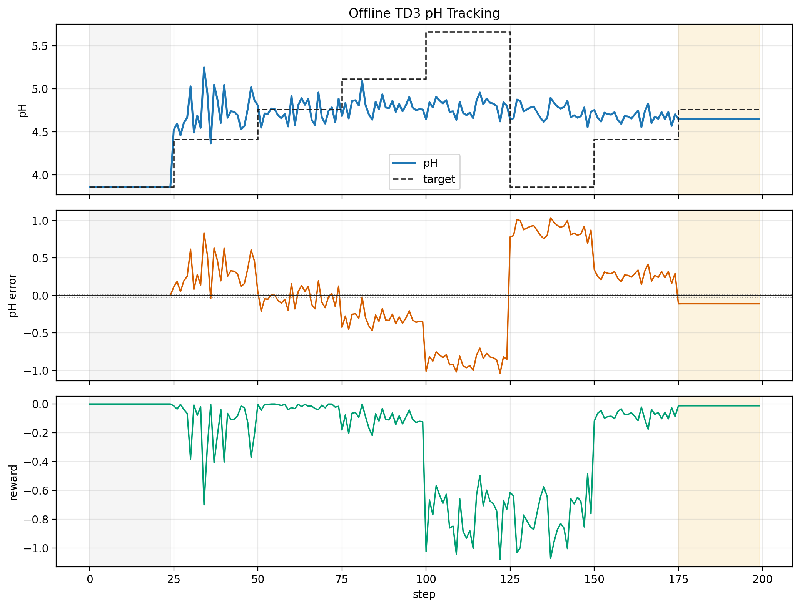
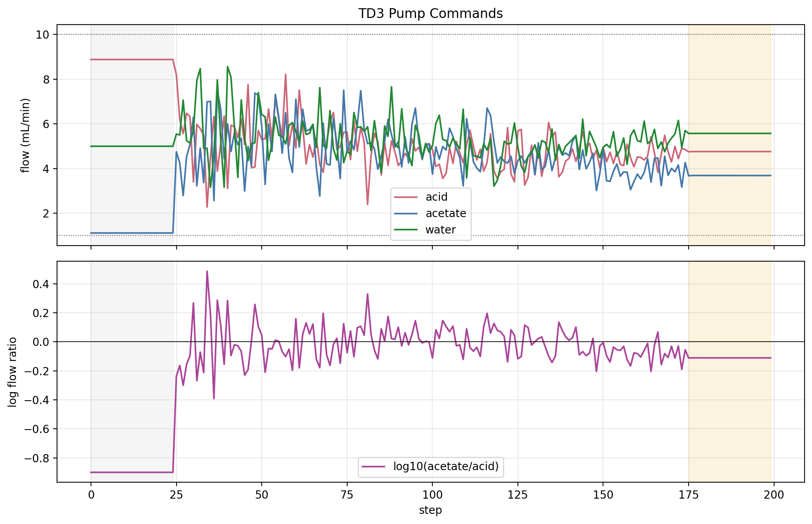
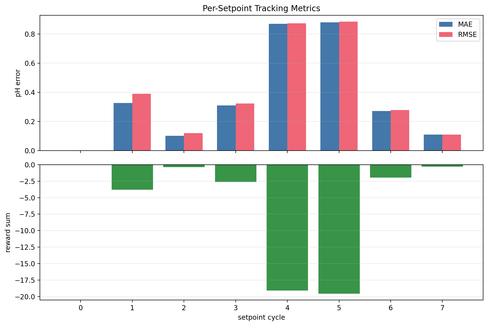
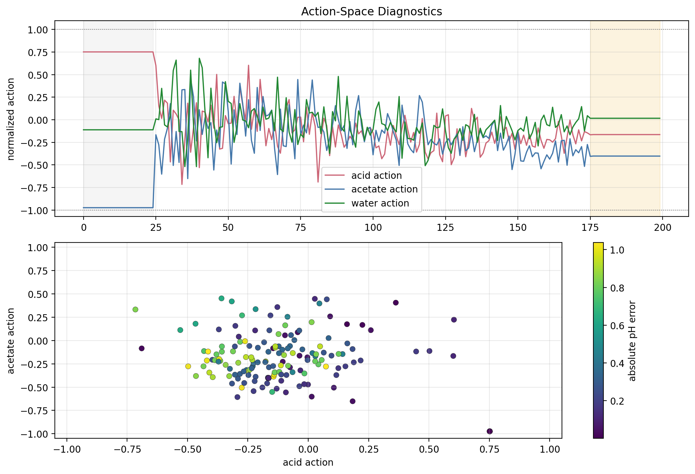
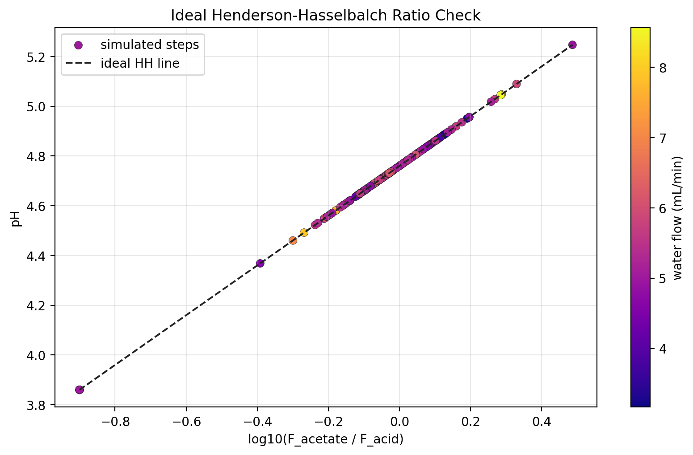
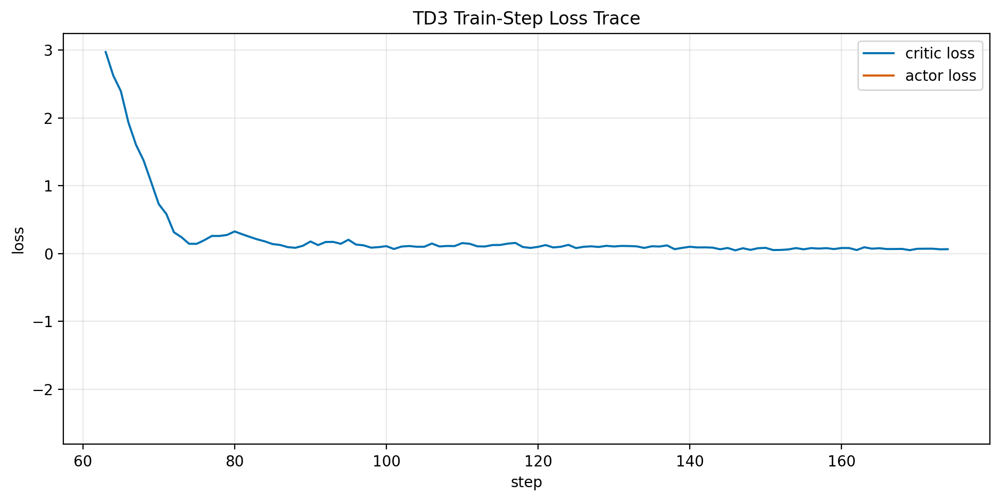

# Offline TD3 pH Tracking Result Analysis

Generated on 2026-07-01 18:38:04 from saved result files only.

## Scope

This report analyzes the current offline pH TD3 simulation output. It does not launch BioSMB, an OPC emulator, hardware, MPC, valves, or pumps. The source result folder is:

`results/offline_ph_td3_training_20260701_181330`

The purpose is to create editable figures and a first write-up around the new direct-flow TD3 scaffold. The result should be treated as an offline software diagnostic, not as a validated pH controller.

## Method

The environment state is the seven-element vector

$$ s_t = [\mathrm{pH}_t,\ \mathrm{pH}^{\mathrm{sp}}_t,\ e_t,\ a_{HAc,t},\ a_{Ac,t},\ a_{W,t},\ \tau_t], $$

where `e_t = pH_t - pH_sp,t`. The TD3 action is

$$ a_t = [a_{HAc,t},\ a_{Ac,t},\ a_{W,t}],\quad a_i \in [-1,1]. $$

Each action coordinate is mapped to a physical pump command by

$$ F_i = F_{i,\min} + \frac{a_i + 1}{2}(F_{i,\max}-F_{i,\min}). $$

The plant pH is the accepted ideal Henderson-Hasselbalch relation

$$ \mathrm{pH} = pK_a + \log_{10}\left(\frac{C_{Ac} F_{Ac}}{C_{HAc} F_{HAc}}\right). $$

Because the current acid and acetate stock concentrations are equal, this reduces to

$$ \mathrm{pH} = pK_a + \log_{10}\left(\frac{F_{Ac}}{F_{HAc}}\right). $$

The saved runner reward is

$$ r_t = -(\mathrm{pH}_t - \mathrm{pH}^{\mathrm{sp}}_t)^2. $$

## Quantitative Summary

| Scope | Steps | MAE | RMSE | Max \|e\| | Reward sum | Train updates |
| --- | --- | --- | --- | --- | --- | --- |
| all_steps | 200 | 0.3588 | 0.4883 | 1.038 | -47.68 | 112 |
| hh_warm_start | 25 | 1.52e-08 | 1.52e-08 | 1.52e-08 | -5.78e-15 | 0 |
| td3_training_steps | 150 | 0.46 | 0.562 | 1.038 | -47.38 | 112 |
| td3_eval_steps | 25 | 0.1107 | 0.1107 | 0.1114 | -0.3064 | 0 |

Overall MAE is 0.3588 pH and overall RMSE is 0.4883 pH. The evaluation-window MAE is 0.1107 pH and evaluation-window RMSE is 0.1107 pH. These values depend on the saved run length and random seed.

## Figures



This figure is the main tracking diagnostic. The gray span marks warm start and the gold span marks the final evaluation segment when those protocol flags exist.



This figure shows the actual flow commands and the acid/acetate log-ratio that drives the ideal HH pH.







The maximum absolute residual against the ideal HH ratio line is 8.882e-16 pH. The water-flow color does not create an independent pH offset in this static ideal model.



## Flow Diagnostics

| Flow | Mean | Min | Max | Low sat frac | High sat frac | Mean \|dF\| |
| --- | --- | --- | --- | --- | --- | --- |
| acid | 5.392 | 2.279 | 8.882 | 0 | 0 | 0.7236 |
| acetate | 4.194 | 1.118 | 7.528 | 0 | 0 | 0.8129 |
| water | 5.314 | 3.165 | 8.565 | 0 | 0 | 0.698 |

## Interpretation

The current scaffold is behaving consistently with the intended static first-principles pH model. The action-to-flow mapping is bounded, the reward sign is correct for setpoint tracking, and the logged pH follows the acid/acetate ratio.

The result is not enough to claim controller quality. For a short smoke run, a low final evaluation error can occur because the ideal HH mapping is simple and the final setpoint may be easy. A longer multi-seed run is needed before comparing learning behavior.

## Bugs, Inconsistencies, Or Risks

- The plant is static ideal HH, so it does not include delay, mixing, residence time, sensor lag, or lab mismatch.
- Water is a controlled actuator and is plotted, but it does not directly shift ideal HH pH with equal acid and acetate stocks.
- The final evaluation result is run-dependent and should not be treated as generalization evidence.
- The report reads saved CSV files, so stale figures are possible if the report is not regenerated after a new run.

## Recommended Next Experiment

Run a longer offline simulation with at least 8 to 12 setpoint cycles, one warm-start cycle, and one final evaluation cycle. Use the same report script afterward and compare `td3_training_steps`, evaluation MAE, max absolute error, flow saturation fractions, and the action scatter plot.

Example:

```powershell
& 'C:\Users\HAMEDI\miniconda3\envs\rl\python.exe' run_offline_ph_td3_training.py --n-tests 10 --set-points-len 40 --warm-start-cycles 1 --batch-size 64 --buffer-size 5000 --seed 21
& 'C:\Users\HAMEDI\miniconda3\envs\rl\python.exe' analysis\generate_offline_ph_td3_report.py
```

## Provenance

Files inspected or consumed:

- `run_offline_ph_td3_training.py`
- `simulation/ph_environment.py`
- `simulation/henderson_hasselbalch_model.py`
- `external: RL_assisted_MPC/Simulation/rl_sim.py`
- `external: RL_assisted_MPC/report/scripts/analyze_distillation_all_runners_latest_20260609.py`
- `external: RL_assisted_MPC/report/generate_rl_state_scaling_report.py`
- `external: RL_assisted_MPC/utils/plotting_core.py`
- `results/offline_ph_td3_training_20260701_181330/tables/trajectory.csv`
- `results/offline_ph_td3_training_20260701_181330/tables/episode_metrics.csv`
- `results/offline_ph_td3_training_20260701_181330/tables/training_summary.csv`
- `results/offline_ph_td3_training_20260701_181330/tables/config_snapshot.json`

Generated outputs:

- `reports/figures/offline_ph_td3_training_20260701_181330_analysis/summary_metrics.csv`
- `reports/figures/offline_ph_td3_training_20260701_181330_analysis/flow_diagnostics.csv`
- `reports/figures/offline_ph_td3_training_20260701_181330_analysis/cycle_metrics.csv`
- `reports/figures/offline_ph_td3_training_20260701_181330_analysis/hh_consistency.csv`
- `reports/figures/offline_ph_td3_training_20260701_181330_analysis/source_training_summary.csv`
- `reports/figures/offline_ph_td3_training_20260701_181330_analysis/manifest.json`
- `reports/figures/offline_ph_td3_training_20260701_181330_analysis/fig_ph_tracking_error_reward.png`
- `reports/figures/offline_ph_td3_training_20260701_181330_analysis/fig_flow_commands_and_ratio.png`
- `reports/figures/offline_ph_td3_training_20260701_181330_analysis/fig_cycle_metrics.png`
- `reports/figures/offline_ph_td3_training_20260701_181330_analysis/fig_action_diagnostics.png`
- `reports/figures/offline_ph_td3_training_20260701_181330_analysis/fig_hh_ratio_consistency.png`
- `reports/figures/offline_ph_td3_training_20260701_181330_analysis/fig_training_losses.png`
- `reports/offline_ph_td3_training_result_analysis.md`
