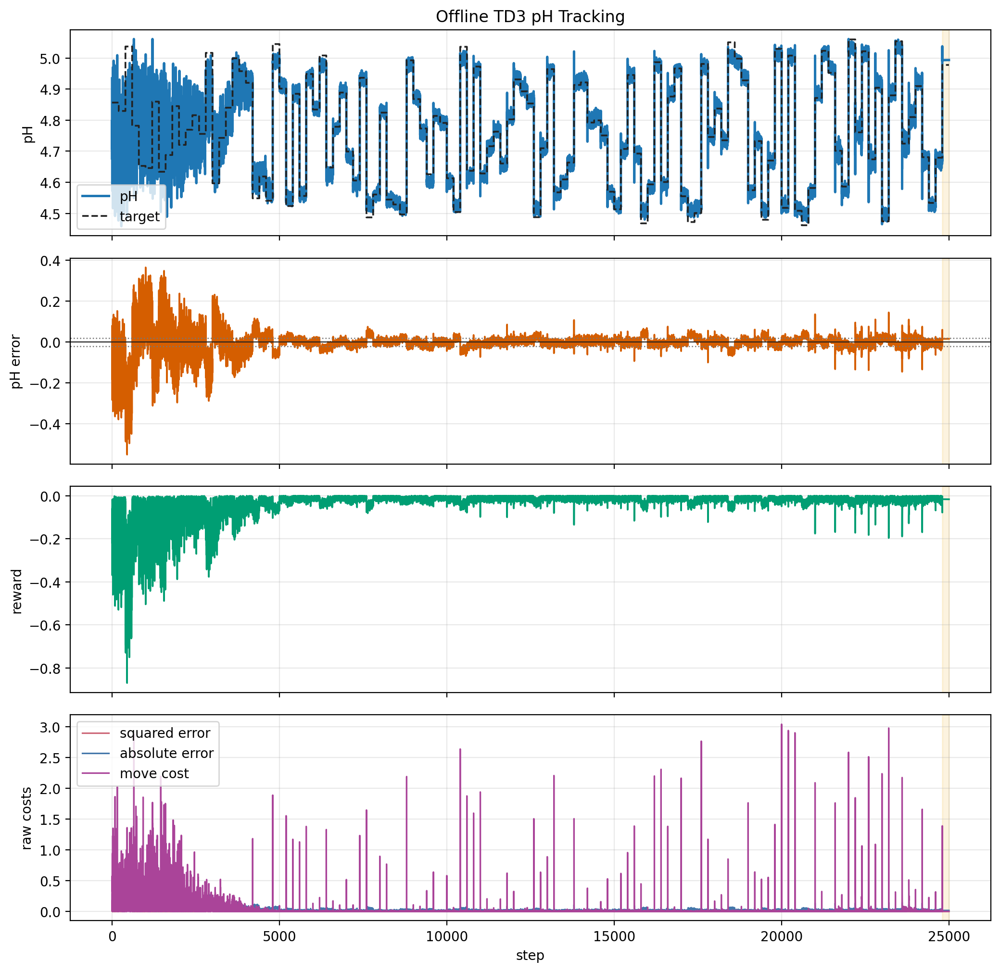
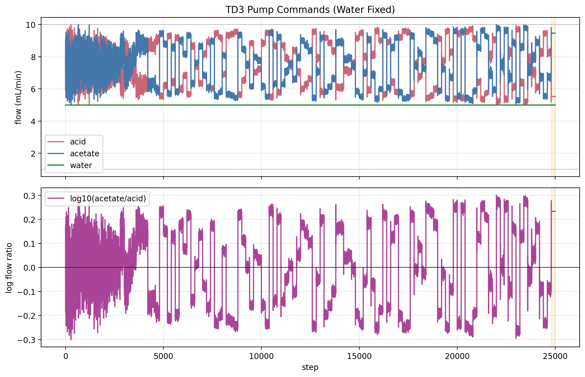
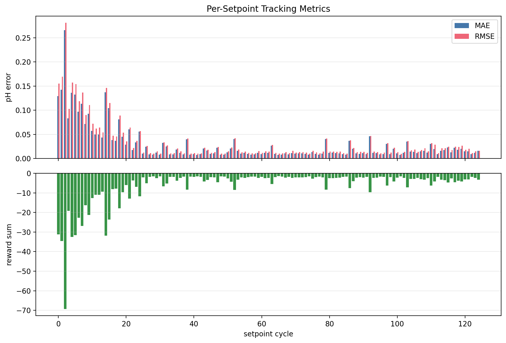
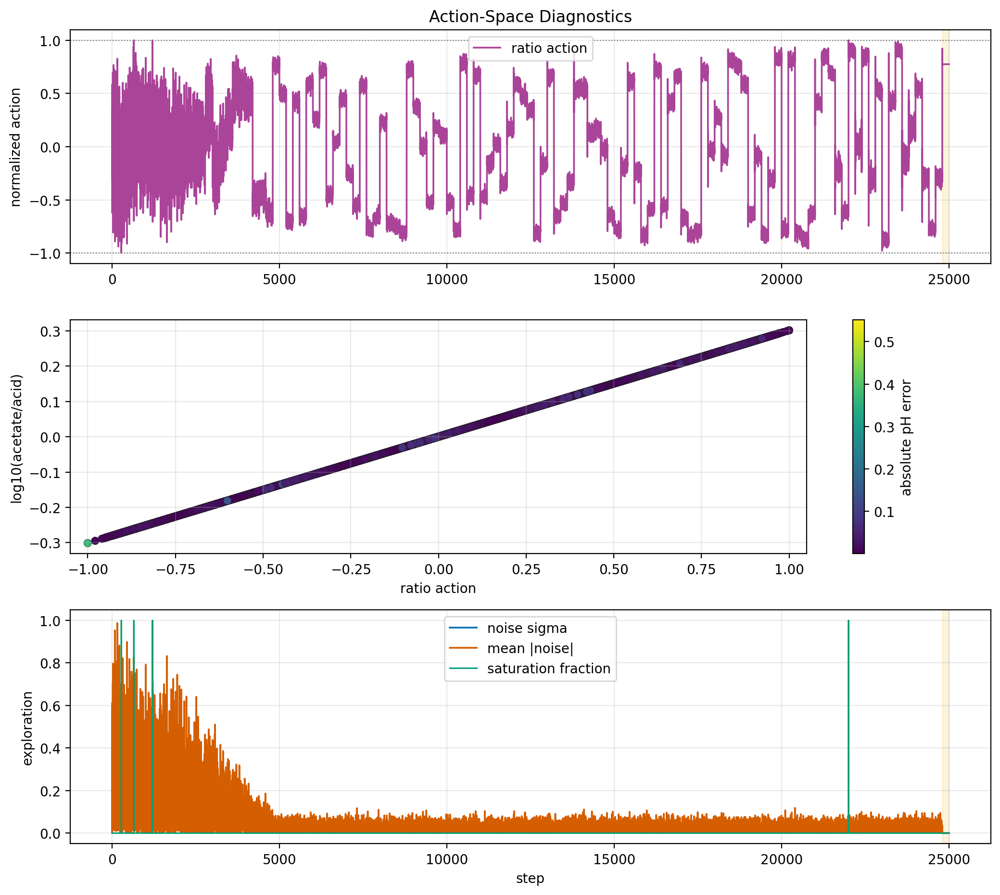
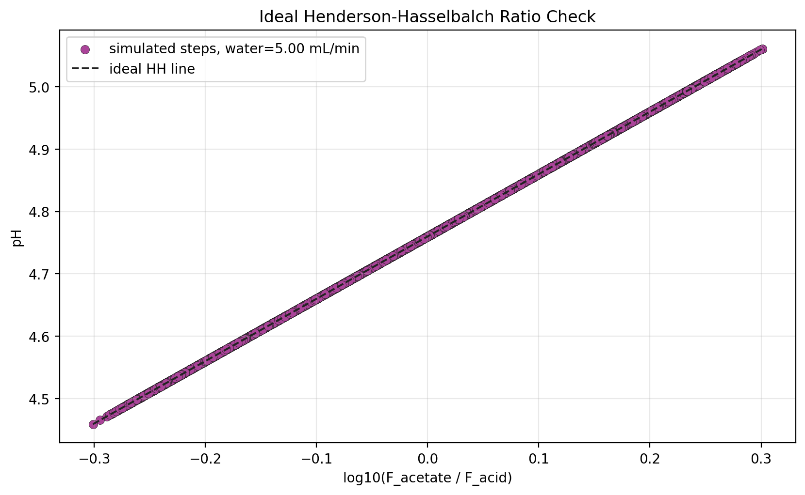
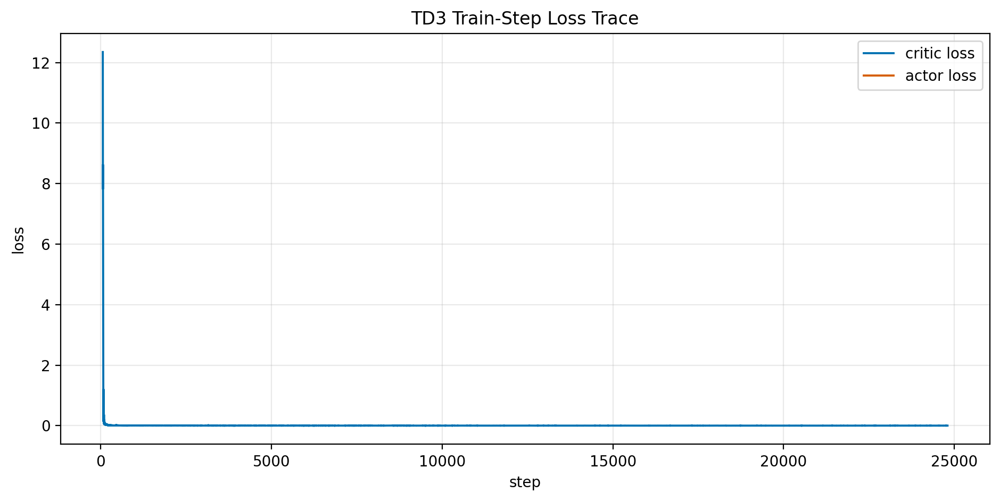

# Offline TD3 pH Tracking Result Analysis

Generated on 2026-07-01 22:32:04 from saved result files only.

## Scope

This report analyzes the current offline pH TD3 simulation output. It does not launch BioSMB, an OPC emulator, hardware, MPC, valves, or pumps. The source result folder is:

`results/offline_ph_td3_training_20260701_221816`

The purpose is to create editable figures and a first write-up around the ratio-action TD3 scaffold. The result should be treated as an offline software diagnostic, not as a validated pH controller.

## Method

The environment state is the five-element vector

$$ s_t = [\mathrm{pH}_t,\ \mathrm{pH}^{\mathrm{sp}}_t,\ e_t,\ a_{r,t},\ \tau_t], $$

where `e_t = pH_t - pH_sp,t`. The TD3 action is

$$ a_t = [a_{r,t}],\quad a_{r,t} \in [-1,1]. $$

The action is mapped to a bounded acetate/acid flow ratio in log space:

$$ \log_{10}(F_{Ac}/F_{HAc}) = \ell_{\min} + \frac{a_{r,t}+1}{2}(\ell_{\max}-\ell_{\min}). $$

The buffer-flow sum is fixed at `15.0` mL/min, so `F_HAc + F_Ac` is constant and the ratio action determines the two buffer flows. Water is fixed and logged at 5 mL/min.

The setpoint schedule uses `admissible_random` targets. Each setpoint is held for `200` steps, and this saved run contains `125` setpoint segments.

The plant pH is the accepted ideal Henderson-Hasselbalch relation

$$ \mathrm{pH} = pK_a + \log_{10}\left(\frac{C_{Ac} F_{Ac}}{C_{HAc} F_{HAc}}\right). $$

Because the current acid and acetate stock concentrations are equal, this reduces to

$$ \mathrm{pH} = pK_a + \log_{10}\left(\frac{F_{Ac}}{F_{HAc}}\right). $$

The saved runner reward is

$$ r_t = -\left(q_2 e_t^2 + q_1 |e_t| + r_{\Delta u}\|a_t-a_{t-1}\|_2^2/n_u\right), $$

where `e_t = pH_sp,t - pH_t`, `a_t` is the normalized ratio action, and `n_u = 1`.

## Quantitative Summary

| Scope | Steps | MAE | RMSE | Max \|e\| | Reward sum | Sq cost | Abs cost | Move cost | Train updates |
| --- | --- | --- | --- | --- | --- | --- | --- | --- | --- |
| all_steps | 25000 | 0.02842 | 0.05332 | 0.5517 | -788.9 | 71.08 | 710.5 | 727 | 24737 |
| td3_training_steps | 24800 | 0.02852 | 0.05352 | 0.5517 | -785.6 | 71.03 | 707.4 | 725.6 | 24737 |
| td3_eval_steps | 200 | 0.01586 | 0.01617 | 0.06005 | -3.238 | 0.05228 | 3.172 | 1.416 | 0 |

Overall MAE is 0.02842 pH and overall RMSE is 0.05332 pH. The evaluation-window MAE is 0.01586 pH and evaluation-window RMSE is 0.01617 pH. These values depend on the saved run length and random seed.

## Learning-Phase Diagnostics

| Phase | Steps | MAE | RMSE | Max \|e\| | Mean \|ratio error\| | Mean sigma | Mean \|noise\| |
| --- | --- | --- | --- | --- | --- | --- | --- |
| all_steps | 25000 | 0.02842 | 0.05332 | 0.5517 | 0.02842 | 0.06175 | 0.04946 |
| first_5000_steps | 5000 | 0.08404 | 0.113 | 0.5517 | 0.08404 | 0.19 | 0.1526 |
| after_exploration_decay | 20000 | 0.01452 | 0.01897 | 0.1457 | 0.01452 | 0.0297 | 0.02369 |
| last_5000_training_steps | 5000 | 0.01618 | 0.02073 | 0.1457 | 0.01618 | 0.03 | 0.02406 |
| evaluation_cycle | 200 | 0.01586 | 0.01617 | 0.06005 | 0.01586 | 0 | 0 |
| first_20_each_cycle | 2500 | 0.03258 | 0.0592 | 0.4881 | 0.03258 | 0.06291 | 0.0494 |
| first_50_each_cycle | 6250 | 0.03089 | 0.05781 | 0.5517 | 0.03089 | 0.06271 | 0.05014 |
| last_50_each_cycle | 6250 | 0.02656 | 0.04992 | 0.4502 | 0.02656 | 0.06079 | 0.04834 |

The main learning signature is the drop from 0.08404 pH MAE during `first_5000_steps` to 0.01452 pH MAE after exploration reaches its floor. This indicates that the one-dimensional ratio action is learnable in the ideal HH simulator.

The final deterministic evaluation cycle gives 0.01586 pH MAE and 0.06005 pH maximum absolute error. This is encouraging, but it is still only one held-out setpoint cycle from the same reachable fixed-sum range.

## Cycle-Group And Settling Diagnostics

| Cycle group | Cycles | Mean cycle MAE | Mean cycle RMSE | Max cycle \|e\| | Mean move cost |
| --- | --- | --- | --- | --- | --- |
| cycles_0_24 | 25 | 0.08404 | 0.09745 | 0.5517 | 22.48 |
| cycles_25_49 | 25 | 0.0141 | 0.01617 | 0.07496 | 1.016 |
| cycles_50_74 | 25 | 0.01248 | 0.01497 | 0.1078 | 1.342 |
| cycles_75_99 | 25 | 0.01548 | 0.01787 | 0.1002 | 1.468 |
| cycles_100_123 | 24 | 0.01601 | 0.01959 | 0.1457 | 2.833 |
| evaluation_cycles | 1 | 0.01586 | 0.01617 | 0.06005 | 1.416 |

| Tolerance | Hold steps | Settled cycles | Failed cycles | Median settling steps | P90 settling steps | Max settling steps |
| --- | --- | --- | --- | --- | --- | --- |
| 0.05 | 20 | 99 | 26 | 0 | 2.2 | 140 |
| 0.02 | 20 | 66 | 59 | 27.5 | 132.5 | 180 |

The settling table is computed within each 200-step setpoint hold. A cycle is counted as settled only after the error stays inside the tolerance band for the listed hold duration.

## Best And Worst Setpoint Cycles

| Rank | Cycle | Target pH | Eval | MAE | RMSE | Max \|e\| | Move cost |
| --- | --- | --- | --- | --- | --- | --- | --- |
| worst | 2 | 5.037 | False | 0.2658 | 0.2809 | 0.5517 | 36.97 |
| worst | 1 | 4.83 | False | 0.1426 | 0.1693 | 0.3706 | 35.05 |
| worst | 14 | 5.016 | False | 0.137 | 0.1459 | 0.2885 | 14.54 |
| worst | 4 | 4.653 | False | 0.1361 | 0.1573 | 0.3293 | 34.96 |
| worst | 5 | 4.646 | False | 0.1324 | 0.1538 | 0.3657 | 40.49 |
| best | 65 | 4.964 | False | 0.007297 | 0.009904 | 0.03959 | 1.378 |
| best | 101 | 5.008 | False | 0.00737 | 0.009494 | 0.03347 | 3.327 |
| best | 41 | 4.545 | False | 0.007579 | 0.009862 | 0.02649 | 1.146 |
| best | 28 | 4.556 | False | 0.007779 | 0.009824 | 0.03083 | 1.45 |
| best | 48 | 4.814 | False | 0.007829 | 0.01 | 0.04166 | 1.023 |

## Figures



This figure is the main tracking diagnostic. The fourth panel separates the raw squared-error, absolute-error, and move-penalty costs before reward weighting.



This figure shows the actual acid and acetate commands under the fixed buffer-flow sum, the fixed water-flow log, and the acid/acetate log-ratio that drives the ideal HH pH.





The action diagnostic figure includes the normalized ratio-action trajectory, the ratio/log-ratio scatter, and exploration traces when those columns are available.



The maximum absolute residual against the ideal HH ratio line is 1.776e-15 pH. Water is fixed at 5 mL/min and does not create an independent pH offset in this static ideal model.



## Flow Diagnostics

| Flow | Mean | Min | Max | Low sat frac | High sat frac | Mean \|dF\| |
| --- | --- | --- | --- | --- | --- | --- |
| acid | 7.522 | 5 | 10 | 0 | 4e-05 | 0.2187 |
| acetate | 7.478 | 5 | 10 | 0 | 0.00012 | 0.2187 |
| water | 5 | 5 | 5 | 0 | 0 | 0 |
| buffer_sum | 15 | 15 | 15 | nan | nan | 2.928e-07 |

## Interpretation

The current scaffold is behaving consistently with the intended static first-principles pH model. The action-to-flow mapping is bounded, the reward sign penalizes tracking error and action movement, and the logged pH follows the acid/acetate ratio.

For this saved run, the TD3 policy appears to learn the static ratio-tracking task after the initial exploration-heavy period. The early cycles contain the dominant tracking failures, while later cycles operate near the ideal HH inverse mapping. This is useful algorithm evidence for the offline simulator, not validation of the laboratory plant.

## Bugs, Inconsistencies, Or Risks

- The plant is static ideal HH, so it does not include delay, mixing, residence time, sensor lag, or lab mismatch.
- Water is fixed at 5 mL/min in this version and is plotted only as a logged process condition.
- The final evaluation result is only one setpoint cycle, so it should not be treated as robust generalization evidence.
- The current fixed 15 mL/min buffer-flow sum restricts the reachable setpoint range to about 4.459-5.061 pH under the current pump bounds.
- The move penalty is small compared with the absolute-error term, so the learned action can still show occasional sharp moves during training.
- The report reads saved CSV files, so stale figures are possible if the report is not regenerated after a new run.

## Recommended Next Experiments

The next step should be a deterministic evaluation sweep, not another single final-cycle check. After training, evaluate the frozen actor without exploration on a grid of reachable setpoints across 4.459-5.061 pH. The key metrics should be MAE, maximum absolute error, settling count within 0.02 and 0.05 pH, and flow saturation fraction.

After that, run a small seed batch, for example seeds 7, 21, 47, 73, and 101, using the same 25,000-step protocol. Compare the mean and worst-case evaluation MAE rather than relying on one run.

A third useful experiment is a fixed-sum sweep. Try buffer-flow sums such as 12, 15, and 18 mL/min, and record the reachable pH range, saturation frequency, and tracking quality. This will tell us whether 15 mL/min is a good control design choice or just a convenient first setting.

Current reproducibility command:

```powershell
& 'C:\Users\HAMEDI\miniconda3\envs\rl\python.exe' run_offline_ph_td3_training.py --total-steps 25000 --set-points-len 200 --batch-size 64 --buffer-size 5000 --seed 7
& 'C:\Users\HAMEDI\miniconda3\envs\rl\python.exe' analysis\generate_offline_ph_td3_report.py --result-dir results/offline_ph_td3_training_20260701_221816
```

## Provenance

Files inspected or consumed:

- `run_offline_ph_td3_training.py`
- `simulation/ph_environment.py`
- `simulation/henderson_hasselbalch_model.py`
- `reports/overview.md`
- `reports/offline_ph_rl_environment_report.md`
- `results/offline_ph_td3_training_20260701_221816/tables/trajectory.csv`
- `results/offline_ph_td3_training_20260701_221816/tables/episode_metrics.csv`
- `results/offline_ph_td3_training_20260701_221816/tables/training_summary.csv`
- `results/offline_ph_td3_training_20260701_221816/tables/config_snapshot.json`

Generated outputs:

- `reports/figures/offline_ph_td3_training_20260701_221816_analysis/summary_metrics.csv`
- `reports/figures/offline_ph_td3_training_20260701_221816_analysis/flow_diagnostics.csv`
- `reports/figures/offline_ph_td3_training_20260701_221816_analysis/cycle_metrics.csv`
- `reports/figures/offline_ph_td3_training_20260701_221816_analysis/hh_consistency.csv`
- `reports/figures/offline_ph_td3_training_20260701_221816_analysis/learning_phase_metrics.csv`
- `reports/figures/offline_ph_td3_training_20260701_221816_analysis/cycle_group_metrics.csv`
- `reports/figures/offline_ph_td3_training_20260701_221816_analysis/settling_diagnostics.csv`
- `reports/figures/offline_ph_td3_training_20260701_221816_analysis/cycle_extremes.csv`
- `reports/figures/offline_ph_td3_training_20260701_221816_analysis/source_training_summary.csv`
- `reports/figures/offline_ph_td3_training_20260701_221816_analysis/manifest.json`
- `reports/figures/offline_ph_td3_training_20260701_221816_analysis/fig_ph_tracking_error_reward.png`
- `reports/figures/offline_ph_td3_training_20260701_221816_analysis/fig_flow_commands_and_ratio.png`
- `reports/figures/offline_ph_td3_training_20260701_221816_analysis/fig_cycle_metrics.png`
- `reports/figures/offline_ph_td3_training_20260701_221816_analysis/fig_action_diagnostics.png`
- `reports/figures/offline_ph_td3_training_20260701_221816_analysis/fig_hh_ratio_consistency.png`
- `reports/figures/offline_ph_td3_training_20260701_221816_analysis/fig_training_losses.png`
- `reports/offline_ph_td3_training_result_analysis.md`
